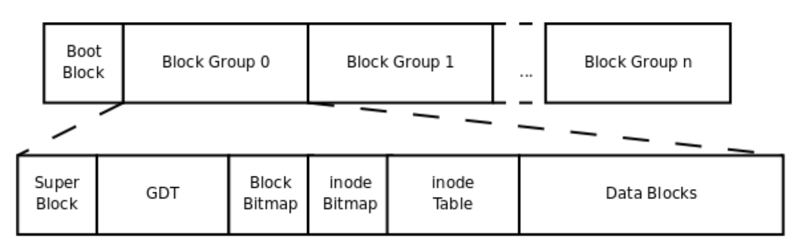
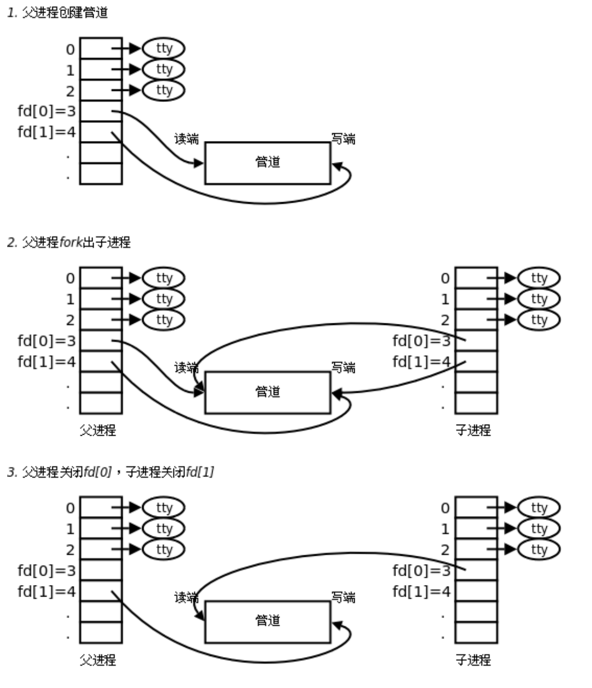
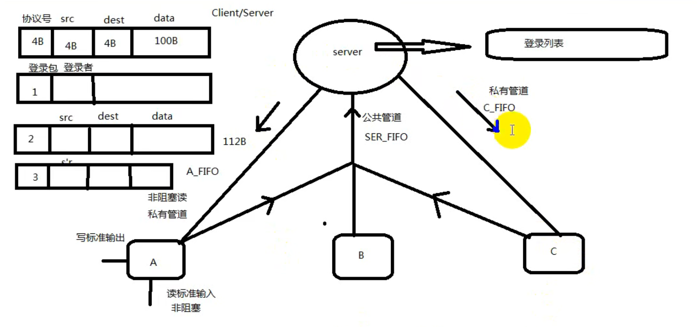

# Linux系统编程

**简介：** 这篇笔记是跟着邢文鹏老师的学习笔记，主要分为Linux的基础使用和系统编程两部分

***笔记目录***

1. Linux基本使用
   1. Linux基本命令
   2. Linux娱乐
   3. 编辑器 vim
   4. 编译器 Gnu工具链-gcc
   5. 调试器 GDB
   6. Makefile
2. 系统编程
   1. 文件I/O
   2. 文件系统
   3. 进程
      1. 进程控制原语
      2. 进程间通信
      3. 进程间关系
   4. 信号
   5. 线程
      1. 线程控制原语
   6. 线程同步机制
3. 网络编程
   1. socket套接字
   2. TCP/IP/UDP
   3. 并发服务器开发
      1. 多进程并发
      2. 多线程并发
      3. 异步I/O
         1. epoll
         2. select
         3. poll
4. shell编程
   1. 正则表达式
5. 数据库

## 1. Linux基本使用

|Linux系统代表  |  |
|--|--|
| ubuntu | 人性，专注桌面应用的系统半年一个版本 |
| Red hat | 服务收费 RHEL |
| CentOS | 社区-开源免费，去掉商标和不开源的代码再编译 |
| kali | 前身是BT5，黑客和安全专家专用系统，内置很多安防工具 |
| Android | 操作系统核心基于Linux |

|开发环境|  |
|--|--|
| 编辑器 | vi，vim，emacs，gedit |
| 编译器 | gcc |
| 调试器 | gdb |
| 项目管理工具 | Makefile/make |

***关于终端的小操作***

- ctrl + shift + t：创建终端标签
- alt + 标签号：切换标签
- ctrl + shift + n：创建新终端

### 1.1. Linux基本命令

#### 简单命令

|命令| 功能 |
|--|--|
| tar | 归档多个文件到一个压缩包 |
| jobs | 显示所有当前作业及其状态 |
| kill | 终止程序 |
| ping | 检查与服务器的连接状态 |
| wget | 从Internet上下载文件 |
| uname | 打印计算机的信息 |
| top | 显示正在运行的进程以及每个进程使用多少cpu列表 |
| echo | 将一些数据移到文件中 |
| zip，unzip | 压缩到zip，从zip中提取 |
| hostname | 主机/网络的名称 |
| data | 返回当前时间 |
| umask [-p] -S [mode] | 指定用户创建文件时的掩码，mode和chmod的命令中的格式一样 |

|有关容量的||
|--|--|
| du catalog | 检查文件或目录占用多少空间 |
| du -hm | 以M为单位 |
| du -hb | 以字节为单位 |
| du -hk | 以K为单位 |
| df --block-size | 获取有关磁盘空间使用情况的报告，并以size为单位 |

| wc | 计算文件的byte数、字数、列数 |
|--|--|
| wc -c(或-bytes、-chars)| 只显示byte数 |
| wc -l(或-lines) | 只显示行数 |
| wc -w(或-words) | 只显示字数 |

| 创建删除 |  |
|--|--|
| cp file catalog| 将文件从当前目录复制到另一个目录 |
| mv file catalog | 移动文件（应用于重命名） |
| mkdir catalog | 创建一个新目录 |
| rmdir catalog | 删除目录（仅能删除空目录） |
| rm catalog | 删除目录及其中的内容 |
| touch file | 创建一个空白文件 |
| useradd，userdel | 创建删除用户 |

| 有关查找的 |  |
|--|--|
| pwd | 找到您当前所在工作目录的路径。（返回绝对路径） |
| cd catalog | 浏览Linux文件或目录 |
| cat catalog | 在标准输出上列出文件内容 |
| locate file | 定位文件 |
| find xx | 查找文件或目录，可以再指定目录中查找 |
| grep word text | 搜索指定文件中的所有文本 |
| head -n x file | 显示任何文本的第一行或自定义的前x行 |
| tail | 显示最后十行 |
| diff | 逐行比较两个文件的内容输出不匹配的行 |
| which | 查看指定命令所在路径 |
| history | 查看使用了的命令 |
| man | 查看某命令详细 |

|find| 根据文件名查找 |
|--|--|
| find ./*-name "*.avi" | 从当前目录下查找以.avi结尾的文件 |
| find /*-name "file*" | 从根目录下查找以file开始的文件 |

| grep | 根据文件内容查找 |
|--|--|
| grep "hello" ./* -R | 递归查找当前目录下文件中含有hello字符串的文件 |

| ls | 查看当前目录的内容 |
|--|--|
| ls -a | 列出隐藏文件（文件以·开头的文件） |
| ls -l | 列出文件的详细信息 |
| ls -R | 连同子目录中的内容一起列出 |

|od -t file | 指定数据的显示格式 |
|--|--|
| c | ASCII字符或反斜杠序列 |
| d | 有符号十进制数 |
| f | 浮点数 |
| o | 八进制 |
| u | 无符号十进制 |
| x | 十六进制 |

#### 1.1.1. 主键盘快捷键

| 功能 | 快捷键 | 助记 |
|--|--|--|
| 上 | Ctrl-p | previous |
| 下 |Ctrl-n  | next |
| 左 | Ctrl-b | backword |
| 右 | Ctrl-f | forward |
| Del | Ctrl-d | delete光标后面的 |
| Home | Ctrl-a | the first letter |
| End | Ctrl-e | end |
| Backspace | Backspace  | delete光标前面的 |

#### 1.1.2. Linux的目录结构

***它类似于一棵树，所有的目录全在根目录 “/” 下***

| 目录 | 功能 |
|--|--|
| bin | 系统可执行程序，如命令 |
| boot | 内核和启动程序，所有和启动相关的文件都保存在这里 |
| boot/grub | 引导器相关文件 |
| dev | 设备文件 |
| etc | 系统软件的启动和配置文件，系统在启动过程中需要读取的文件都在此目录下（LILO参数，用户账号密码） |
| home | 用户的主目录 |
| lib | 系统的程序库文件，最基本的动态链接共享库 |
| media | 挂载媒体设备，光驱 |
| mnt | 用户临时挂载别的文件系统 |
| opt | 可选的应用软件包 |
| proc | 系统内存的映射，可以通过它来获取系统信息 |
| sbin | 管理员系统程序 |
| selinux |  |
| srv |  |
| sys | udev用到的设备目录树，/sys反映你机器当前所接的设备 |
| tmp | 临时文件夹 |
| usr | 最大的目录，大多应用程序的文件都保存在此 |
| usr-bin | 应用程序 |
| usr-game | 游戏程序 |
| usr-include |  |
| usr-lib | 应用程序的库文件 |
| usr-lib64 |  |
| usr-local | 包含用户程序等 |
| usr-sbin | 管理员应用程序 |

***cd ·· ：表示返回上一级目录***

#### 1.1.3. 文件属性

| 文件属性 |  |
|--|--|
| whoami | 查看当前登录用户 |
| chomd | 更改文件和目录的读取、写入和执行权限 |
| chown | 更改文件或目录的所有权给指定用户和指定组 |
| chgrp | 更改文件所属的用户组 |
| sudo | 使用超级管理员权限 |

| chmod | 更改文件权限 |
|--|--|
|chmod u/g/o/a +/-/= rwx 文件|  |
|  | u：文件所有者 |
|  | g：所有者相同组成员 |
|  | o：其他用户 |
|  | a：所有用户 |
|  | +：增加权限 |
|  | -：撤销权限 |
|  | =：设定权限 |
| 数字法设定权限： |  |
|  |r权限数为4，w权限数为2，x权限数为1 。若是没有权限则为0 ，要是三个权限都有就是7（4+2+1）|
| 如：chmod u=rwx g=rx o=r filename | 就等同于：chmod u=7 g=5 o=4 filename |
|  | 简化一下就是：chmod 754 filename |
| 目录权限：| 递归所有目录加上相同权限，需要加上参数 -R 。如：chmod 777 d |

| chown | 更改文件或目录的所有权给指定用户和指定组 |
|--|--|
| -R | 递归的改变指定目录及其下的所有子目录和文件的拥有者 |
| -v | 显示chown命令所作的工作 |
| 注意： | chown必须特权用户才可以执行（sudo chown root：root file -R） |
|  | 一个文件的owner和ownering group是没有关联的 |

***使用 “ls -l” 命令显示的信息中，开头由十个字符构成的字符串，第一个字符表示文件类型***

| 文件类型 |  |
|--|--|
| - | 普通文件 |
| d | 目录 |
| l | 符号链接 |
| b | 块设备文件 |
| c | 字符设备文件 |
| s | socket文件，网络套接字 |
| p | 管道 |

***紧跟着的九个字符表示文件的访问权限，分三组，每组三类，第一组表示文件属主的权限，第二组表同组用户的权限，第三组表其他用户的权限。每一组的三个字符分别表示：对文件的读、写和执行的权限。***

| 权限 | 含义 |
|--|--|
| r | 读 |
| w | 写 |
| x | 可执行 |
| s | 当文件被执行时，把文件的UID或GID赋予执行进程的UID（用户ID）或GID（组ID） |
| t | 设置标志位 |
| - | 没有相应位置的权限 |

| 链接技术 | 当一个文件的硬链接数为零的时候，这个文件被删除 |
|--|--|
| 硬链接 | ln file1 file2 |
| 软链接 | ln -s file1 file2 |

#### 1.1.4. 安装和卸载软件

***apt-get（必须连网）***

|更新源服务器列表|
|--|
| sudo vim /etc/apt/sources.list |

| 命令 | 功能 |
|--|--|
| sudo apt-get update | 更新源（更新完服务器列表后需要更新下源） |
| sudo apt-get install package | 安装包 |
| sudo apt-get remove package | 删除包 |
| sudo apt-cache search package | 搜索软件包 |
| sudo apt-cache show package | 获取包的相关信息，如大小、版本、说明等 |
| sudo apt-get install package --reinstall | 重新安装包  |
| sudo apt-get -f install | 修复安装 |
| sudo apt-get remove package --purge | 删除包，包括配置文件等 |
| sudo apt-get build-dep package | 安装相关的编译环境 |
| sudo apt-get upgrade | 更新已安装的包 |
| sudo apt-get dist-upgrade | 升级系统 |
| sudo apt-cache depends package | 了解使用该包依赖哪些包 |
| sudo apt-cache rdepends package | 查看该包被哪些包依赖 |
| sudo apt-get source package | 下载该包的源代码 |
| sudo apt-get clean && sudo apt-get autoclean | 清理无用的包 |
| sudo apt-get check | 检查是否有损坏的依赖 |

***deb包安装***

| 命令 | 功能 |
|--|--|
| sudo dpkg -i xxx.deb | 安装deb软件包 |
| sudo dpkg -r xxx.deb | 删除软件包 |
| sudo dpkg -r --purge xxx.deb | 连同配置文件一起删除 |
| sudo dpkg -info xxx.deb | 查看软件包信息 |
| sudo dpkg -L xxx.deb | 查看文件拷贝详情 |
| sudo dpkg -l | 查看系统中已安装软件包信息 |
| sudo dpkg-reconfigure xxx | 重新配置软件 |

***原码安装***

1. 解压缩源代码包
2. cd dir
3. ./configure 检测文件是否缺失，创建Makefile，检测编译环境
4. make  编译源码，生成库和可执行程序
5. sudo make install 把库和可执行程序安装到系统路径下

#### 1.1.5. 磁盘管理

**挂载**
linux在没有图形化界面是不能直接操作U盘的
需要进行：

1. 检测存储设备名称：sudo fdisk -l
2. 挂载存储设备sdb1到挂载点/mnt目录：sudo mount /dev/sdb1 /mnt
3. 访问/mnt
4. 卸载/mnt ：sudo umount  /mnt

**拷贝**
拷贝光盘和文件（光盘的格式需要是标准的iso9660格式）

1. 拷贝光盘：dd if=/dev/cdrom of=cdrom.iso
2. 拷贝文件：dd if=sfile of=dfile
3. 创建一个100M的空文件：dd if=/dev/zero of=hello.txt bs=100M count=1

#### 1.1.6. 压缩包管理

**tar**
为文件和目录创建档案。利用tar命令用户可以为某一特定文件创建档案，使用tar命令时有必须的主选项：
| 选项 | 作用 |
|--|--|
| c | 创建新的档案文件（用在备份目录或文件） |
| r | 把要存档的文件追加到档案文件的末尾 |
| t | 列出档案文件的内容，查看已备份了哪些文件 |
| u | 更新文件，用新增的文件取代原备份文件，找不到就追加到备份文件的最后 |
| x | 从档案文件中释放文件（解包） |

也有非必须的辅选项：

| 选项 | 作用 |
|--|--|
| f | 使用档案文件或设备，通常必选 |
| k | 保存已经存在的文件 |
| m | 在还原文件时，把所有文件的修改时间设置为现在 |
| M | 创建多卷的档案文件，以便在几个磁盘中存放 |
| v | 详细报告tar处理的文件信息 |
| w | 每一步都要求确认 |
| z | 用gzip来压缩/解压缩文件（用它压缩也要用它解压缩） |
| j | 用bzip2来压缩/解压缩文件（同上） |

打包命令：

1. tar cvf dir.tar dir
2. tar xvf dir.tar dir
3. 打gz压缩包：tar zcvf dir.tar.gz dir
4. 解gz压缩包：tar zxvf dir.tar.gz
5. 打bz2压缩包：tar jcvf dir.tar.bz2 dir
6. 解bz2压缩包：tar jxvf dir.tar.bz2
7. 指定目录解压缩：tar zxvf dir.tar.gz -C ~/test

***rar***

1. 打包：rar a -r newdir dir
2. 解包：unrar x newdir.rar

***zip***

1. 打包：zip -r dir.zip dir
2. 解包：unzip dir.zip

#### 1.1.7. 进程管理

***who***

查看当前在线上的用户情况

tty1到tty6给字符窗口(黑窗口)预留，tty7给图形界面预留的
图形下的终端是pts/n命名

***ps***

监控后台进程的工作情况，部分选项如下：
| 选项 | 功能 |
|--|--|
| -e | 显示所有进程 |
| -f | 全格式 |
| -h | 不显示标题 |
| -l | 长格式 |
| -w | 宽输出 |
| a | 显示终端上的所有进程包括其他用户的进程 |
| r | 只显示正在运行的进程 |
| x | 显示没有控制终端的进程 |
|  |  |
| u、a、x | 最常用的三个参数 |
| aux、ajx、-Lf | 常用的三种组合 |

列出进程信息含义：
| 名称 | 含义 |
|--|--|
| USER | 用户名 |
| UID | 用户ID |
| PID | 进程ID |
| PPID | 父进程的进程ID |
| SID | 会话ID |
| %CPU | 进程的CPU占用率 |
| %MEM | 进程的内存占用率 |
| VSZ | 进程使用的虚存的大小（Virtual Size） |
| RSS | 进程使用的驻留集大小或者是实际内存大小 |
| TTY | 与进程关联的终端 |
| STAT | 进程的状态：使用字符表示 |
| START | 进程启动时间和日期 |
| TIME | 进程使用的总CPU时间 |
| COMMAND | 正在执行的命令行命令 |
| NI | 优先级（Nice） |
| PRI | 进程优先级编号（Priority） |
| WCHAN | 进程正在休眠的内核名称；该函数的名称是从/rot/system.map文件中获得的 |
| FLAGS | 与进程相关的数字标识 |

| STAT的状态码 |  |
|--|--|
| R | Runnable。运行，正在运行或在运行队列中等待 |
| S | Sleeping。睡眠，休眠中，受阻，等待某个条件的形成或接受到信号 |
| I | Idle。空闲 |
| Z | Zombie。僵死，进程已终止，但进程描述符存在，直到父进程调用wait4()系统调用后释放 |
| D | Uninterruptible sleep。不可中断，收到信号不唤醒和不可运行，进程必须等待直到有终端发生 |
| T | Terminate。停止，进程收到SIGSTOP、SIGSTP、SIGTIN、SIGTOU信号后停止运行 |
| P | 等待交换页 |
| W | has no resident pages。无驻留页，没有足够的记忆体分页可分配 |
| X | 死掉的进程 |
| < | 高优先级的进程 |
| N | 低优先级的进程 |
| L | Lock。内存锁页，有记忆体分页分配并缩在记忆体内 |
| s | 进程的领导者（在它之下有子进程） |
| l | 多进程的（使用CLONE_THREAD，类似NPTL pthreads） |
| + | 位于后台的进程组 |

***jobs、fg、bg***

用来显示当前shell下正在运行哪些作业

- cat运行
- 使用Ctrl + z挂起当前进程（Ctrl + c终止进程）
- 使用jobs显示所有的进程
- 使用fg把指定的挂起的进程运行起来
- 使用bg把指定的挂起的进程切换到后台运行

***kill***

向指定的进程发送信号

- 查看信号：kill -l

- kill 编号 进程编号（大多数都是使进程停止的信号）

***env***

查看当前进程的环境变量

配置当前用户环境变量

- vim ~/.bashrc

配置系统环境变量：

- vim /etc/profile
- 配置系统环境变量，配置时需要有root权限
- 在文件末尾加上：export PATH=$PATH:新路径

***source***

打开一个脚本，并执行脚本的内容

```txt
source test.sh
等同于：
. test.sh
```

#### 1.1.8. 用户管理

##### 创建用户

- sudo useradd -s /bin/bash -g fittiger -d /home/fittiger -m fittiger
- -s：指定新用户登录时shell类型
- -g：组名
- -d：home目录
- -m：用户名
- sudo useradd -s /bin/bash -g group -G adm,root xwp
- -G：指定附属组，该组必须已经存在

##### 设置用户组

- sudo groupadd fittiger

##### 设置密码

- sudo passwd fittiger

##### 切换用户

- su 用户
- sudo su：切换到root用户

##### 删除用户

- sudo userdel -r 用户

#### 1.1.9. 网络管理

##### ifconfig

- 查看网卡信息：ifconfig
- 关闭网卡：sudo ifconfig eth0 down
- 开启网卡eth0：sudo ifconfig eth0 up
- 给eth0配置临时IP：sudo ifconfig eth0 IP

##### ping

- ping [选项] 主机名/IP地址

|选项| 含义 |
|--|--|
| -c | 数目，在发送指定数目的包后停止 |
| -d | 设置SO_DEBUG的选项 |
| -f | 大量且快速的送网络封包给一台机器，看他的回应 |
| -I（大写i） | 秒数，设定间隔几秒送一个网络封包给一台机器，预设值是一秒送一次 |
| -l | 次数，在指定次数内以最快的方式送封包数据到指定机器（只有超级用户才可以使用此选项） |
| -q | 不显示任何传送封包的信息，只显示最后的结果 |
| -r | 不经由网关，而直接送封包到一台机器，通常是查看本机的网络接口是否有问题 |
| -s | 字节数，指定发送的数据字节数，预设值是56，加上8字节的ICMP头，一共是64ICMP数据字节 |

##### netstat [选项]

显示网络连接、路由表和网络接口信息，可以让用户得知目前都有哪些网络连接正在工作。

| 选项 | 作用 |
|--|--|
| -a | 显示所有socket，包括正在监听的 |
| -c | 每隔一秒就重新显示一遍，知道用户中断它 |
| -i | 显示所有网络接口的信息，格式同“ifconfig -e” |
| -n | 以网络IP地址代替名称，显示出网络连接情形 |
| -r | 显示核心路由表，格式同“route -e” |
| -t | 显示TCP协议的连接情况 |
| -u | 显示UDP协议的连接情况 |
| -v | 显示正在进行的工作 |

##### nslookup name

查询一台机器IP地址和其对应的域名
给个域名找到IP

##### finger 用户名

显示用户的信息

#### 1.1.10. 常用服务器

##### ftp服务器

1. 安装vsftpd服务器：sudo apt-get install vsftpd
2. 配置vsftpd.conf文件：sudo vi /etc/vsftpd.conf
   - 添加设置：

```txt
anonymous_enable=YES     # 允许匿名用户访问
anon_root=/home/fittiger/ftp    # 匿名客户登录后所在的目录
no_anon_password=YES    # 匿名用户不需要密码
write_enable=YES               # 匿名用户可以写操作
anon_upload_enable=YES     # 匿名用户可以上传
anon_mkdir_write_enable=YES   # 匿名用户可以创建目录
```

3. 重启服务器，重新加载/etc/vsftpd.conf配置文件：sudo /etc/init.d/vsftpd restart
4. 测试上传功能，登录ftp服务器，进入anonymous目录
   - ftp IP
   - cd anonymous
5. 上传命令，把你当前目录下的文件上传到ftp服务器的anonymous目录：put somefile
6. 下载文件：get somefile

##### nfs服务器

1. 安装nfs服务器：sudo apt-get install nfs-kernel-server
2. 设置/etc/exports配置文件：sudo vi /etc/exports
   - 添加配置：/home/用户名/nfs *(rw,sync,no_root_squash)（就是添加了读写，同步以及不需用户登录）
3. 在用户目录下创建nfs目录：mkdir /home/用户名/nfs
4. 重启服务器，重新加载配置文件：sudo /etc/init.d/nfs-kernel-server restart
5. 在/home/用户名/nfs目录下创建测试文件hello：touch hello
6. 测试服务器，把服务器共享目录nfs挂载到/mnt节点：sudo mount -t nfs -o nolock -o tcp IP:/home/用户名/nfs  /mnt
7. 进入/mnt目录下可以看到hello文件表示构建
8. 卸载网络共享目录：sudo umount /mnt

##### ssh

1. 安装ssh服务器：sudo apt-get install openssh-server
2. 远程登录：ssh 用户名@IP

#### 1.1.11.其他命令

##### 终端翻页

- shift+pageup
- shift+pagedown

##### man

看每一个命令和系统函数的手册

- man read：查看read命令的man page
- man 2 read：查看read系统函数的man page（在第二个session中，表示为read（2））
- man -k read：以read为关键字查找相关的man page

##### clear 清屏（回到屏幕第一行，还可以往上翻）

快捷键Ctrl+l

##### alias

别名：alias [-p] name=value：给value起别名为name，命令行输入name，shell会自动翻译为value

-p显示当前定义的别名列表

##### echo

回显字符串

- echo [-n] 字符串

##### 关机重启

- poweroff：关闭电源
- shutdown -t 秒数 [-rknncfF] 时间 [警告讯息]
- reboot ：重启

| 选项 | 作用 |
|--|--|
| -t 秒数 | 设定在切换至不同的runlevel之前，警告和删除二讯号之间的延迟时间 |
| -k | 仅送出警告讯息文字，但不是真的要shutdown |
| -r | shutdown之后重新开机 |
| -h | shutdown之后关机 |
| -n | 不经过init，由shutdown指令本事来完成关机动作 |
| -f | 重新开机时，跳过fsck指令，不检查档案系统 |
| -F | 重新开机时，强迫做fsck检查 |
| -c | 将已经正在shutdown的动作取消 |

- uname -a：查看内核版本
- lsb_release -a：查看发行版信息
- free -m：查看内存空闲

### 1.2. Linux娱乐

### 1.3. 编辑器 vim

```text
它可以执行输出、删除、查找、替换、块操作等众多文本操作，vi没有菜单，只有命令。

vi的三种工作模式：
 命令模式：
   用户按下esc键，vi就会进入命令模式，用户可以输入各种合法的vi命令来管理自己的文档
 文本输入模式：
   只有在输入模式下，才可以对文本进行编辑。
   在命令模式下输入：插入命令i、附加命令a、打开命令o、修改命令c取代命令r或者替换命令s。都可以进入文本输入模式
 末行模式：
   也叫ex转义模式。用户在命令模式下可以按' ：' 键进入末行模式。vi会在窗口最后一行显示一个：作为末行模式的提示符

操作步骤（在终端操作）：
 创建文件：vi文件名 --> i进入编辑模式 --> 编辑文件 --> esc到命令模式 --> ：到末行模式 --> wq保存并退出
```

|进入编辑模式  |  |
|--|--|
|i和I  | i在光标前插入，I在行首插入 |
|a和A  | a在光标后插入，A在行末插入 |
|o和O  |o在光标所在下一行插入，O在光标所在上一行插入  |

| 进入命令模式 |  
|--|
| esc |

|进入末行模式：  |  |
|--|--|
| q | 退出 |
| w | 保存 |
| q！ | 强制退出，不保存 |
| qw！ | 强制退出并保存 |
|！  | 强制的意思，可以不加 |

|移动光标命令  |  |
|--|--|
| h | 光标向左移动 |
| j | 光标向下移动 |
| k | 光标向上移动 |
| I | 光标向右移动 |
|H、M、L  | 光标移动到可见屏幕的第一行、中间行、最后一行 |
| ^和$ | 移动到行首、行末 |
| G和gg | 移动到文档的最后一行、第一行 |
| ctrl+f、ctrl+b | 向前翻屏、向后翻屏 |
| ctrl+d、ctrl+u  |  向前半屏、向后半屏 |
| { 和 } | 向上移动一段，向后移动一段 |
| w和b |w向前移动一个单词、b向后移动一个单词  |

|删除命令  |  |
|--|--|
| X和x | x删除光标所在字符，X删除光标前一个字符，包括光标所在字符 |
| dd和n dd | dd删除所在行，n dd删除n行 |
| d0和D | d0删除光标前文本行所有内容。D删除光标后文本行所有内容，包括光标位置字符 |
|dw  | 删除光标所在位置的字，包括光标所在位置字符 |

| 撤销命令 |  |
|--|--|
| u |一步步撤销  |
|ctrl+r  |反撤销（重做）  |

| 重复命令 |  |
|--|--|
| . | 重复执行上一次操作的命令 |

| 移动命令 |  |
|--|--|
| >> | 文本行向右移动 |
| << |文本行向左移动  |

| 复制粘贴 |  |
|--|--|
| yy、n yy、y$ |yy复制当前行，n yy复制n行，y$复制当前光标至行尾  |
|p  |在光标所在位置向下开辟一行粘贴  |

|可视模式|  |
|--|--|
| v | 按字符移动选中文本 |
| V | 按行移动选中文本 |
|  | 可视模式可以和d，y，<<，>>配合使用 |

| 分屏 |  |
|--|--|
| 执行shell下命令 | 末行模式里输入！，后面跟命令 |
| 启动分屏 | n是分屏数 |
|  | vim -On file1，file2... ：垂直分屏|
|  | vim -on file1，file2...：水平分屏 |
| 关闭分屏 |  |
|  | ctrl+w c ：关闭当前窗口 |
|  | ctrl+w q ：如果当前窗口为最后一个就退出vim |
| 在编辑中分屏 |  |
|  | sp：上下分屏，后面可以跟文件名 |
|  | ctrl+w s：上下分割当前打开的文件 |
|  | vsp：左右分屏，后面可以跟文件名 |
|  | ctrl+w v：左右分割当前打开的文件 |
| 移动光标 |  |
| ctrl+w k | 把光标移动到上面的屏 |
| ctrl+w j | 把光标移动到下面的屏 |
| ctrl+w l | 把光标移动到右面的屏 |
| ctrl+w h | 把光标移动到左面的屏 |
| ctrl+w w | 把光标移动到下一个屏 |
| 移动屏幕 |  |
| ctrl+w K | 向上移动 |
| ctrl+w J | 向下移动 |
| ctrl+w L | 向右移动 |
| ctrl+w H | 向左移动 |
| 屏幕尺寸 |  |
| ctrl+w + | 增加高度 |
| ctrl+w - | 减少高度 |
| ctrl+w = | 让所有屏幕高度一致 |
| ctrl+w > | 左加宽度 |
| ctrl+w < | 右加宽度 |
| ctrl+w n> | 左加n倍宽度 |
| ctrl+w n< | 右加n倍宽度 |

| 查找替换 |  |
|--|--|
| 命令模式 |  |
| r和R | r替换当前字符，R替换光标后的字符 |
| / + str | 找到字符串str，n查找下一个，N查找上一个 |
| 查看 Man Page | 光标移动到函数上，使用K查看，或者3K查看第三章的Man Page |
| 查看宏定义 | [-d：可以查看宏定义，必须先包含此宏定义的头文件 |
| 排版 | gg=G：代码自动缩进排版 |
|  |  |
| 末行模式 |  |
| %s/abc/123/g | 将文件中所有abc替换成123 |
| 1,10s/abc/123/g | 将第一行至第十行之间的abc替换成123 |

***配置适合自己的vim编辑器***

```txt
1.找到配置文件存放的目录：/etc/vim
2.输入：sudo vi vimrc 进行配置配置文件
3.对文件进行配置，在网上就能找到
```

### 1.4. 编译器 Gnu工具链-gcc

***gcc***

| gcc |  |
|--|--|
| -I | 指定头文件目录（后面不加空格） |
| -g | 包含调试信息 |
| -c | 只编译，生成.o文件，不进行链接 |
| -On（n：0~3） | 编译优化，n越大优化的越多 |
| -Wall | 提示更多警告信息 |
| -D | 编译时宏定义（后面不加空格） |
| -E | 生成预处理文件 |
| -M | 生成.c文件与头文件依赖关系以用于Makefile，包括系统库的头文件 |
| -MM | 生成.c文件与头文件依赖关系以用于Makefile，不包括系统库的头文件 |

***toolchain***

| |  |
|--|--|
| gcc | 编辑器 |
| glibc | 该库实现Linux系统函数，例如open、read等，也实现标准c语言库，如printf等。几乎所有应用程序都需要安装与glibc链接 |

```txt
binutils一组用于编译、链接、汇编和其他调试目的的程序，包括ar、as、ld、nm、objcopy、objdump等
```

| toolchain中几种主要工具的作用 |  |
|--|--|
| ar | 打包生成静态库 |
| as | 汇编器 |
| ld | 链接器。gcc完成链接步骤中，其实是gcc调用链接器ld，将用户编译生成的目标文件连同系统的libc启动代码链接在一起形成最终的可执行文件 |
| nm | 查看目标文件中的符号（全局变量，全局符号等） |
| objcopy | 将原目标文件中的内容复制到新的目标文件中，可以通过不同的命令选项调整目标文件的格式，比如去除某些ELF文件头 |
| objdump | 用于生成反汇编文件，主要依赖objcopy实现，a.out编译时需要-g，objdump -dSsx a.out > file |
| ranlib | 为静态库文件创建索引相当于ar命令的s选项 |
| readelf | 解读ELF文件头 |

#### 程序库

```txt
就是包含了数据和执行码的文件。其不能单独执行，可以作为其他执行程序的一部分来完成某些功能，库的存在可以使得程序模块化，
可以加快程序的再编译，可以实现代码重用，可以使得程序便于升级。

程序库分为静态库和共享库
```

***静态库***

```txt
是在可执行程序运行前就已经加入到执行码中，成为执行程序的一部分。

静态库可以认为是一些目标代码的集合，按照习惯，一般按照.a作为文件后缀名。

使用ar(archiver)命令可以创建静态库。

创建一个静态库：
 ar rcs libmylib.a file1.o\
 rcs：创建一个索引
 libmylib：库名，一般以lib开头
```

***共享库***

```txt
是在执行程序启动时加载到执行程序中，可以被多个执行程序共享使用。

共享库有比较明显的优点：库是独立的，便于维护和更新

创建一个共享库：
 1.使用-fPIC或-fpic创建目标文件
 2.然后使用以下格式来创建共享库：
  gcc -share -Wl, -soname,your_soname -o library_name file_list library_list

创建案例：
 gcc -fPIC -c a.c   # 先生成.o文件
 gcc -fPIC -c b.c
 gcc -shared -Wl -o libmyab.so a.o b.o   # 再创建共享库
 # .so 共享库的后缀

 gcc -fPIC -c a.c 
 gcc -fPIC -c b.c
 gcc -shared -Wl,-soname, libmyab.so.1 -o libmyab.so.1.0.1 a.o b.o
 # 后面的1.0.1是库的版本号
```

| 三个库名 |  |
|--|--|
| real name | libmylib.so.1.10：小版本号，小版本差一些也可以运行 |
| so name | libmylib.so.1：这个是主版本号，主版本号一致才可以通用 |
| link name | libmylib.so ：不显示出版本来，是为了链接使用的，方便Makefile |
|| 这三者之间的关系：后两个都是链接指向第一个，第一个才是真正调用的 |

```txt
1.修改/etc/ld.so.conf：sudo vi /etc/ld.so.conf
 向里面添加你的共享库路径
2.更新查找共享库的路径
 sudo ldconfig -v
```

### 1.5. 调试器 GDB

它是一款非常强大的调试工具，可以随时查看程序中所有的内部状态。

编译程序的时候需要加上-g

- gcc -g main.c -o main

#### 常用命令

|命令|简写|作用|
|--|--|--|
|help|h|按模块列出命令类|
|help class||查看某一类型的具体命令|
|list|l|查看代码，可跟行号和函数名|
|quit|q|退出gdb|
|run|r|全速运行程序|
|start||单步执行，运行程序，停在第一行执行语句|
|next|n|逐过程执行|
|step|s|逐语句执行，遇到函数，调到函数内执行|
|backtrace|bt|查看函数的调用的栈帧和层级关系|
|info|i|查看GDB内部局部变量的数值,info breakpoints|
|frame|f|切换函数的栈帧|
|finish||结束当前函数，返回到函数调用点|
|set var||设置变量的值 set var num=10|
|run argv[1] argv[2]||调试时命令行传参|
|print|p|打印变量和地址|
|break|b|设置断点，可根据行号和函数名|
|delete|d|删除断点 d breakpoints NUM|
|display||设置观察变量|
|undisplay||取消观察变量|
|continue|c|继续全速运行剩下的代码|
|enable breakpoints||启用断点|
|disable breakpoints||禁用断点|
|x||查看内存 x/20xw 显示20个单元，16进制，4字节每单元|
|watch||被设置观察点的变量发生修改时，打印显示|
|core文件||ulimit -c 1024 开启core文件，调试时 gdb a.out core|

#### gdb调试模式

- run:全速运行
- start:单步调试
- set follow-fork-mode child

### 1.6. Makefile项目管理工具

#### 用途

- 项目代码编译管理
- 节省编译项目时间
- 一次编写终身受益
- 操作示例文件:add.c sub.c mul.c dive.c main.c

#### 基本规则

通常是建立一个Makefile的文件，向文件中输入类似下面的内容，在命令行使用make命令执行

```txt
目标:依赖(条件)
   命令

all:add.c sub.c dive.c mul.c main.c
   gcc add.c sub.c dive.c mul.c main.c -o app

#阶段一
#all:
#  gcc add.c sub.c dive.c mul.c main.c -o app

#阶段二
app:add.o sub.o dive.o mul.o main.o
   gcc add.o sub.o dive.o mul.o main.o -o app
add.o:add.c
   gcc -c add.c
sub.o:sub.c
   gcc -c sub.c
dive.o:dive.c
   gcc -c dive.c
mul.o:mul.c
   gcc -c mul.c
main.o:main.c
   gcc -c main.c

#阶段三:已经不需要向里面输入文件名了
src = $(wildcard *.c) # 找到当前目录下所有的.c文件
obj = $(patsubst %.c,%.o,$(src)) # 把src中所有的.c后缀转换为.o后缀，并保存在obj中
target = app
$(target):$(obj)
   gcc $^ -o $@

# $@:表示目标
# $^:表示所有依赖
# $<:表示依赖中的第一个
# 把所有的.c文件变异成.o文件
%.o:%.c
   gcc -c $< -o $@

#阶段四

CPPFLAGS= -Iinclude # 预处理标志，头文件在什么位置
CFLAGS= -g -Wall # 编译的时候需不需要加调试信息-g、是否开启严格编译-Wall
LDFLAGS= -L../lib -lmycalc # 加载时候的参数，共享库
CC=gcc # 编译器是什么

src = $(wildcard *.c)
obj = $(patsubst %.c,%.o,$(src))
target = app
$(target):$(obj)
   $(CC) $^ $(LDFLAGS) -o $@

%.o:%.c
   $(CC) -c $< $(CFLAGS) $(CPPFLAGS) -o $@

# 彻底清除生成的过程文件和配置文件
distclean:


# 安装
install:
   cp app /usr/bin

.PHONY:clean
# 彻底清除生成的过程文件
clean:
   rm -f *.o
   rm -f app
```


makefile的两个阶段

1. 自上向下建立关系树
2. 自下向上执行命令

#### Makefile工作原理

- 分析各个目标和依赖之间的关系
- 根据依赖关系自底向上执行命令
- 根据依赖的修改时间比目标的修改时间新，从而确定更新
- 如果目标不依赖于任何条件，则执行对应命令，以示更新

#### clean

- 用途：清除编译生成的中间.o文件和最终目标文件
- make clean如果当前目录下有同名clean文件，则不执行clean对应的命令
- 伪目标声明：.PHONY:clean
- clean命令中的特殊符号
  - "-"此条命令出错，make也会继续执行后续的命令。如"-rm main.o"
  - "@"不显示命令本身，只显示结果。如"@echo" clean done
- 其他
  - make默认执行第一个出现的目标，可通过make dest执行要执行的目标
  - distclean目标
  - install目标
  - make -C 指定目录 进入指定目录

## 2. 系统编程

### 2.1. 文件I/O

#### c标准函数与系统函数


***I/O缓冲区***

每个文件流都有个缓冲区buffer，默认大小8192B

c标准函数的跨平台性要好，但是性能方面不如linuxAPI

#### PCB（进程控制块）

***task_struct结构体***

位置：/usr/src/linux-headers/include/linux/sched.h

***文件描述符***

```txt
一个文件默认打开三个文件描述符
 STDIN_FILENO  0
 STDOUT_FILENO  1
 STDERR_FILENO  2
```


#### open函数

```txt
int open(const char *pathname, int flags);
int open(const char *pathname, int flags, mode_t mode);
```

| 必选参数 | 访问模式 |
|--|--|
| O_RDONLY | 只读 |
| O_WRONLY | 只写 |
| O_RDWR | 读写 |

| 可选参数 | 可以同时指定另个或多个 |
|--|--|
| O_APPEND | 追加 |
| O_CREAT | 不存在文件则创建，需要加上参数mode，表示该文件的访问权限 |
| O_EXCL | 如果指定了O_CREAT，并且文件存在，则出错返回 |
| O_TRUNC | 如果文件存在并是可写状态打开，则将其长度截断为0字节 |
| O_NONBLOCK | 对于设备文件，以此方式打开可以做非阻塞I/O |

**文件最大打开数：1024（默认值，可改变）**
**查看系统用户所有限制值：ulimit -a**
**修改系统用户文件打开限制值：ulimit -n 4096**

#### read/write函数

```txt
ssize_t read(int fd, void *buf, size_t count);
 成功返回读到的字节数
 读到文件末尾返回0
 读失败返回-1
ssize_t write(int fd, const void *buf, size_t count);
```

#### 阻塞和非阻塞

读常规文件是不会阻塞的，read会在一定的时间内返回。从终端或网络读则不一定，有可能会一直阻塞。(写也一样)

***阻塞：当进程调用一个阻塞的系统函数时，该进程被置于睡眠（sleep）状态，这时内核调度其他进程运行，知道该进程的等待的事件发生了，它才有可能继续运行。（与睡眠状态相对应的是运行状态）***

linux内核中处于运行状态的进程分为两类：

- 正在被调度运行
- 就绪状态

***阻塞读终端***

```cpp
#include <unistd.h>
#include <stdlib.h>

int main(void)
{
 char buf[10];
 int n;
 n = read(STDIN_FILENO, buf, 10);
 if (n < 0) {
  perror("read STDIN_FILENO");
  exit(1);
 }
 write(STDOUT_FILENO, buf, n);
 return 0;
}

// 轮询(Poll),调用者只查询一下，并不会在这里阻塞等死，可以同时监听多个设备

while(1) {
 非阻塞read(设备1);
 if(设备1有数据到达)
  处理数据;

 非阻塞read(设备2);
 if(设备2有数据到达)
  处理数据;

 ...

 sleep(n); // 休息一段时间
}

```

***非阻塞读终端***

```cpp
// 非阻塞读终端
#include <stdio.h>
#include <stdlib.h>
#include <sys/types.h>
#include <sys/stat.h>
#include <unistd.h>
#include <string.h>
#include <stdlib.h>
#include <errno.h>
#include <fcntl.h>

#define MSG_TRY "try again\n"


int main(void)
{
 char buf[10];
 int fd, n;

 fd = open("/dev/tty", O_RDONLY|O_NONBLOCK); // 重新打开终端 // O_NONBLOCK：非阻塞标志，为打开的文件(终端)设置非阻塞标志
 if(fd<0){ // 打开失败提示失败信息
  perror("open /dev/tty");
  exit(1);
 }
 tryagain: // 如果打开成功就开始非阻塞读，如果读失败就一直重复读，成功就结束
 n = read(fd, buf, 10);
 if(n<0){
  if(errno == EAGAIN){
   sleep(1);
   write(STDOUT_FILENO, MSG_TRY, strlen(MSG_TRY));
   goto tryagain;
  }
  perror("read /dev/tty");
  exit(1);
 }
 write(STDOUT_FILENO,buf,n);
 close(fd);

 return 0;
}
```

```cpp
// 非阻塞读终端和等待超时
#include <unistd.h>
#include <fcntl.h>
#include <errno.h>
#include <string.h>
#include <stdlib.h>
#define MSG_TRY "try again\n"
#define MSG_TIMEOUT "timeout\n"

int main(void)
{
 char buf[10];
 int fd, n, i;
 
 fd = open("/dev/tty", O_RDONLY|O_NONBLOCK);
 
 if(fd<0) {
  perror("open /dev/tty");
  exit(1);
 }
 
 for(i=0; i<5; i++) { // 循环等待五次
  n = read(fd, buf, 10);
  if(n>=0)
   break;
  if(errno!=EAGAIN) {
   perror("read /dev/tty");
   exit(1);
  }
  sleep(1);
  write(STDOUT_FILENO, MSG_TRY, strlen(MSG_TRY));
 }
 
 if(i==5) // 如果五次都没有读到数据，就提示等待超时
  write(STDOUT_FILENO, MSG_TIMEOUT, strlen(MSG_TIMEOUT));
 else // 读到数据了，将数据写入进去
  write(STDOUT_FILENO, buf, n);
 close(fd);
 
 return 0;
}
```

#### lseek

lseek和标准I/O库的fseek函数类似，可以移动当前读写位置(偏移量)

偏移量允许超过文件末尾，这种情况下对该文件的下一次写操作将延长文件，中间空洞的部分读出来都是0。

```cpp
#include <sys/types.h>
#include <unistd.h>

off_t lseek(int fd, off_t offset, int whence);

// 若lseek成功执行，则返回新的偏移量
off_t currpos;
currpos = lseek(fd, 0, SEEK_CUR);
```

```cpp
#include <sys/types.h>
#include <sys/stat.h>
#include <fcntl.h>
#include <unistd.h>
#include <errno.h>
#include <stdlib.h>
#include <stdio.h>

int main(void)
{
   int fd = open("abc", O_RDWR);
   if(fd<0) {
      perror("open abc");
      exit(-1);
   }

   // 1.拓展文件
   // 扩展一个文件，一定要有一次写操作
   lseek(fd, 0x1000, SEEK_SET);
   write(fd, "a");

   close(fd);
   fd = open("hello", O_RDWR);
   if(fd<0) {
      perror("open hello");
      exit(-1);
   }
   // 2.获取文件大小
   // 指针位置移到到文件末尾，偏移量为0，返回值就是文件的大小
   printf("hello size = %d\n", lseek(fd, 0, SEEK_END));
   close(fd);

   // 3.它真正的工作是移动打开的文件的指针位置
   return 0;
}
```

#### fcntl

获取或设置文件访问控制属性

数改变一个已打开的文件的属性，可以重新设置读、写、追加、非阻塞等标志（这些标志称为File Status Flag），而不必重新open文件。

```cpp
#include <unistd.h>
#include <fcntl.h>
int fcntl(int fd, int cmd);
int fcntl(int fd, int cmd, long arg);
int fcntl(int fd, int cmd, struct flock *lock);


#include <unistd.h>
#include <fcntl.h>
#include <errno.h>
#include <string.h>
#include <stdlib.h>

#define MSG_TRY "try again\n"

int main(void)
{
   char buf[10];
   int n;
   int flags;
   // 它改变一个已经打开文件的访问控制属性
   flags = fcntl(STDIN_FILENO, F_GETFL);
   flags |= O_NONBLOCK;
   if (fcntl(STDIN_FILENO, F_SETFL, flags) == -1) {
      perror("fcntl");
      exit(1);
   }

tryagain:
   n = read(STDIN_FILENO, buf, 10);
   if (n < 0) {
      if (errno == EAGAIN) {
         sleep(1);
         write(STDOUT_FILENO, MSG_TRY, strlen(MSG_TRY));
         goto tryagain;
      }
      perror("read stdin");
      exit(1);
   }

   write(STDOUT_FILENO, buf, n);
   return 0;
}
```

#### ioctl

设置和获取设备文件的物理特性时使用.

用于向设备发控制和配置命令，有些命令也需要读写一些数据

```cpp
#include <sys/ioctl.h>

int ioctl(int d, int request, ...);
// d是某个设备的文件描述符。request是ioctl的命令，可变参数取决于request，通常是一个指向变量或结构体的指针。
// 若出错则返回-1，若成功则返回其他值，返回值也是取决于request。
```

```cpp
// 使用TIOCGWINSZ命令获得终端设备的窗口大小。
#include <stdio.h>
#include <stdlib.h>
#include <unistd.h>
#include <sys/ioctl.h>

int main(void)
{
   struct winsize size; // 终端大小
   
   if (isatty(STDOUT_FILENO) == 0) // isatty:根据文件描述符判断是否是终端文件
      exit(1);
   
   if(ioctl(STDOUT_FILENO, TIOCGWINSZ, &size)<0) {
      perror("ioctl TIOCGWINSZ error");
      exit(1);
   }
   
   printf("%d rows, %d columns\n", size.ws_row, size.ws_col);
   return 0;
}
```

### 2.2. 文件系统

#### 2.2.1. ext2文件系统




- Boot Block:启动块，记录磁盘的分区情况，每个区的大小以及起始位置，记录里面装的什么系统...大小为1K
- Block 1 .... Block n:大小为4096Bytes(就是8个磁盘扇区)
- Block Group:文件系统将分区划分为若干大小相同的块组。
  - Super Block(超级块):***描述整个分区的文件系统信息***(块大小、文件系统版本号、上次mount的时间...超级块在每个块组的开头都有一份拷贝)
  - GDT(块组描述符表):由一系列块组描述符组成，分区有多少块组就有多少块组描述符。存储***一个块组的描述信息***(inode表开始位、数据块开始位、空闲的inode和数据块数量)***Super Block和GDT在每个块组的开头都有一份拷贝***
  - Block Bitmap(块位图):***用来描述整个块组中哪些块已用，哪些块仍空闲***，它本身占一个块，每个bit表示块组中的一个块，通过0、1标识是否被使用。
  - inode Bitmap(inode位图):类似块位图，标识inode是否使用
  - inode Table(inode表):每个文件一个inode，一个块组的全部inode构成了inode表，用来存储 ***文件描述信息(文件类型(常规、目录、符号链接)、权限、文件大小、创建/修改/访问时间等)*** inode表占多少块在格式化的时候就决定了，根据要存放的文件的大小来决定inode表的大小。
  - Data Block(数据块):
    - 常规文件：数据存储在数据块中
    - 目录：目录下所有的文件名以及目录名存放在数据块中
    - 符号链接：目标路径名较短就直接保存在inode中以便快速查找，如果目标路径名较长就分配一个数据块来保存。
    - 设备文件、FIFO和socket等特殊文件没有数据块，设备文件的主设备号和次设备号保存在inode中。

***目录中记录项文件类型***

|编码|文件类型|
|--|--|
|0|Unknown|
|1|Regular file|
|2|Directory|
|3|Character device|
|4|Block device|
|5|Named pipe|
|6|Socket|
|7|Symbolic link|

***数据块寻址***


- 直接寻址：
  - 直接寻址，它的块里面存放的就是数据本身
- 间接寻址
  - 间接寻址，它的块里面存放的是指针，指向另一个地址，一个Block里面可以存放Block/4个指针

#### 2.2.2. stat

stat既有命令也有同名函数，用来获取文件Inode里主要信息，stat跟踪符号链接，lstat不跟踪符号链接

stat里时间

- atime：最近访问时间
- mtime：最近更改时间，指最近修改文件内容的时间
- ctime：最近改动时间，指最近改动Inode的时间

```cpp
#include <sys/types.h>
#include <sys/stat.h>
#include <unistd.h>

int stat(const char *path, struct stat *buf);
int fstat(int fd, struct stat *buf);
int lstat(const char *path, struct stat *buf);

struct stat {
   dev_t st_dev; /* ID of device containing file */
   ino_t st_ino; /* inode number */
   mode_t st_mode; /* protection */
   nlink_t st_nlink; /* number of hard links */
   uid_t st_uid; /* user ID of owner */
   gid_t st_gid; /* group ID of owner */
   dev_t st_rdev; /* device ID (if special file) */
   off_t st_size; /* total size, in bytes */
   blksize_t st_blksize; /* blocksize for file system I/O */
   blkcnt_t st_blocks; /* number of 512B blocks allocated */
   time_t st_atime; /* time of last access */
   time_t st_mtime; /* time of last modification */
   time_t st_ctime; /* time of last status change */
};
```

#### 2.2.3. access

```cpp
#include <unistd.h>

int access(const char *pathname, int mode);
```

按实际用户ID和实际组ID测试,跟踪符号链接

***参数mode***

```txt
R_OK 是否有读权限
W_OK 是否有写权限
X_OK 是否有执行权限
F_OK 测试一个文件是否存在
```

实际用户ID：
有效用户ID：sudo执行时，有效用户ID是root，实际用户ID是登录的用户

#### 2.2.4. chmod

```cpp
#include <sys/stat.h>
int chmod(const char *path, mode_t mode);
int fchmod(int fd, mode_t mode);
```

***mode***

||列2|列3|
|--|--|--|
|S_ISUID|04000|执行时设置用户ID|
|S_ISGID|02000|执行时设置组ID|
|S_ISVTX|01000|黏住位，让它尽量放在内存中，不被踢出去|
|S_IRUSR|00400|所有者-读|
|S_IWUSR|00200|所有者-写|
|S_IXUSR|00100|所有者-执行|
|S_IRGRP|00040|组-读|
|S_IWGRP|00020|组-写|
|S_IXGRP|00010|组-执行|
|S_IROTH|00004|其他-读|
|S_IWOTH|00002|其他-写|
|S_IXOTH|00001|其他-执行|

#### 2.2.5. chown

```cpp
#include <unistd.h>

int chown(const char *path, uid_t owner, gid_t group);
int fchown(int fd, uid_t owner, gid_t group);
int lchown(const char *path, uid_t owner, gid_t group);
```

chown使用时必须拥有root权限。

#### 2.2.6. utime

更改文件的更改时间和改动时间

#### 2.2.7. truncate

截断一个文件

```cpp
#include <unistd.h>
#include <sys/types.h>

int truncate(const char *path, off_t length);
int ftruncate(int fd, off_t length);
```

#### 2.2.8. link

***link***

创建一个硬链接

当rm删除文件时，只是删除了目录下的记录项和把inode硬链接计数减1，当硬链接计数减为0时，才会真正的删除文件。

- 硬链接通常要求位于同一文件系统中,POSIX允许跨文件系统
- 符号链接没有文件系统限制
- 通常不允许创建目录的硬链接，某些unix系统下超级用户可以创建目录的硬链接
- 创建目录项以及增加硬链接计数应当是一个原子操作

***unlink***

```txt
int unlink(const char *pathname)

1. 如果是符号链接，删除符号链接
2. 如果是硬链接，硬链接数减1，当减为0时，释放数据块和inode
3. 如果文件硬链接数为0，但有进程已打开该文件，并持有文件描述符，则等该进程关闭该文件时，kernel才真正去删除该文件
4. 利用该特性创建临时文件，先open或creat创建一个文件，马上unlink此文件
```

***symlink***

创建一个软链接

```cpp
int symlink(const char *oldpath, const char *newpath)
```

***readlink***

读符号链接指向的文件名字，不读文件内容

```cpp
ssize_t readlink(const char *path, char *buf, size_t bufsiz)
```

#### 2.2.9. rename

文件重命名

```cpp
#include <stdio.h>
int rename(const char *oldpath, const char *newpath);
```

#### 2.2.10. chdir

改变当前进程的工作目录

```cpp
#include <unistd.h>

int chdir(const char *path);
int fchdir(int fd);
```

#### 2.2.11. getcwd

获取当前进程的工作目录

```cpp
#include <unistd.h>
char *getcwd(char *buf, size_t size);
```

#### 2.2.12. pathconf

系统允许最大存储的文件名、最大路径、最大缓冲区...

```cpp
#include <unistd.h>
long fpathconf(int fd, int name);
long pathconf(char *path, int name);
```

#### 2.2.13. 目录操作

***mkdir***

创建一个目录

```cpp
#include <sys/stat.h>
#include <sys/types.h>
int mkdir(const char *pathname, mode_t mode);
```

***rmdir***

删除一个目录

```cpp
#include <unistd.h>
int rmdir(const char *pathname);
```

***opendir***

打开一个目录

```cpp
#include <sys/types.h>
#include <dirent.h>

DIR *opendir(const char *name);
DIR *fdopendir(int fd);
```

***readdir***

读一个目录

```cpp
#include <dirent.h>
struct dirent *readdir(DIR *dirp);

struct dirent {
   ino_t d_ino; /* inode number */
   off_t d_off; /* offset to the next dirent */
   unsigned short d_reclen; /* length of this record */
   unsigned char d_type; /* type of file; not supported by all file system types */
   char d_name[256]; /* filename */
};
```

readdir每次返回一条记录项，DIR*指针指向下一条记录项

***rewinddir***

把目录指针恢复到目录的起始位置

```cpp
#include <sys/types.h>
#include <dirent.h>
void rewinddir(DIR *dirp);
```

***telldir***

返回目录指针所在的位置

```cpp
#include <dirent.h>
long telldir(DIR *dirp);
```

***seekdir***

移动目录指针的位置

```cpp
#include <dirent.h>
void seekdir(DIR *dirp, long offset);
```

***closedir***

关闭目录

```cpp
#include <sys/types.h>
#include <dirent.h>
int closedir(DIR *dirp);
```

***递归遍历目录***

```cpp
#include <sys/types.h>
#include <sys/stat.h>
#include <unistd.h>
#include <dirent.h>
#include <stdio.h>
#include <string.h>
#define MAX_PATH 1024

/* dirwalk: apply fcn to all files in dir */
void dirwalk(char *dir, void (*fcn)(char *))
{
   char name[MAX_PATH];
   struct dirent *dp;
   DIR *dfd;
   if ((dfd = opendir(dir)) == NULL) {
      fprintf(stderr, "dirwalk: can't open %s\n", dir);
      return;
   }
   while ((dp = readdir(dfd)) != NULL) {
      if (strcmp(dp->d_name, ".") == 0|| strcmp(dp->d_name, "..") == 0)
         continue; /* skip self and parent */
      if (strlen(dir)+strlen(dp->d_name)+2 > sizeof(name))
         fprintf(stderr, "dirwalk: name %s %s too long\n",dir, dp->d_name);
      else {
         sprintf(name, "%s/%s", dir, dp->d_name);
         (*fcn)(name);
      }
   }
   closedir(dfd);
}

/* fsize: print the size and name of file "name" */
void fsize(char *name)
{
   struct stat stbuf;
   if (stat(name, &stbuf) == -1) {
      fprintf(stderr, "fsize: can't access %s\n", name);
      return;
   }
   if ((stbuf.st_mode & S_IFMT) == S_IFDIR) // 判断文件是否是目录
      dirwalk(name, fsize); // 递归
   printf("%8ld %s\n", stbuf.st_size, name);
}

int main(int argc, char **argv)
{
   if (argc == 1) /* default: current directory */
      fsize(".");
   else
      while (--argc > 0
         fsize(*++argv);
   
   return 0;
}
```

#### 2.2.14. VFS虚拟文件系统

因为Linux支持各种文件系统格式，想要使用一套命令来操作各种文件系统就需要Linux内核在各种不同的文件系统格式之上做了一个抽象层，使得文件、目录、读写访问等概念成为抽象层的概念，因此各种文件系统看起来用起来都一样，这个抽象层称为虚拟文件系统（VFS，Virtual Filesystem）


***dup/dup2***

```cpp
#include <unistd.h>

int dup(int oldfd);
int dup2(int oldfd, int newfd);
```

- 复制一个现存的文件描述符，使得两个文件描述符指向同一个文件结构体。
  - File Status Flag和读写位置只保存一份在file结构体中，并且file结构体的引用计数是2。
  - 如果两次open同一文件得到两个文件描述符，则每个描述符对应一个不同的file结构体，可以有不同的File Status Flag和读写位置。

```cpp
#include <unistd.h>
#include <sys/stat.h>
#include <fcntl.h>
#include <stdio.h>
#include <stdlib.h>
#include <string.h>

int main(void)
{
   int fd, save_fd;
   char msg[] = "This is a test\n";

   fd = open("somefile", O_RDWR|O_CREAT, S_IRUSR|S_IWUSR);
   if(fd<0) {
      perror("open");
      exit(1);
   }

   save_fd = dup(STDOUT_FILENO);
   dup2(fd, STDOUT_FILENO);
   close(fd);
   write(STDOUT_FILENO, msg, strlen(msg));
   dup2(save_fd, STDOUT_FILENO);
   write(STDOUT_FILENO, msg, strlen(msg));
   close(save_fd);

   return 0;
}
```


### 2.3. 进程

每个进程在内核中都有一个进程控制块（PCB）来维护进程相关的信息，Linux内核的进程控制块是task_struct结构体。

- 进程id。系统中每个进程有唯一的id，在C语言中用pid_t类型表示，其实就是一个非负整数。
- 进程的状态，有运行、挂起、停止、僵尸等状态。
- 进程切换时需要保存和恢复的一些CPU寄存器。
- 描述虚拟地址空间的信息。
- 描述控制终端的信息。
- 当前工作目录（Current Working Directory）。
- umask掩码。
- 文件描述符表，包含很多指向file结构体的指针。
- 和信号相关的信息。
- 用户id和组id。
- 控制终端、Session和进程组。
- 进程可以使用的资源上限（Resource Limit）。


- 0-3G用户空间，3-4G内核空间都是虚拟地址，它会在运行是映射到真实的物理地址上，系统化会为每个进程开辟一块空间，但是所有的进程的内核空间都是指向同一块，但是需要创建不同的PCB。
- 0-3四种状态，拥有四种处理的级别，0内核态权限最大，3用户态最小。
  - 新创建一个进程的时候，它处于用户态，执行时会将它转换为内核态。

#### 2.3.1. 进程环境、状态

libc中定义的全局变量environ指向环境变量表，environ没有包含在任何头文件中，所以在使用时要用extern声明。

```cpp
#include <stdio.h>

int main(void)
{
   extern char **environ;
   int i;
   for(i=0; environ[i]!=NULL; i++)
      printf("%s\n", environ[i]);
   return 0;
}
```

按照惯例，环境变量字符串都是name=value这样的形式，大多数name由大写字母加下划线组成(环境变量定义了进程的运行环境)

- 一般把name的部分叫做环境变量。
- value的部分则是环境变量的值。
- 查看环境变量:echo $环境变量
***一些重要的环境变量***

|环境变量|含义|
|--|--|
|PATH|可执行文件的搜索路径，可包含多个值，用:隔开|
|SHELL|当前shell，通常是/bin/bash|
|TERM|当前终端类型，图形终端通常是xterm，终端类型决定程序的输出方式|
|LANG|语言和locale，决定了字符编码以及时间、货币等信息的显示格式|
|HOME|当前用户主目录的路径|

***getenv***

查看环境变量表中name对应的value

```cpp
#include <stdlib.h>

char *getenv(const char *name);
// getenv的返回值是指向value的指针，若未找到则为NULL。
```

***setenv***

修改环境变量

```cpp
#include <stdlib.h>

int setenv(const char *name, const char *value, int rewrite);
void unsetenv(const char *name);

// putenv和setenv函数若成功则返回为0，若出错则返回非0。
```

setenv将环境变量name的值设置为value。如果已存在环境变量name，那么

- 若rewrite非0，则覆盖原来的定义；
- 若rewrite为0，则不覆盖原来的定义，也不返回错误。

unsetenv删除name的定义。即使name没有定义也不返回错误。

***进程状态***


***查看进程资源限制***


```cpp
#include <sys/time.h>
#include <sys/resource.h>

int getrlimit(int resource, struct rlimit *rlim);
int setrlimit(int resource, const struct rlimit *rlim);
// 修改进程资源限制，软限制可改，最大值不能超过硬限制，硬限制只有root用户可以修改

// cat /proc/self/limits
// ulimit -a
```

#### 2.3.2. 进程控制原语

##### fork

创建一个子进程

```cpp
#include <unistd.h>
pid_t fork(void);
```


- fork函数，调用一次，返回两次
  - 一次返回给父进程，返回子进程的PID
  - 一次返回给子进程，返回0
- 子进程完全继承父进程的东西，但是后续执行，父子进程的数据相互独立
  - 读时共享，写时赋值。如果不需要改变值的数据，父子进程可以先暂时指向同一块数据，但是需要改变值的时候，就给子进程赋值出一份来，这种方法来节省内存


- 调用fork函数后，父进程创建一个子进程，他们两个同时运行，运行相同的代码，可以通过fork的返回值来控制逻辑

```cpp
#include <sys/types.h>
#include <unistd.h>
#include <stdio.h>
#include <stdlib.h>

int main(void)
{
   pid_t pid;
   char *message;
   int n;

   pid = fork();

   if (pid < 0) {
      perror("fork failed");
      exit(1);
   }
   
   if (pid == 0) {
      message = "This is the child\n";
      n = 6;
   } else {
      message = "This is the parent\n";
      n = 3;
   }

   for(; n > 0; n--) {
      printf(message);
      sleep(1);
   }

   return 0;
}
```

***getpid/gteppid***

```cpp
#include <sys/types.h>
#include <unistd.h>

pid_t getpid(void); //返回调用进程的PID号
pid_t getppid(void); //返回调用进程父进程的PID号
```

***设置用户ID，让普通用户执行此文件的时候，可以拥有该文件拥有者的权限***


***getuid***

```cpp
#include <unistd.h>
#include <sys/types.h>

uid_t getuid(void); //返回实际用户ID
uid_t geteuid(void); //返回有效用户ID
```

***getgid***

```cpp
#include <unistd.h>
#include <sys/types.h>

gid_t getgid(void); //返回实际用户组ID
gid_t getegid(void); //返回有效用户组ID
```

***vfork***

- 创建子进程的时候不去复制父进程的数据，这是在早期fork的读时共享、写时复制性能太差的时候使用。
- 用于fork后马上调用exec函数
- 父子进程，共用同一地址空间,子进程如果没有马上exec而是修改了父进程出得到的变量值，此修改会在父进程中生效
- 设计初衷，提高系统效率，减少不必要的开销
- 现在fork已经具备读时共享写时复制机制，vfork逐渐废弃

##### exec族

它用于用fork创建子进程后调用exec函数后子进程执行另一个程序。调用exec并不创建新进程，所以调用exec前后该进程的id并未改变。

当进程调用一种exec函数时，该进程的用户空间代码和数据完全被新程序替换，从新程序的启动例程开始执行。


```cpp
#include <unistd.h>

int execl(const char *path, const char *arg, ...);
int execlp(const char *file, const char *arg, ...);
int execle(const char *path, const char *arg, ..., char *const envp[]);
int execv(const char *path, char *const argv[]);
int execvp(const char *file, char *const argv[]);
int execve(const char *path, char *const argv[], char *const envp[]);

// 这些函数如果调用成功则加载新的程序从启动代码开始执行，不再返回，如果调用出错则返回-1，所以exec函数只有出错的返回值而没有成功的返回值。

// 调用示例
char *const ps_argv[] ={"ps", "-o", "pid,ppid,pgrp,session,tpgid,comm", NULL};
char *const ps_envp[] ={"PATH=/bin:/usr/bin", "TERM=console", NULL};
execl("/bin/ps", "ps", "-o", "pid,ppid,pgrp,session,tpgid,comm", NULL);
execv("/bin/ps", ps_argv);
execle("/bin/ps", "ps", "-o", "pid,ppid,pgrp,session,tpgid,comm", NULL, ps_envp);
execve("/bin/ps", ps_argv, ps_envp);
execlp("ps", "ps", "-o", "pid,ppid,pgrp,session,tpgid,comm", NULL);
execvp("ps", ps_argv);
```

事实上，只有execve是真正的系统调用，其它五个函数最终都调用execve，所以execve在man手册第2节，其它函数在man手册第3节。这些函数之间的关系如下图所示。


- l 命令行参数列表
- p 搜素file时使用path变量
- v 使用命令行参数数组
- e 使用环境变量数组,不使用进程原有的环境变量，设置新加载程序运行的环境变量

由于exec函数只有错误返回值，只要返回了一定是出错了，所以不需要判断它的返回值，直接在后面调用perror即可。

***示例***

```cpp
/* upper.c 
功能：把从标准输入读到的小写字母转换为大写字母，并输出到标准输出上
*/
#include <stdio.h>

int main(void)
{
   int ch;
   
   while((ch = getchar()) != EOF) {
      putchar(toupper(ch)); // toupper:把小写字母转换为大写字母。
   }
   
   return 0;
}

/* wrapper.c */
#include <unistd.h>
#include <stdlib.h>
#include <stdio.h>
#include <fcntl.h>

int main(int argc, char *argv[])
{
   int fd;

   if (argc != 2) {
      fputs("usage: wrapper file\n", stderr);
      exit(1);
   }
   
   fd = open(argv[1], O_RDONLY); // 打开一个文件
   if(fd<0) {
      perror("open");
      exit(1);
   }

   dup2(fd, STDIN_FILENO); // 把文件的文件描述符给标准输入
   close(fd);

   execl("./upper", "upper", NULL); // 调用upper，将标准输入的内容转换为大写并输出到标准输出上
   perror("exec ./upper");
   exit(1);
}
```

##### wait\waitpid

- 僵尸进程: 子进程退出，父进程没有回收子进程资源（PCB），则子进程变成僵尸进程
- 孤儿进程: 父进程先于子进程结束，则子进程成为孤儿进程,子进程的父进程成为1号进程init进程，称为init进程领养孤儿进程

```cpp
#include <sys/types.h>
#include <sys/wait.h>

pid_t wait(int *status);
pid_t waitpid(pid_t pid, int *status, int options);

// pid的值
/*
< -1 回收指定进程组内的任意子进程
-1 回收任意子进程
0 回收和当前调用waitpid一个组的所有子进程
> 0 回收指定ID的子进程
*/

// status的值
/*
NULL:不需要去管是什么信号杀死的子进程
非NULL:通过man去查看，会有一系列的宏
如果参数status不是空指针，则子进程的终止信息通过这个参数传出，如果只是为了同步而不关心子进程的终止信息，可以将status参数指定为NULL。
*/

// options的值
/*
WNOHANG:如果没有子进程结束，则立即返回。
WUNTRACED:如果子进程已停止也会返回，即使未指定此项，也会提供已停止的跟踪子项的状态。
WCONTTNUED:如果停止的子进程通过SIGCONT恢复，也会返回。
*/
```

&nbsp;&nbsp;&nbsp;&nbsp;一个进程在终止时会关闭所有文件描述符，释放在用户空间分配的内存，但它的PCB还保留着，内核在其中保存了一些信息：如果是正常终止则保存着退出状态，如果是异常终止则保存着导致该进程终止的信号是哪个。

这个进程的父进程可以调用wait或waitpid获取这些信息，然后彻底清除掉这个进程。这样可以有效清理僵尸进程。

父进程调用wait或waitpid时可能会：

- 阻塞（如果它的所有子进程都还在运行）。
- 带子进程的终止信息立即返回（如果一个子进程已终止，正等待父进程读取其终止信息）。
- 出错立即返回（如果它没有任何子进程）。

这两个函数的区别是：

- 如果父进程的所有子进程都还在运行，调用wait将使父进程阻塞，而调用waitpid时如果在options参数中指定WNOHANG可以使父进程不阻塞而立即返回0。
- wait等待第一个终止的子进程，而waitpid可以通过pid参数指定等待哪一个子进程。

调用wait和waitpid不仅可以获得子进程的终止信息，还可以使父进程阻塞等待子进程终止，起到进程间同步的作用。

#### 2.3.3. 进程间通信

进程间数据是不透明的，如果想要进程间通信，就需在内核开辟一块缓冲区，把通信需要的数据拷贝到缓冲区中再拷贝走需要的数据，内核提供的这种机制就是进程间通信(IPC)。


##### pipe管道

管道是一种最基本的IPC机制，通常是由环形队列实现的，它是单向的，要确定通信方向。

pipe管道由pipe函数创建

```cpp
#include <unistd.h>

int pipe(int filedes[2]);
// pipe函数调用成功返回0，调用失败返回-1。
```

调用pipe函数时在内核中开辟一块缓冲区（称为管道）用于通信，它有一个读端一个写端，然后通过filedes参数传出给用户程序两个文件描述符，filedes[0]指向管道的读端，filedes[1]指向管道的写端。

管道作用于**有血缘关系的进程之间**,通过fork来传递。

***开辟了管道之后实现两个进程间的通信***



- 父进程创建管道
- 子进程继承管道
- 通信方向：父->子
  - 父进程关闭读
  - 子进程关闭写
- 通信方向：子->父
  - 父进程关闭写
  - 子进程关闭读

```cpp
// 例
#include <stdlib.h>
#include <unistd.h>
#define MAXLINE 80

int main(void)
{
   int n;
   int fd[2];
   pid_t pid;
   char line[MAXLINE];
   if (pipe(fd) < 0) {
      perror("pipe");
      exit(1);
   }

   if ((pid = fork()) < 0) {
      perror("fork");
      exit(1);
   }

   if (pid > 0) { /* parent */
      close(fd[0]);
      write(fd[1], "hello world\n", 12);
      wait(NULL);
   } else { /* child */
      close(fd[1]);
      n = read(fd[0], line, MAXLINE);
      write(STDOUT_FILENO, line, n);
   }

   return 0;
}
```

管道使用时的几种情况：

- 写关闭，读端读完管道中的内容的时候，再次读，返回0相当于读到EOF。
- 写端未关闭，写段暂时无数据，读端读完管道里数据时，再次读，阻塞。
- 读端关闭，写段写管道，产生SIGPIPE信号，写进程默认情况会终止进程。
- 读端未读管道数据，当写端写满管道后，再次写，阻塞。

***非阻塞管道***, fcntl函数设置O_NONBLOCK标志。

fpathconf(int fd, int name)***测试管道缓冲区大小***，name参数设置:_PC_PIPE_BUF

##### fifo有名管道

创建一个有名管道，解决无血缘关系的进程间的通信


***通过命令创建***


***通过函数创建***

```cpp
#include <sys/types.h>
#include <sys/stat.h>

int mkfifo(const char *pathname, mode_t mode);
```

- 当只写打开FIFO管道时，如果没有FIFO没有读端打开，则open写打开会阻塞。
- FIFO内核实现时可以支持双向通信。（pipe单向通信，因为父子进程共享同一个file结构体）
- FIFO可以一个读端，多个写端；也可以一个写端，多个读端。

##### 内存共享映射

***mmap/munmap***

把磁盘文件的一部分直接映射到内存，这样文件的位置直接就有对应的内存地址，对文件的读写使用指针来操作，不需要使用read/write函数。


```cpp
#include <sys/mman.h>

void *mmap(void *addr, size_t length, int prot, int flags, int fd, off_t offset);
// addr:建立映射的位置，通常为NULL，表示从0地址附近寻找合适的位置。如果选择的位置不可使用，就从附近寻找合适的位置。
// length:需要映射的那部分文件的长度
/* port(页面属性)参数的四种取值
* PROT_EXEC:表示映射的这一段可执行，例如映射共享库
* PROT_READ:表示映射的这一段可读
* PROT_WRITE:表示映射的这一段可写
* PROT_NONE:表示映射的这一段不可访问
*/
/* flags参数最重要的两种
* MAP_SHARED:多个进程共享同一文件，一个进程对映射的内存做了修改，另一个进程也会看到这种变化。
* MAP_PRIVATE:多个进程对同一个文件的映射不共享，一个进程对映射的内存做了修改，另一个进程并不会看到这种变化，也不会真的写到文件中去。
*/
// fd:文件描述符，要共享的磁盘文件
// offset:偏移量，要映射的文件从什么位置开始。偏移量必须是4K(一页)的整数倍
// 如果mmap成功则返回映射首地址，如果出错则返回常数MAP_FAILED。
// 解除映射:进程终止时自动解除/调用munmap解除映射
int munmap(void *addr, size_t length);
// 成功返回0，失败返回-1
```

- 用于进程间通信时，一般设计成结构体，来传输通信的数据
- 进程间通信的文件，应该设计成临时文件
- 当报总线错误时，优先查看共享文件是否有存储空间

***进程间共享通信***

```cpp
/* process_mmap_w.c*/
#include <stdio.h>
#include <sys/types.h>
#include <sys/stat.h>
#include <sys/mman.h>
#include <unistd.h>
#include <stdlib.h>
#include <fcntl.h>
#define MAPLEN 0x1000

struct STU {
   int id;
   char name[20];
   char sex;
};

void sys_err(char *str, int exitno)
{
   perror(str);
   exit(exitno);
}

int main(int argc, char *argv[])
{
   struct STU *mm;
   int fd, i = 0;
   if (argc < 2) {
      printf("./a.out filename\n");
      exit(1);
   }
   fd = open(argv[1], O_RDWR | O_CREAT, 0777);
   
   if (fd < 0)
      sys_err("open", 1);
   if (lseek(fd, MAPLEN-1, SEEK_SET) < 0)
      sys_err("lseek", 3);
   if (write(fd, "\0", 1) < 0)
      sys_err("write", 4);
   
   mm = mmap(NULL, MAPLEN, PROT_READ|PROT_WRITE, MAP_SHARED, fd, 0);
   if (mm == MAP_FAILED)
      sys_err("mmap", 2);
   close(fd);
   
   while (1) {
      mm->id = i;
      sprintf(mm->name, "zhang-%d", i);
      if (i % 2 == 0)
         mm->sex = 'm';
      else
         mm->sex = 'w';
      i++;
      sleep(1);
   }

   munmap(mm, MAPLEN);
   
   return 0;
}
```

```cpp
/* process_mmap_r.c*/
#include <stdio.h>
#include <sys/types.h>
#include <sys/stat.h>
#include <sys/mman.h>
#include <unistd.h>
#include <stdlib.h>
#include <fcntl.h>
#define MAPLEN 0x1000

struct STU {
   int id;
   char name[20];
   char sex;
};

void sys_err(char *str, int exitno)
{
   perror(str);
   exit(exitno);
}

int main(int argc, char *argv[])
{
   struct STU *mm;
   int fd, i = 0;
   
   if (argc < 2) {
      printf("./a.out filename\n");
      exit(1);
   }
   fd = open(argv[1], O_RDWR);
   
   if (fd < 0)
      sys_err("open", 1);

   mm = mmap(NULL, MAPLEN, PROT_READ|PROT_WRITE, MAP_SHARED, fd, 0);
   if (mm == MAP_FAILED)
      sys_err("mmap", 2);
   close(fd);
   unlink(argv[1]);

   while (1) {
      printf("%d\n", mm->id);
      printf("%s\n", mm->name);
      printf("%c\n", mm->sex);
      sleep(1);
   }

   munmap(mm, MAPLEN);
   
   return 0;
}
```

##### Unix Domain Socket

```txt
fattager@ubuntu:~$ ls -l /var/run/
总用量 72
srw-rw-rw- 1 root root 0 9月 15 18:18 acpid.socket
...
srw-rw-rw- 1 root root 0 9月 15 18:18 rpcbind.sock
```



***本地聊天室***

#### 2.3.4. 进程间关系

##### 终端

```txt
init-->fork-->exec-->getty-->用户输入帐号-->login-->输入密码-->exec-->shell
```

&nbsp;&nbsp;&nbsp;&nbsp;在UNIX系统中，用户通过终端登录系统后得到一个Shell进程，这个终端成为Shell进程的控制终端（Controlling Terminal）

- 由进程可知，控制终端是保存在PCB中的信息，而我们知道fork会复制PCB中的信息，因此由Shell进程启动的其它进程的控制终端也是这个终端。
  - 默认情况下（没有重定向），每个进程的标准输入、标准输出和标准错误输出都指向控制终端。
    - 进程从标准输入读也就是读用户的键盘输入。
    - 进程往标准输出或标准错误输出写也就是输出到显示器上。
- 由信号可知，在控制终端输入一些特殊的控制键可以给前台进程发信号。
  - 例如Ctrl-C表示SIGINT
  - Ctrl-\表示SIGQUIT。
- 文件与I/O，每个进程都可以通过一个特殊的设备文件/dev/tty访问它的控制终端。
  - 每个终端设备都对应一个不同的设备文件，/dev/tty提供了一个通用的接口
  - 一个进程要访问它的控制终端
   1. 通过/dev/tty
   2. 通过该终端设备所对应的设备文件
  - ttyname函数可以由文件描述符查出对应的文件名，该文件描述符必须指向一个终端设备而不能是任意文件。

```cpp
// 看一下各种不同的终端所对应的设备文件名。
#include <unistd.h>
#include <stdio.h>

int main()
{
   printf("fd 0: %s\n", ttyname(0));
   printf("fd 1: %s\n", ttyname(1));
   printf("fd 2: %s\n", ttyname(2));
   
   return 0;
}
/*
fattiger@ubuntu:~$ ./app
fd 0: /dev/pts/1
fd 1: /dev/pts/1
fd 2: /dev/pts/1
*/
```


&nbsp;&nbsp;&nbsp;&nbsp;硬件驱动程序负责读写实际的硬件设备

***例如***从键盘读入字符和把字符输出到显示器

- 线路规程像一个过滤器，对于某些特殊字符并不是让它直接通过，而是做特殊处理
  - 在键盘上按下Ctrl-Z，对应的字符并不会被用户程序的read读到，而是被线路规程截获，解释成SIGTSTP信号发给前台进程，通常会使该进程停止。
- 线路规程应该过滤哪些字符和做哪些特殊处理是可以配置的。

***网络终端***

&nbsp;&nbsp;&nbsp;&nbsp;虚拟终端或串口终端的数目是有限的，虚拟终端(字符控制终端)一般就是/dev/tty1∼/dev/tty6六个，串口终端的数目也不超过串口的数目。然而网络终端或图形终端窗口的数目却是不受限制的，这是通过伪终端（Pseudo TTY）实现的。

- 伪终端：由一个主设备（PTYMaster）和一个从设备（PTY Slave）组成。
  - 主设备在概念上相当于键盘和显示器，只不过它不是真正的硬件而是一个内核模块，操作它的也不是用户而是另外一个进程。
  - 从设备和上面介绍的/dev/tty1这样的终端设备模块类似，只不过它的底层驱动程序不是访问硬件而是访问主设备。
- 网络终端或图形终端窗口的Shell进程以及它启动的其它进程都会认为自己的控制终端是伪终端从设备
  - 例如/dev/pts/0、/dev/pts/1等。


以telnet为例说明网络登录和使用伪终端的过程。

***缺点***对网络依赖大

- 如果telnet客户端和服务器之间的网络延迟较大，我们会观察到按下一个键之后要过几秒钟才能回显到屏幕上。
  - 这说明我们每按一个键telnet客户端都会立刻把该字符发送给服务器，然后这个字符经过伪终端主设备和从设备之后被Shell进程读取，同时回显到伪终端从设备，回显的字符再经过伪终端主设备、telnetd服务器和网络发回给telnet客户端，显示给用户看。
- 每按一个键都要在网络上走个来回！

##### 进程组

一个或多个进程的集合,进程组ID是一个正整数，是组长进程的ID号，组长进程通常就是父进程，它的子进程就是它的组员进程。

```cpp
// 获取当前进程进程组ID
pid_t getpgid(pid_t pid)
pid_t getpgrp(void)
```

***例：***获得父子进程进程组

```cpp
#include <stdio.h>
#include <stdlib.h>
#include <unistd.h>

int main(void)
{
   pid_t pid;

   if ((pid = fork()) < 0) {
      perror("fork");
      exit(1);
   }else if (pid == 0) {
      printf("child process PID is %d\n",getpid());
      printf("Group ID is %d\n",getpgrp());
      printf("Group ID is %d\n",getpgid(0));
      printf("Group ID is %d\n",getpgid(getpid()));
      exit(0);
   }
   sleep(3);
   printf("parent process PID is %d\n",getpid());
   printf("Group ID is %d\n",getpgrp());
   
   return 0;
}
```

- 组长进程可以创建一个进程组，创建该进程组中的进程，然后终止,只要进程组中有一个进程存在，进程组就存在，与组长进程是否终止无关
- 进程组生存期:进程组创建到最后一个进程离开(终止或转移到另一个进程组)

一个进程可以为自己或子进程设置进程组ID

```cpp
int setpgid(pid_t pid, pid_t pgid)

// 如改变子进程为新的组，应在fork后，exec前使用
// 非root进程只能改变自己创建的子进程，或有权限操作的进程
```

```cpp
#include <stdio.h>
#include <stdlib.h>
#include <unistd.h>

int main(void)
{
   pid_t pid;
   
   if ((pid = fork()) < 0) {
      perror("fork");
      exit(1);
   } else if (pid == 0) {
      printf("child process PID is %d\n",getpid());
      printf("Group ID of child is %d\n",getpgid(0)); // 返回组id
      sleep(5);
      printf("Group ID of child is changed to %d\n",getpgid(0));
      exit(0);
   }
   
   sleep(1);
   setpgid(pid,pid); // 父进程改变子进程的组id为子进程本身
   sleep(5);
   printf("parent process PID is %d\n",getpid());
   printf("parent of parent process PID is %d\n",getppid());
   printf("Group ID of parent is %d\n",getpgid(0));
   setpgid(getpid(),getppid()); // 改变父进程的组id为父进程的父进程
   printf("Group ID of parent is changed to %d\n",getpgid(0));
   
   return 0;
}
```

##### 会话

```cpp
// 设置会话
pid_t setsid(void)
```

***注意***

1. 调用进程不能是进程组组长,该进程变成新会话首进程(session header)
2. 该进程成为一个新进程组的组长进程。
3. 需有root权限(ubuntu不需要)
4. 新会话丢弃原有的控制终端,该会话没有控制终端
5. 该调用进程是组长进程，则出错返回
6. 建立新会话时，先调用fork, 父进程终止，子进程调用

```cpp
// 获得进程属于的会话
pid_t getsid(pid_t pid)
/*
pid为0表示察看当前进程session ID
ps ajx命令查看系统中的进程。参数a表示不仅列当前用户的进程，也列出所有其他用户的进程，参数x表示不仅列有控制终端的进程，也列出所有无控制终端的进程，参数j表示列出与作业控制相关的信息。
组长进程不能成为新会话首进程，新会话首进程必定会成为组长进程。
*/
```

```cpp
#include <stdio.h>
#include <stdlib.h>
#include <unistd.h>

int main(void)
{
   pid_t pid;

   if ((pid = fork())<0) {
      perror("fork");
      exit(1);
   } else if (pid == 0) {
      printf("child process PID is %d\n", getpid());
      printf("Group ID of child is %d\n", getpgid(0));
      printf("Session ID of child is %d\n", getsid(0));
      sleep(10);
      setsid(); // 子进程非组长进程，故其成为新会话首进程，且成为组长进程。该进程组id即为会话进程
      printf("Changed:\n");
      printf("child process PID is %d\n", getpid());
      printf("Group ID of child is %d\n", getpgid(0));
      printf("Session ID of child is %d\n", getsid(0));
      sleep(20);
      exit(0);
   }

   return 0;
}
```

#### 2.3.5. 守护进程

**守护进程** Daemon(精灵)进程,是Linux中的后台服务进程,生存期较长的进程(通常是从开机到关机)，通常独立于控制终端并且周期性地执行某种任务或等待处理某些发生的事件。

***守护进程编程步骤***

```txt
1. 创建子进程，父进程退出
   所有工作在子进程中进行
   形式上脱离了控制终端
2. 在子进程中创建新会话
　　setsid()函数
　　使子进程完全独立出来，脱离控制
3. 改变当前目录为根目录
　　chdir()函数
　　防止占用可卸载的文件系统
　　也可以换成其它路径
4. 重设文件权限掩码
　　umask()函数
　　防止继承的文件创建屏蔽字拒绝某些权限
　　增加守护进程灵活性
5. 关闭文件描述符
　　继承的打开文件不会用到，浪费系统资源，无法卸载
6. 开始执行守护进程核心工作
7. 守护进程退出处理
```

```cpp
#include <stdlib.h>
#include <stdio.h>
#include <fcntl.h>

void daemonize(void)
{
   pid_t pid;
   /*
   * 成为一个新会话的首进程，失去控制终端
   */
   if ((pid = fork()) < 0) { // 创建子进程，退出父进程
      perror("fork");
      exit(1);
   } else if (pid != 0) /* parent */
      exit(0);
   setsid(); // 子进程成为新的会话，脱离原有会话的关系
   /*
   * 改变当前工作目录到/目录下.
   */
   if (chdir("/") < 0) {
      perror("chdir");
      exit(1);
   }
   /* 设置umask为0 */
   umask(0);
   /*
   * 重定向0，1，2文件描述符到 /dev/null，因为已经失去控制终端，再操作0，1，2没有意义.
   */
   close(0); // 先关闭0
   open("/dev/null", O_RDWR); // 再重新打开一个文件，文件描述符为0
   dup2(0, 1); // 把0的文件描述符复制给1和2，现在它们三个都指向/dev/null
   dup2(0, 2);
}

int main(void)
{
   daemonize(); // 创建守护进程
   while(1); /* 在此循环中可以实现守护进程的核心工作 */
}
```

### 2.4. 信号

#### 2.4.1. 信号概念

***查看信号***

```bash
fattager@ubuntu:~$ kill -l
1) SIGHUP 2) SIGINT 3) SIGQUIT 4) SIGILL 5) SIGTRAP
2) SIGABRT 7) SIGBUS 8) SIGFPE 9) SIGKILL 10) SIGUSR1
3)  SIGSEGV 12) SIGUSR2 13) SIGPIPE 14) SIGALRM 15) SIGTERM
4)  SIGSTKFLT 17) SIGCHLD 18) SIGCONT 19) SIGSTOP 20) SIGTSTP
5)  SIGTTIN 22) SIGTTOU 23) SIGURG 24) SIGXCPU 25) SIGXFSZ
6)  SIGVTALRM 27) SIGPROF 28) SIGWINCH 29) SIGIO 30) SIGPWR
7)  SIGSYS 34) SIGRTMIN 35) SIGRTMIN+1 36) SIGRTMIN+2 37) SIGRTMIN+3
8)  SIGRTMIN+4 39) SIGRTMIN+5 40) SIGRTMIN+6 41) SIGRTMIN+7 42) SIGRTMIN+8
9)  SIGRTMIN+9 44) SIGRTMIN+10 45) SIGRTMIN+11 46) SIGRTMIN+12 47) SIGRTMIN
+13
48) SIGRTMIN+14 49) SIGRTMIN+15 50) SIGRTMAX-14 51) SIGRTMAX-13 52) SIGRTMAX-12
53) SIGRTMAX-11 54) SIGRTMAX-10 55) SIGRTMAX-9 56) SIGRTMAX-8 57) SIGRTMAX-7
58) SIGRTMAX-6 59) SIGRTMAX-5 60) SIGRTMAX-4 61) SIGRTMAX-3 62) SIGRTMAX-2
63) SIGRTMAX-1 64) SIGRTMAX
```

***信号机制***

查看信号机制:man 7 signal

```txt
Term: Default action is to terminate the process.表示终止当前进程
Ign: Default action is to ignore the signal.表示忽略该信号
Core: Default action is to terminate the process and dump core (see core(5)).表示终止当前进程并且Core Dump(Core Dump用于gdb调试)
Stop: Default action is to stop the process.表示停止当前进程
Cont: Default action is to continue the process if it is currently stopped.表示继续执行之前停止的进程
```

***First the signals described in the original POSIX.1-1990 standard.***

| Signal(信号宏定义名称) | Value(信号编号) | Action(默认处理动作) | Comment(简要介绍信号产生的条件) |
|--|--|--|--|
| SIGHUP | 1 | Term | Hangup detected on controlling terminal or death of controlling process |
| SIGINT | 2 | Term | Interrupt from keyboard |
| SIGQUIT | 3 | Core | Quit from keyboard |
| SIGILL | 4 | Core | Illegal Instruction |
| SIGABRT | 6 | Core | Abort signal from abort(3) |
| SIGFPE | 8 | Core | Floating point exception |
| SIGKILL | 9 | Term | Kill signal |
| SIGSEGV | 11 | Core | Invalid memory reference |
| SIGPIPE | 13 | Term | Broken pipe: write to pipe with no readers |
| SIGALRM | 14 | Term | Timer signal from alarm(2) |
| SIGTERM | 15 | Term | Termination signal |
| SIGUSR1 | 30,10,16 | Term | User-defined signal 1 |
| SIGUSR2 | 31,12,17 | Term | User-defined signal 2 |
| SIGCHLD | 20,17,18 | Ign | Child stopped or terminated |
| SIGCONT | 19,18,25 | Cont | Continue if stopped |
| SIGSTOP | 17,19,23 | Stop | Stop process |
| SIGTSTP | 18,20,24 | Stop | Stop typed at tty |
| SIGTTIN | 21,21,26 | Stop | tty input for background process |
| SIGTTOU | 22,22,27 | Stop | tty output for background process |

The signals SIGKILL and SIGSTOP cannot be caught, blocked, or ignored.

***信号产生种类***

- 在终端下
  - ctrl+c:SIGINT
  - ctrl+z:SIGTSTP
  - ctrl+\:SIGQUIT
- 硬件异常
  - 除0操作
  - 访问非法内存
- kill函数或kill命令
  - 不过，kill向调用者返回测试结果时，原来存在的被测试进程可能刚终止
- 某种软件条件已发生
  - 定时器alarm到时,每个进程只有一个定时器

```cpp
int kill(pid_t pid, int sig)
   pid > 0
      // sig发送给ID为pid的进程
   pid == 0
      // sig发送给与发送进程同组的所有进程
   pid < 0
      // sig发送给组ID为|-pid|的进程，并且发送进程具有向其发送信号的权限
   pid == -1
      // sig发送给发送进程有权限向他们发送信号的系统上的所有进程

// sig为0时，用于检测，特定为pid进程是否存在，如不存在，返回-1。

int raise(int sig) // 向自己发信号
void abort(void) // 向自己发送一个SIGABRT(6号)信号，就是一个终止信号

/*-----------------------------------------------------------------*/
unsigned int alarm(unsigned int seconds) // 定时器，定时n秒

// 管道读端关闭，写端写数据
#include <unistd.h>
#include <stdio.h>

int main(void)
{
   int counter;
   alarm(1); // 这里不同于sleep(1); sleep是在这里停止1秒，alarm是在这里开始计时，然后继续后面的操作
   for(counter=0; 1; counter++)
      printf("counter=%d ", counter);

   return 0;
}
```

***信号产生的原因***

```txt
1) SIGHUP:当用户退出shell时，由该shell启动的所有进程将收到这个信号，默认动作为终止进程
2）SIGINT：当用户按下了<Ctrl+C>组合键时，用户终端向正在运行中的由该终端启动的程序发出此信号。默认动作为终止里程。
3）SIGQUIT：当用户按下<ctrl+\>组合键时产生该信号，用户终端向正在运行中的由该终端启动的程序发出些信号。默认动作为终止进程。
4）SIGILL：CPU检测到某进程执行了非法指令。默认动作为终止进程并产生core文件
5）SIGTRAP：该信号由断点指令或其他 trap指令产生。默认动作为终止里程 并产生core文件。
6 ) SIGABRT:调用abort函数时产生该信号。默认动作为终止进程并产生core文件。
7）SIGBUS：非法访问内存地址，包括内存对齐出错，默认动作为终止进程并产生core文件。
8）SIGFPE：在发生致命的运算错误时发出。不仅包括浮点运算错误，还包括溢出及除数为0等所有的算法错误。默认动作为终止进程并产生core文件。
9）SIGKILL：无条件终止进程。本信号不能被忽略，处理和阻塞。默认动作为终止进程。它向系统管理员提供了可以杀死任何进程的方法。
10）SIGUSE1：用户定义 的信号。即程序员可以在程序中定义并使用该信号。默认动作为终止进程。
11）SIGSEGV：指示进程进行了无效内存访问。默认动作为终止进程并产生core文件。
12）SIGUSR2：这是另外一个用户自定义信号 ，程序员可以在程序中定义 并使用该信号。默认动作为终止进程。1
13）SIGPIPE：Broken pipe向一个没有读端的管道写数据。默认动作为终止进程。
14) SIGALRM:定时器超时，超时的时间 由系统调用alarm设置。默认动作为终止进程。
15）SIGTERM：程序结束信号，与SIGKILL不同的是，该信号可以被阻塞和终止。通常用来要示程序正常退出。执行shell命令Kill时，缺省产生这个信号。默认动作为终止进程。
16）SIGCHLD：子进程结束时，父进程会收到这个信号。默认动作为忽略这个信号。
17）SIGCONT：停止进程的执行。信号不能被忽略，处理和阻塞。默认动作为终止进程。
18）SIGTTIN：后台进程读终端控制台。默认动作为暂停进程。
19）SIGTSTP：停止进程的运行。按下<ctrl+z>组合键时发出这个信号。默认动作为暂停进程。
21）SIGTTOU:该信号类似于SIGTTIN，在后台进程要向终端输出数据时发生。默认动作为暂停进程。
22）SIGURG：套接字上有紧急数据时，向当前正在运行的进程发出些信号，报告有紧急数据到达。如网络带外数据到达，默认动作为忽略该信号。
23）SIGXFSZ：进程执行时间超过了分配给该进程的CPU时间 ，系统产生该信号并发送给该进程。默认动作为终止进程。
24）SIGXFSZ：超过文件的最大长度设置。默认动作为终止进程。
25）SIGVTALRM：虚拟时钟超时时产生该信号。类似于SIGALRM，但是该信号只计算该进程占用CPU的使用时间。默认动作为终止进程。
26）SGIPROF：类似于SIGVTALRM，它不公包括该进程占用CPU时间还包括执行系统调用时间。默认动作为终止进程。
27）SIGWINCH：窗口变化大小时发出。默认动作为忽略该信号。
28）SIGIO：此信号向进程指示发出了一个异步IO事件。默认动作为忽略。
29）SIGPWR：关机。默认动作为终止进程。
30）SIGSYS：无效的系统调用。默认动作为终止进程并产生core文件。
31）SIGRTMIN～（64）SIGRTMAX：LINUX的实时信号，它们没有固定的含义（可以由用户自定义）。所有的实时信号的默认动作都为终止进程。
```

#### 2.4.2. 进程处理信号行为

- manpage里三种处理信号的方式：
  - SIG_IGN
  - SIG_DFL
  - a signal handling function
- 进程处理信号的行为
  - 默认处理动作
    - term
    - core
      - gcc -g file.c
      - ulimit -c 1024
      - gdb a.out core
      - 进程死之前的内存情况，死后验尸
    - ign
    - stop
    - cont
  - 忽略
  - 捕捉(用户自定义信号处理函数)

#### 2.4.3. 信号集处理函数

```cpp
// sigset_t为信号集,可sizeof(sigset_t)察看
// 它是设置一个信号集，先构造一个信号集，再把它注册到当前进程的信号端

int sigemptyset(sigset_t *set) // 把信号集全部置0
int sigfillset(sigset_t *set) // 把信号集全部置1
int sigaddset(sigset_t *set, int signo) // 把信号集某一位置1
int sigdelset(sigset_t *set, int signo) // 把信号集某一位置0
int sigismember(const sigset_t *set, int signo) // 判断信号集的某个信号是否置1
```

#### 2.4.4. PCB的信号集


- 常规信号在递达之前产生多次只计一次，而实时信号在递达之前产生多次可以依次放在一个队列里。
- 每个信号只有一个bit的未决标志，非0即1，不记录该信号产生了多少次，阻塞标志也是这样表示的。
- 未决和阻塞标志可以用相同的数据类型sigset_t来存储，sigset_t称为信号集，这个类型可以表示每个信号的“有效”或“无效”状态。
  - 在阻塞信号集中“有效”和“无效”的含义是该信号是否被阻塞。
  - 在未决信号集中“有效”和“无效”的含义是该信号是否处于未决状态。
- 阻塞信号集也叫做当前进程的信号屏蔽字（Signal Mask）

***sigprocmask***

它负责注册，可以读取或更改进程的信号屏蔽字。

```cpp
#include <signal.h>

int sigprocmask(int how, const sigset_t *set, sigset_t *oset);
// 返回值：若成功则为0，若出错则为-1
/* how参数
SIG_BLOCK: set包含了我们希望添加到当前信号屏蔽字的信号，相当于mask=mask|set
SIG_UNBLOCK: set包含了我们希望从当前信号屏蔽字中解除阻塞的信号，相当于mask=mask&~set
SIG_SETMASK: 设置当前信号屏蔽字为set所指向的值，相当于mask=set
*/
// 如果set是非空指针，则更改进程的信号屏蔽字
// 如果set和oset都是非空，则将原来的信号屏蔽字备份到oset中
// 读取进程的当前信号屏蔽字通过oset参数传出
```

如果调用sigprocmask解除了对当前若干个未决信号的阻塞，则在sigprocmask返回前，至少将其中一个信号递达。

***sigpending***

读取当前进程的未决信号集，通过set参数传出

```cpp
#include <signal.h>

int sigpending(sigset_t *set);
// 成功返回0，出错返回-1
```

***示例代码***

```cpp
#include <signal.h>
#include <stdio.h>

void printsigset(const sigset_t *set)
{
   int i;
   for (i = 1; i < 32; i++)
      if (sigismember(set, i) == 1)
         putchar('1');
      else
         putchar('0');
   puts("");
}

int main(void)
{
   sigset_t s, p;
   sigemptyset(&s);
   sigaddset(&s, SIGINT);
   sigprocmask(SIG_BLOCK, &s, NULL);
   
   while (1) {
      sigpending(&p);
      printsigset(&p);
      sleep(1);
   }
   
   return 0;
}
/*
程序运行时，每秒钟把各信号的未决状态打印一遍，由于我们阻塞了SIGINT信号，按Ctrl-C将会使SIGINT信号处于
未决状态，按Ctrl-\仍然可以终止程序，因为SIGQUIT信号没有阻塞。
fattiger@ubuntu:~$ ./a.out
0000000000000000000000000000000
0000000000000000000000000000000（这时按Ctrl-C）
0100000000000000000000000000000
0100000000000000000000000000000（这时按Ctrl-\）
Quit (core dumped)
*/
```

#### 2.4.5. 信号捕捉设定


```cpp
#include <signal.h>
int sigaction(int signum, const struct sigaction *act, struct sigaction *oldact);
// 检查或修改与指定信号相关联的处理动作
// signum参数指出要捕获的信号类型，
// act参数指定新的信号处理方式，
// oldact参数输出先前信号的处理方式


// struct sigaction 定义:

struct sigaction {
   void (*sa_handler)(int);
   void (*sa_sigaction)(int, siginfo_t *, void *);
   sigset_t sa_mask;
   int sa_flags;
   void (*sa_restorer)(void);
};

/*
sa_handler : 早期的捕捉函数
sa_sigaction : 新添加的捕捉函数，可以传参,和sa_handler互斥，两者通过sa_flags选择采用哪种捕捉函数
sa_mask : 在执行捕捉函数时，设置阻塞其它信号，sa_mask | 进程阻塞信号集，退出捕捉函数后，还原回原有的阻塞信号集
sa_flags : SA_SIGINFO 或者 0
sa_restorer : 保留，已过时
*/
```

可以利用SIGUSR1和SIGUSR2实现父子进程同步输出

- 子进程继承了父进程的信号屏蔽字和信号处理动作

#### 2.4.6. C标准库信号处理函数

```cpp
typedef void (*sighandler_t)(int)
sighandler_t signal(int signum, sighandler_t handler) // 简单的sigaction，但是可以跨平台，需要跨平台的时候使用它，不需要的时候还是使用sigaction比较好

int system(const char *command) // 加载一条命令去执行
// 集合fork，exec，wait一体
```

#### 2.4.7. 可重入函数

- 不含全局变量和静态变量是可重入函数的一个要素
- 可重入函数见man 7 signal
- 在信号捕捉函数里应使用可重入函数
- 在信号捕捉函数里尽量不调用不可重入函数

#### 2.4.8. 信号引起的竟态和异步I/O

***时序竟态***

```cpp
int pause(void)
// 使调用进程挂起，直到有信号递达，如果递达信号是忽略，则继续挂起

int sigsuspend(const sigset_t *mask)
/*
1.以通过指定mask来临时解除对某个信号的屏蔽，
2.然后挂起等待,
3.当被信号唤醒sigsuspend返回时，进程的信号屏蔽字恢复为原来的值
*/
```

```cpp
// mysleep
#include <unistd.h>
#include <signal.h>
#include <stdio.h>

void sig_alrm(int signo)
{
/* nothing to do */
}

unsigned int mysleep(unsigned int nsecs)
{
   struct sigaction newact, oldact;
   unsigned int unslept;
   
   newact.sa_handler = sig_alrm;
   sigemptyset(&newact.sa_mask);
   newact.sa_flags = 0;
   sigaction(SIGALRM, &newact, &oldact);
   alarm(nsecs);
   pause();
   unslept = alarm(0);
   sigaction(SIGALRM, &oldact, NULL);
   
   return unslept;
}

int main(void)
{
   while(1){
      mysleep(2);
      printf("Two seconds passed\n");
   }

   return 0;
}
```

```cpp
// mysleep改进
unsigned int mysleep(unsigned int nsecs)
{
   struct sigaction newact, oldact;
   sigset_t newmask, oldmask, suspmask;
   unsigned int unslept;
   
   /* set our handler, save previous information */
   newact.sa_handler = sig_alrm;
   sigemptyset(&newact.sa_mask);
   newact.sa_flags = 0;
   sigaction(SIGALRM, &newact, &oldact);

   /* block SIGALRM and save current signal mask */
   sigemptyset(&newmask);
   sigaddset(&newmask, SIGALRM);
   sigprocmask(SIG_BLOCK, &newmask, &oldmask);
   alarm(nsecs);
   suspmask = oldmask;
   sigdelset(&suspmask, SIGALRM); /* make sure SIGALRM isn't blocked */
   sigsuspend(&suspmask); /* wait for any signal to be caught */
   /* some signal has been caught, SIGALRM is now blocked */
   unslept = alarm(0);
   sigaction(SIGALRM, &oldact, NULL); /* reset previous action */
   /* reset signal mask, which unblocks SIGALRM */
   sigprocmask(SIG_SETMASK, &oldmask, NULL);
   
   return(unslept);
}
```

***全局变量异步IO***

```cpp
sig_atomic_t
// 平台下的原子类型,就是32位系统大小就是32，64位系统就是64
volatile
// 防止编译器开启优化选项时，优化对内存的读写，就是C的一个关键字
```

#### 2.4.9. SIGCHLD信号处理

***SIGCHLD信号的产生条件***

- 子进程终止时
- 子进程接收到SIGSTOP信号停止时
- 子进程处于停止态，接受到SIGCONT后唤醒时

***status处理方式***

```cpp
pid_t waitpid(pid_t pid, int *status, int options)

options
   WNOHANG
      没有子进程结束，立即返回
   WUNTRACED
      如果子进程由于被停止产生的SIGCHLD， waitpid则立即返回
   WCONTINUED
      如果子进程由于被SIGCONT唤醒而产生的SIGCHLD， waitpid则立即返回

获取status
   WIFEXITED(status)
      子进程正常exit终止，返回真
         WEXITSTATUS(status)返回子进程正常退出值
   WIFSIGNALED(status)
      子进程被信号终止，返回真
         WTERMSIG(status)返回终止子进程的信号值
   WIFSTOPPED(status)
      子进程被停止，返回真
         WSTOPSIG(status)返回停止子进程的信号值
   WIFCONTINUED(status)
      子进程由停止态转为就绪态，返回真
```

```cpp
#include <stdio.h>
#include <stdlib.h>
#include <unistd.h>
#include <errno.h>
#include <sys/types.h>
#include <sys/wait.h>
#include <signal.h>

void sys_err(char *str)
{
   perror(str);
   exit(1);
}

void do_sig_child(int signo)
{
   int status;
   pid_t pid;
   while ((pid = waitpid(0, &status, WNOHANG)) > 0) {
      if (WIFEXITED(status))
         printf("child %d exit %d\n", pid, WEXITSTATUS(status));
      else if (WIFSIGNALED(status))
         printf("child %d cancel signal %d\n", pid, WTERMSIG(status));
   }
}

int main(void)
{
   pid_t pid;
   int i;
   //阻塞SIGCHLD
   for (i = 0; i < 10; i++) {
      if ((pid = fork()) == 0)
         break;
      else if (pid < 0)
         sys_err("fork");
   }

   if (pid == 0) {
      int n = 18;
      while (n--) {
         printf("child ID %d\n", getpid());
         sleep(1);
      }
      return i;
   }
   else if (pid > 0) {
      //先设置捕捉
      //再解除对SIGCHLD的阻塞
      struct sigaction act;
      act.sa_handler = do_sig_child;
      sigemptyset(&act.sa_mask);
      act.sa_flags = 0;
      sigaction(SIGCHLD, &act, NULL);
      
      while (1) {
         printf("Parent ID %d\n", getpid());
         sleep(1);
      }
   }

   return 0;
}
```

#### 2.4.10. 向信号捕捉函数传参

***sigqueue***

```cpp
int sigqueue(pid_t pid, int sig, const union sigval value)

union sigval {
   int sival_int;
   void *sival_ptr;
};
```

***sigaction***

```cpp
void (*sa_sigaction)(int, siginfo_t *, void *)

siginfo_t {
   int si_int; /* POSIX.1b signal */
   void *si_ptr; /* POSIX.1b signal */
   sigval_t si_value; /* Signal value */
   ...
}

sa_flags = SA_SIGINFO
```

- 进程自己收发信号，在同一地址空间
- 不同进程间收发信号，不在同一地址空间,不适合传地址

#### 2.4.11. 信号中断系统调用

read阻塞时，信号中断系统调用:

解决方法：

1. 返回部分读到的数据
2. read调用失败，errno设成EINTER

### 2.5. 线程

#### 2.5.1. 线程概念

1. 轻量级进程(light-weight process)，也有PCB,创建线程使用的底层函数和进程一样，都是clone
2. 从内核里看进程和线程是一样的，都有各自不同的PCB，但是PCB中指向内存资源的三级页表是相同的
3. 进程可以蜕变成线程
4. 线程可以理解成寄存器和栈
5. 在linux下，线程最是小的执行单位；进程是最小的分配资源单位

察看LWP(线程)号

``` txt
ps -Lf pid
ps -eLf
// 可以查看到一个进程可能是由多个线程组成的
```


- P:表示进程
- LWP:表示线程
- 从这张图可以看出，资源的分配单位是进程，CPU调度的单位是线程

***线程间共享的资源***

1. 文件描述符表
2. 每种信号的处理方式
3. 当前工作目录
4. 用户ID和组ID
5. 内存地址空间

```txt
Text
data
bss
堆
共享库
```


***线程间非共享资源***

1. 线程id
2. 处理器现场和栈指针(内核栈)
3. 独立的栈空间(用户空间栈)
4. errno变量
5. 信号屏蔽字
6. 调度优先级

***线程优缺点***

```txt
优点
   提高程序的并发性
   开销小，不用重新分配内存
   通信和共享数据方便
缺点
   线程不稳定（库函数实现）
   线程调试比较困难（gdb支持不好）
   线程无法使用unix经典事件，例如信号
```

***pthread manpage***

```txt
查看manpage关于pthread的函数
man -k pthread

安装pthread相关manpage
sudo apt-get install manpages-posix manpages-posix-dev
```

#### 2.5.2. 线程原语

***pthread_create***

创建一个线程

```cpp
#include <pthread.h>

int pthread_create(pthread_t *thread, const pthread_attr_t *attr, void *(*start_routine) (void *), void *arg);
/* 参数
pthread_t *thread:传递一个pthread_t(线程id)变量地址进来，用于保存新线程的tid（线程ID）
   typedef unsigned long int pthread_t;
const pthread_attr_t *attr:线程属性设置，如使用默认属性，则传NULL
void *(*start_routine) (void *):函数指针，指向新线程应该加载执行的函数模块
void *arg:指定线程将要加载调用的那个函数的参数
*/
/*
返回值:成功返回0，失败返回错误号。
   以前学过的系统函数都是成功返回0，失败返回-1，而错误号保存在全局变量errno中，而pthread库的函数都是通过返回值返回错误号，虽然每个线程也都有一个errno，但这是为了兼容其它函数接口而提供的，pthread库本身并不使用它，通过返回值返回错误码更加清晰。
*/
// 编译的时候需要链接(Compile and link with) -lpthread.
```

线程通过调用pthread_create()创建新线程。此时：

- 当前线程从pthread_create()返回继续执行。
- 新线程由pthread_create的函数指针start_routine决定后面执行的内容。
  - start_routine函数接收一个类型为void *的参数，是通过pthread_create的arg参数传递给它的。
  - start_routine的返回值类型也是void *
  - start_routine返回时，这个线程就退出了,其它线程可以调用pthread_join得到start_routine的返回值.

pthread_create成功返回后，新创建的线程的id被填写到thread参数所指向的内存单元。

- 线程id的类型是thread_t，它只在当前进程中保证是唯一的，在不同的系统中thread_t这个类型有不同的实现，它可能是一个整数值，也可能是一个结构体，也可能是一个地址，所以不能简单地当成整数用printf打印，调用pthread_self(3)可以获得当前线程的id。

***pthread_self***

获取调用线程tid

```cpp
#include <pthread.h>

pthread_t pthread_self(void);
```

例子

```cpp
#include <stdio.h>
#include <string.h>
#include <stdlib.h>
#include <pthread.h>
#include <unistd.h>

pthread_t ntid;

void printids(const char *s)
{
   pid_t pid;
   pthread_t tid;
   pid = getpid();
   tid = pthread_self();
   printf("%s pid %u tid %u (0x%x)\n", s, (unsigned int)pid, (unsigned int)tid, (unsigned int)tid);
}

void *thr_fn(void *arg)
{
   printids(arg);
   return NULL;
}

int main(void)
{
   int err;
   err = pthread_create(&ntid, NULL, thr_fn, "new thread: ");
   if (err != 0) {
      fprintf(stderr, "can't create thread: %s\n", strerror(err));
      // 由于pthread_create的错误码不保存在errno中，因此不能直接用perror(3)打印错误信息，可以先用strerror(3)把错误码转换成错误信息再打印。
      exit(1);
   }
   printids("main thread:");
   sleep(1);
   // 任意一个线程调用了exit或_exit，则整个进程的所有线程都终止，由于从main函数return也相当于调用exit，为了防止新创建的线程还没有得到执行就终止，我们在main函数return之前延时1秒，这只是一种权宜之计。
   return 0;
}
```

exit：关闭C标准文件流，刷新缓冲区

_exit：Linux底层函数，导致进程退出，关闭未关闭的文件描述符

***pthread_exit***

调用线程退出函数，注意和exit函数的区别，任何线程里exit会导致进程退出，其他线程未工作结束，主控线程退出时不能return或exit。

需要注意，pthread_exit或者return返回的指针所指向的内存单元必须是全局的或者是用malloc分配的，不能在线程函数的栈上分配，因为当其它线程得到这个返回指针时线程函数已经退出了。

```cpp
#include <pthread.h>
void pthread_exit(void *retval);
// void *retval:线程退出时传递出的参数，可以是退出值或地址，如是地址时，不能是线程内部申请的局部地址。
```

***pthread_join***

等价于进程的wait

```cpp
#include <pthread.h>
int pthread_join(pthread_t thread, void **retval);
/*
pthread_t thread:回收线程的tid
void **retval:接收退出线程传递出的返回值
返回值：成功返回0，失败返回错误号
*/
```

调用该函数的线程将挂起等待，直到id为thread的线程终止。会释放线程资源(线程的PCB)

thread线程以不同的方法终止，通过pthread_join得到的终止状态是不同的，总结如下：

- 如果thread线程通过return返回，retval所指向的单元里存放的是thread线程函数的返回值。
- 如果thread线程被别的线程调用pthread_cancel异常终止掉，retval所指向的单元里存放的是常数PTHREAD_CANCELED。
- 如果thread线程是自己调用pthread_exit终止的，retval所指向的单元存放的是传给pthread_exit的参数。
- 如果对thread线程的终止状态不感兴趣，可以传NULL给retval参数。

***pthread_cancel***

在一个进程内的线程可以互相取消

```cpp
#include <pthread.h>
int pthread_cancel(pthread_t thread);

// 被取消的线程，退出值，定义在Linux的pthread库中常数PTHREAD_CANCELED的值是-1。可以在头文件pthread.h中找到它的定义：
#define PTHREAD_CANCELED ((void *) -1)
```

例子

```cpp
#include <stdio.h>
#include <stdlib.h>
#include <pthread.h>
#include <unistd.h>

void *thr_fn1(void *arg)
{
   printf("thread 1 returning\n");
   return (void *)1;
}

void *thr_fn2(void *arg)
{
   printf("thread 2 exiting\n");
   pthread_exit((void *)2);
}

void *thr_fn3(void *arg)
{
   while(1) {
      printf("thread 3 writing\n");
      sleep(1);
   }
}

int main(void)
{
   pthread_t tid;
   void *tret;
   
   pthread_create(&tid, NULL, thr_fn1, NULL);
   pthread_join(tid, &tret);
   printf("thread 1 exit code %d\n", (int)tret);
   
   pthread_create(&tid, NULL, thr_fn2, NULL);
   pthread_join(tid, &tret);
   printf("thread 2 exit code %d\n", (int)tret);
   
   pthread_create(&tid, NULL, thr_fn3, NULL);
   sleep(3);
   
   pthread_cancel(tid);
   pthread_join(tid, &tret);
   printf("thread 3 exit code %d\n", (int)tret);
   
   return 0;
}
```

***pthread_detach***

将线程设为分离态线程，就是它运行结束由操作系统回收，不需要主控线程管理。

```cpp
#include <pthread.h>
int pthread_detach(pthread_t tid);
// pthread_t tid:分离线程tid
// 返回值：成功返回0，失败返回错误号。
```

一般情况下，线程终止后，其终止状态一直保留到其它线程调用pthread_join获取它的状态为止。但是线程也可以被置为detach状态，这样的线程一旦终止就立刻回收它占用的所有资源(操作系统回收)，而不保留终止状态。

- 不能对一个已经处于detach状态的线程调用pthread_join，这样的调用将返回EINVAL。
- 如果已经对一个线程调用了pthread_detach就不能再调用pthread_join了。

例子

```cpp
#include <stdio.h>
#include <stdlib.h>
#include <pthread.h>
#include <unistd.h>
#include <string.h>

void *thr_fn(void *arg)
{
   int n = 3;
   
   while (n--) {
      printf("thread count %d\n", n);
      sleep(1);
   }
   
   return (void *)1;
}

int main(void)
{
   pthread_t tid;
   void *tret;
   int err;
   
   pthread_create(&tid, NULL, thr_fn, NULL);
   //第一次运行时注释掉下面这行，第二次再打开，分析两次结果
   pthread_detach(tid);

   while (1) {
      err = pthread_join(tid, &tret);
      if (err != 0)
         fprintf(stderr, "thread %s\n", strerror(err));
      else
         fprintf(stderr, "thread exit code %d\n", (int)tret);
      sleep(1);
   }
   
   return 0;
}
```

***pthread_equal***

比较两个线程是否相等

```cpp
#include <pthread.h>
int pthread_equal(pthread_t t1, pthread_t t2);
```

#### 2.5.3. 线程终止方式

如果需要只终止某个线程而不终止整个进程，可以有三种方法：

1. 从线程主函数return。这种方法对主控线程不适用，从main函数return相当于调用exit。
2. 一个线程可以调用pthread_cancel终止同一进程中的另一个线程。
3. 线程可以调用pthread_exit终止自己。

同一进程的线程间，pthread_cancel向另一线程发终止信号。系统并不会马上关闭被取消线程，只有在被取消线程下次系统调用时，才会真正结束线程。或调用**pthread_testcancel**，让内核去检测是否需要取消当前线程。

#### 2.5.4. 线程属性

之前讨论的线程都是采用线程的默认属性，默认属性已经可以解决绝大多数开发时遇到的问题。设置线程属性就是创建线程时的第二个参数。

```cpp
typedef struct
{
   int etachstate; //线程的分离状态
   int schedpolicy; //线程调度策略
   structsched_param schedparam; //线程的调度参数
   int inheritsched; //线程的继承性
   int scope; //线程的作用域
   size_t guardsize; //线程栈末尾的警戒缓冲区大小
   int stackaddr_set; //线程的栈设置
   void* stackaddr; //线程栈的位置
   size_t stacksize; //线程栈的大小
}pthread_attr_t;

注：目前线程属性在内核中不是直接这么定义的，这是早期的线程属性定义，两者之间定义的主要元素差别不大，目前的属性经过多次typedef，元素已经不堪入目。
```

属性值不能直接设置，须使用相关函数进行操作，初始化的函数为pthread_attr_init，这个函数必须在pthread_create函数之前调用。之后须用pthread_attr_destroy函数来释放资源。

- 线程属性主要包括如下属性：
  - 作用域（scope）
  - 栈尺寸（stack size）
  - 栈地址（stack address）
  - 优先级（priority）
  - 分离的状态（detached state）
  - 调度策略
  - 参数（scheduling policy and parameters）。
- 默认的属性为非绑定、非分离、缺省M的堆栈、与父进程同样级别的优先级。

***线程属性初始化***

先初始化线程属性，再pthread_create创建线程。

```cpp
#include <pthread.h>

int pthread_attr_init(pthread_attr_t *attr); //初始化线程属性
int pthread_attr_destroy(pthread_attr_t *attr); //销毁线程属性所占用的资源
```

***线程的分离状态（detached state）***

线程的分离状态决定一个线程以什么样的方式来终止自己。

- 非分离状态:线程的默认属性是非分离状态，这种情况下，原有的线程等待创建的线程结束。只有当pthread_join()函数返回时，创建的线程才算终止，才能释放自己占用的系统资源。
- 分离状态:分离线程没有被其他的线程所等待，自己运行结束了，线程也就终止了，马上释放系统资源。应该根据自己的需要，选择适当的分离状态。

设置线程分离状态的函数：

```cpp
#include <pthread.h>
int pthread_attr_setdetachstate(pthread_attr_t *attr, int detachstate); //设置线程属性，分离or非分离
int pthread_attr_getdetachstate(pthread_attr_t *attr, int *detachstate); //获取程属性，分离or非分离

// pthread_attr_t *attr:被已初始化的线程属性
// int *detachstate:可选为PTHREAD_CREATE_DETACHED（分离线程）和 PTHREAD_CREATE_JOINABLE（非分离线程）
```

**注意**如果设置一个线程为分离线程，而这个线程运行又非常快，它很可能在pthread_create函数返回之前就终止了，它终止以后就可能将线程号和系统资源移交给其他的线程使用，这样调用pthread_create的线程就得到了错误的线程号。

要避免这种情况可以采取一定的同步措施，最简单的方法之一是可以在被创建的线程里调用pthread_cond_timedwait函数，让这个线程等待一会儿，留出足够的时间让函数pthread_create返回。

***线程的栈地址***

POSIX.1定义了两个常量_POSIX_THREAD_ATTR_STACKADDR 和_POSIX_THREAD_ATTR_STACKSIZE检测系统是否支持栈属性。也可以给sysconf函数传递_SC_THREAD_ATTR_STACKADDR或_SC_THREAD_ATTR_STACKSIZE来进行检测。
当进程**栈地址空间不够用**时，指定新建线程使用由malloc分配的空间作为自己的栈空间。通过pthread_attr_setstackaddr和pthread_attr_getstackaddr两个函数分别设置和获取线程的栈地址。传给pthread_attr_setstackaddr函数的地址是缓冲区的低地址（不一定是栈的开始地址，栈可能从高地址往低地址增长）。

```cpp
#include <pthread.h>
int pthread_attr_setstackaddr(pthread_attr_t *attr, void *stackaddr);
int pthread_attr_getstackaddr(pthread_attr_t *attr, void **stackaddr);
// attr: 指向一个线程属性的指针
// stackaddr: 返回获取的栈地址
// 返回值：若是成功返回0,否则返回错误的编号
// 说 明：函数已过时，一般用pthread_attr_getstack来代替
```

***线程的栈大小***

当系统中有很多线程时，可能需要减小每个线程栈的默认大小，防止进程的地址空间不够用,当线程调用的函数会分配很大的局部变量或者函数调用层次很深时，可能需要增大线程栈的默认大小。

函数pthread_attr_getstacksize和 pthread_attr_setstacksize提供设置。

```cpp
#include <pthread.h>
int pthread_attr_setstacksize(pthread_attr_t *attr, size_t stacksize);
int pthread_attr_getstacksize(pthread_attr_t *attr, size_t *stacksize);
// attr 指向一个线程属性的指针
// stacksize 返回线程的堆栈大小
// 返回值：若是成功返回0,否则返回错误的编号
```

获取和设置线程栈属性

```cpp
#include <pthread.h>
int pthread_attr_setstack(pthread_attr_t *attr, void *stackaddr, size_t stacksize);
int pthread_attr_getstack(pthread_attr_t *attr, void **stackaddr, size_t *stacksize);
// attr 指向一个线程属性的指针
// stackaddr 返回获取的栈地址
// stacksize 返回获取的栈大小
// 返回值：若是成功返回0,否则返回错误的编号
```

例子

```cpp
#include <stdio.h>
#include <pthread.h>
#include <string.h>
#include <stdlib.h>
#define SIZE 0x10000

int print_ntimes(char *str)
{
   sleep(1);
   printf("%s\n", str);

   return 0;
}

void *th_fun(void *arg)
{
   int n = 3;
   while (n--)
      print_ntimes("hello xwp\n");
}

int main(void)
{
   pthread_t tid;
   int err, detachstate, i = 1;
   pthread_attr_t attr;
   size_t stacksize;
   void *stackaddr;

   pthread_attr_init(&attr);
   pthread_attr_getstack(&attr, &stackaddr, &stacksize);
   printf("stackadd=%p\n", stackaddr);
   printf("stacksize=%x\n", (int)stacksize);
   pthread_attr_getdetachstate(&attr, &detachstate);

   if (detachstate == PTHREAD_CREATE_DETACHED)
      printf("thread detached\n");
   else if (detachstate == PTHREAD_CREATE_JOINABLE)
      printf("thread join\n");
   else
      printf("thread un known\n");

   /* 设置线程分离属性 */
   pthread_attr_setdetachstate(&attr, PTHREAD_CREATE_DETACHED);

   while (1) {
      /* 在堆上申请内存，指定线程栈的起始地址和大小 */
      stackaddr = malloc(SIZE);
      if (stackaddr == NULL) {
         perror("malloc");
         exit(1);
      }

      stacksize = SIZE;
      pthread_attr_setstack(&attr, stackaddr, stacksize);
      err = pthread_create(&tid, &attr, th_fun, NULL);

      if (err != 0) {
         printf("%s\n", strerror(err));
         exit(1);
      }
      printf("%d\n", i++);
   }

   pthread_attr_destroy(&attr);

   return 0;
}
```

#### 2.5.5. NPTL

1. 查看当前pthread库版本
   - getconf GNU_LIBPTHREAD_VERSION
2. NPTL实现机制(POSIX)，Native POSIX Thread Library
3. 使用线程库时gcc指定 -lpthread

#### 注意

1. 为了主线程退出其他线程不退出，主线程应调用ptrhed_exit
2. 避免僵线程
   - join
   - pthread_deatch
   - pthread_create指定分离属性
   - 被join线程可能在join函数返回前就释放完自己的所有内存资源，所以不应当返回被回收线程栈中的值;
3. malloc和mmap申请的内存可以被其他线程释放
4. 如果线程终止时没有释放加锁的互斥量，则该互斥量不能再被使用
5. 应避免在多线程模型中调用fork，除非马上exec，子进程中只有调用fork的线程存在，其他线程在子进程中均pthread_exit
6. 信号的复杂语义很难和多线程共存，应避免在多线程引入信号机制

### 2.6. 线程同步

#### 2.6.1. 同步概念

***线程同步***

协同步调，线程间按照预定的先后次序运行

线程为什么要同步

1. 共享资源，多个线程都对共享资源进行操作
2. 线程操作共享资源的先后顺序不确定
3. 处理器对存储器的操作一般不是原子操作


#### 2.6.2. 互斥量(互斥锁)

```cpp
// mutex操作原语
pthread_mutex_t ：互斥量类型，只有两种取值：加锁：0 。解锁：1 。
pthread_mutex_init ：初始化互斥量
pthread_mutex_destroy ：销毁互斥量
pthread_mutex_lock ：对互斥量加锁
pthread_mutex_trylock ：尝试加锁，如果被人锁上了就返回，不阻塞
pthread_mutex_unlock ：对互斥量解锁

#include <pthread.h>
pthread_mutex_t mutex = PTHREAD_MUTEX_INITIALIZER;
int pthread_mutex_destroy(pthread_mutex_t *mutex);
int pthread_mutex_init(pthread_mutex_t *restrict mutex, const pthread_mutexattr_t *restrict attr);
/*
restric关键字：只用于限制指针，告诉编译器，所有修改该指针指向内存中内容的操作，只能通过本指针完成。
pthread_mutexattr_t：互斥量属性，一个传入参数，通常为NULL，选用默认属性(线程间共享)
静态初始化：互斥锁定义在全局或static修饰：直接使用宏进行初始化
动态初始化：局部变量采用动态初始化：pthread_mutex_init(&mutex, NULL)
*/
int pthread_mutex_lock(pthread_mutex_t *mutex); // 就是将mutex--，把mutex设置为0
int pthread_mutex_trylock(pthread_mutex_t *mutex);
int pthread_mutex_unlock(pthread_mutex_t *mutex); // 就是mutex++，把mutex设置为1
```

保证在某一时刻只有一个线程能访问数据的简便办法：

- 在任意时刻只允许一个线程对共享资源进行访问。
- 如果有多个线程试图同时访问临界区，那么 在有一个线程进入后其他所有试图访问此临界区的线程将被挂起，并一直持续到进入临界区的线程离开。
  - 临界区在被释放后，其他线程可以继续抢占，并以此达到用原子方式操作共享资源的目的。

临界区应该尽可能的小，临界区就是访问共享资源的那段代码区域(时间空间)(就是锁中间的那段代码涉及的时空操作)，这个区域应该越小越好。

例子

```cpp
#include <stdio.h>
#include <stdlib.h>
#include <pthread.h>
#define NLOOP 5000

int counter; /* incremented by threads */
pthread_mutex_t counter_mutex = PTHREAD_MUTEX_INITIALIZER;

void *doit(void *);

int main(int argc, char **argv)
{
   pthread_t tidA, tidB;
   pthread_create(&tidA, NULL, doit, NULL);
   pthread_create(&tidB, NULL, doit, NULL);
   /* wait for both threads to terminate */
   pthread_join(tidA, NULL);
   pthread_join(tidB, NULL);
   
   return 0;
}

void *doit(void *vptr)
{
   int i, val;
   for (i = 0; i < NLOOP; i++) {
      pthread_mutex_lock(&counter_mutex);
      val = counter;
      printf("%x: %d\n", (unsigned int)pthread_self(), val + 1);
      counter = val + 1;
      pthread_mutex_unlock(&counter_mutex);
   }

   return NULL;
}
```

#### 2.6.3. 死锁

- 同一线程在拥有A锁的情况下再次请求获得A锁
  - 加锁完立刻解锁，在加锁前进行检查
- 线程1拥有A锁，请求B锁。线程2拥有B锁，请求A锁
  - 使用trylock进行加锁，如果拿不到所有锁，放弃已经占有的锁
- 震荡：循环等待

#### 2.6.4. 读写锁

***读共享，写独占，写锁优先级高***。读写锁是一把锁的两种加锁状态

- 读模式下加锁状态(读锁)
- 写模式下加锁状态(写锁)
- 不加锁状态

***特性***

1. 读写锁是“写锁”状态时：解锁前，所有对该锁加锁的线程都会被阻塞
2. 读写锁是“读锁”状态时：如果线程以读模式对其加锁会成功，如果线程以写模式加锁会阻塞
3. 读写锁是“读锁”状态时：既有试图以写模式加锁的线程，也有试图以读模式加锁的线程，那么读写锁会阻塞随后的读模式锁请求，优先满足写模式锁

读写锁适合对数据结构读的次数远大于写的情况

```cpp
#include <pthread.h>
pthread_rwlock_t

int pthread_rwlock_init(pthread_rwlock_t *restrict rwlock, const pthread_rwlockattr_t *restrict attr); // 初始化读写锁
int pthread_rwlock_destroy(pthread_rwlock_t *restrict rwlock); // 销毁读写锁
int pthread_rwlock_rdlock(pthread_rwlock_t *rwlock); // 以读的方式加锁
int pthread_rwlock_wrlock(pthread_rwlock_t *rwlock); // 以写的方式加锁
int pthread_rwlock_tryrdlock(pthread_rwlock_t *rwlock);
int pthread_rwlock_trywrlock(pthread_rwlock_t *rwlock);
int pthread_rwlock_unlock(pthread_rwlock_t *rwlock); // 解锁
成功返回0，失败返回错误号
```

例子

```cpp
#include <stdio.h>
#include <pthread.h>

int counter;
pthread_rwlock_t rwlock;

//3个线程不定时写同一全局资源，5个线程不定时读同一全局资源
void *th_write(void *arg)
{
   int t;
   while (1) {
      pthread_rwlock_wrlock(&rwlock);
      t = counter;
      usleep(100);
      printf("write %x : counter=%d ++counter=%d\n", (int)pthread_self(), t, ++counter);
      pthread_rwlock_unlock(&rwlock);
      usleep(100);
   }
}

void *th_read(void *arg)
{
   while (1) {
      pthread_rwlock_rdlock(&rwlock);
      printf("read %x : %d\n", (int)pthread_self(), counter);
      pthread_rwlock_unlock(&rwlock);
      usleep(100);
   }
}

int main(void)
{
   int i;
   pthread_t tid[8];
   pthread_rwlock_init(&rwlock, NULL);
   
   for (i = 0; i < 3; i++)
      pthread_create(&tid[i], NULL, th_write, NULL);
   
   for (i = 0; i < 5; i++)
      pthread_create(&tid[i+3], NULL, th_read, NULL);
   
   pthread_rwlock_destroy(&rwlock);
   for (i = 0; i < 8; i++)
      pthread_join(tid[i], NULL);
   
   return 0;
}
```

#### 2.6.5. 条件变量

条件变量本身不是锁，但是它也可以造成线程阻塞。通常与互斥锁配合使用，给多个线程提供了一个汇合的场所

```cpp
pthread_cond_t cond = PTHREAD_COND_INITIALIZER;

int pthread_cond_init(pthread_cond_t *restrict cond, const pthread_condattr_t *restrict attr); // 初始化
int pthread_cond_destroy(pthread_cond_t *cond);
int pthread_cond_wait(pthread_cond_t *restrict cond, pthread_mutex_t *restrict mutex);
/*
1.阻塞等待条件变量cond满足
2.释放已掌握的互斥锁(相当于pthread_mutex_unlock()动作)
1、2两步为一个原子操作
3.当被唤醒，pthread_cond_wait函数返回时，解除阻塞并重新申请获取互斥锁pthread_mutex_lock()
*/
int pthread_cond_timedwait(pthread_cond_t *restrict cond, pthread_mutex_t *restrict mutex, const struct timespec *restrict abstime); // 限时等待一个条件变量
/*
struct timespec {
   time_t tv_sec; // 秒
   long tv_nsec; // 纳秒
}
struct timeval {
   time_t tv_sec; // 秒
   suseconds_t tv_usec; // 微秒
}
形参abstime：绝对时间(就是类似1999-1-1 00:00:01),这个是绝对时间
   这里绝对时间是从Unix的元年(1970-1-1 00:00:00)开始计时
这里的正确用法：
   time_t cur = time(NULL); 获取当前时间
   struct timespec t; 定义timespec结构体变量t
   t.tv_sec = cur+1; 定时1秒
   pthread_cond_timedwait(&cond, &mutex, &t); 传参
*/
int pthread_cond_signal(pthread_cond_t *cond); // 唤醒至少一个正在阻塞的线程(就是前面wait的线程)
int pthread_cond_broadcast(pthread_cond_t *cond); // 唤醒全部正在阻塞的线程(广播)
// 成功返回0，失败返回错误号
```

条件变量的优点：相对于互斥量，减少竞争(减少了消费者之间的竞争)。提高效率

***生产者消费者模型***

```cpp
/* 生产者消费者模型
有两个线程：
   一个模拟生产者行为
   一个模拟消费者行为
两个线程同时操作一个共享资源
   生产者向其中添加产品
   消费者从中消费掉产品
*/
#include <stdlib.h>
#include <pthread.h>
#include <stdio.h>

struct msg {
   struct msg *next;
   int num;
};

struct msg *head;
pthread_cond_t has_product = PTHREAD_COND_INITIALIZER;
pthread_mutex_t lock = PTHREAD_MUTEX_INITIALIZER;

void *consumer(void *p)
{
   struct msg *mp;
   for (;;) {
      pthread_mutex_lock(&lock);
      while (head == NULL)
         pthread_cond_wait(&has_product, &lock);
      mp = head;
      head = mp->next;
      pthread_mutex_unlock(&lock);
      printf("Consume %d\n", mp->num);
      free(mp);
      sleep(rand() % 5);
   }
}

void *producter(void *p)
{
   struct msg *mp;
   for (;;) {
      mp = malloc(sizeof(struct msg));
      mp->num = rand() % 1000 + 1;
      printf("Produce %d\n", mp->num);
      pthread_mutex_lock(&lock);
      mp->next = head;
      head = mp;
      pthread_mutex_unlock(&lock);
      pthread_cond_signal(&has_product);
      sleep(rand() % 5);
   }
}

int main(int argc, char *argv[])
{
   pthread_t pid, cid;
   srand(time(NULL));

   pthread_create(&pid, NULL, producter, NULL);
   pthread_create(&cid, NULL, consumer, NULL);
   pthread_join(pid, NULL);
   pthread_join(cid, NULL);
   
   return 0;
}
```

#### 2.6.6. 信号量

进化版的互斥量，互斥量只能供应一个线程，而信号量能供应N个线程

```cpp
#include <semaphore.h>
sem_t
int sem_init(sem_t *sem, int pshared, unsigned int value);
/*
pshared：是否能在进程间共享：非0，可以。0，不可以。
value：决定了占用信号量的线程的个数
*/
int sem_wait(sem_t *sem);
/*
信号量大于0，信号量--(相当于加一个锁)
信号量等于0，造成线程阻塞
*/
int sem_trywait(sem_t *sem);
int sem_timedwait(sem_t *sem, const struct timespec *restrict abstime);
int sem_post(sem_t *sem);
// 将信号量++，同时唤醒阻塞在信号量上的线程

int sem_destroy(sem_t *sem);
// 成功返回0，失败返回-1，并设置errno
```

生产者消费者实例

```cpp
#include <stdlib.h>
#include <pthread.h>
#include <stdio.h>
#include <semaphore.h>

#define NUM 5
int queue[NUM];
sem_t blank_number, product_number;

void *producer(void *arg)
{
   int p = 0;
   while (1) {
      sem_wait(&blank_number);
      queue[p] = rand() % 1000 + 1;
      printf("Produce %d\n", queue[p]);
      sem_post(&product_number);
      p = (p+1)%NUM;
      sleep(rand()%5);
   }
}

void *consumer(void *arg)
{
   int c = 0;
   while (1) {
      sem_wait(&product_number);
      printf("Consume %d\n", queue[c]);
      queue[c] = 0;
      sem_post(&blank_number);
      c = (c+1)%NUM;
      sleep(rand()%5);
   }
}

int main(int argc, char *argv[])
{
   pthread_t pid, cid;
   sem_init(&blank_number, 0, NUM);
   sem_init(&product_number, 0, 0);

   pthread_create(&pid, NULL, producer, NULL);
   pthread_create(&cid, NULL, consumer, NULL);
   pthread_join(pid, NULL);
   pthread_join(cid, NULL);
   sem_destroy(&blank_number);
   sem_destroy(&product_number);

   return 0;
}
```

生产者消费者(两个消费者)

```cpp
#include <stdlib.h>
#include <pthread.h>
#include <stdio.h>
#include <semaphore.h>

#define NUM 5
int queue[NUM];
int c = 0;
sem_t blank_number, product_number;
pthread_mutex_t number;

void *producer(void *arg)
{
   int p = 0;
   while (1) {
      sem_wait(&blank_number);
      queue[p] = rand() % 1000 + 1;
      printf("Produce %d\n", queue[p]);
      sem_post(&product_number);
      p = (p+1)%NUM;
      sleep(rand()%5);
   }
}

void *consumer(void *arg)
{
   while (1) {
      pthread_mutex_lock(&number);
      sem_wait(&product_number);
      printf("Consume %u : %d\n", (unsigned int)pthread_self(), queue[c]);
      queue[c] = 0;
      sem_post(&blank_number);
      c = (c+1)%NUM;
      pthread_mutex_unlock(&number);
      sleep(rand()%5);
   }
}

int main(int argc, char *argv[])
{
   pthread_t pid, cid, cid_2;
   sem_init(&blank_number, 0, NUM);
   sem_init(&product_number, 0, 0);
   pthread_mutex_init(&number, NULL);

   pthread_create(&pid, NULL, producer, NULL);
   pthread_create(&cid, NULL, consumer, NULL);
   pthread_create(&cid_2, NULL, consumer, NULL);
   pthread_join(pid, NULL);
   pthread_join(cid, NULL);
   pthread_join(cid_2, NULL);
   sem_destroy(&blank_number);
   sem_destroy(&product_number);
   pthread_mutex_destroy(&number);

   return 0;
}
```

#### 2.6.7. 进程间同步

##### 互斥量mutex

进程间可以使用互斥锁，应该在pthread_mutex_init初始化之前，修改其属性为进程间共享。

```cpp
// 就是修改mutex的这个属性
pthread_mutexattr_t mattr;

int pthread_mutexattr_init(pthread_mutexattr_t *attr); // 初始化属性对象
int pthread_mutexattr_destroy(pthread_mutexattr_t *attr); // 销毁属性对象
int pthread_mutexattr_setpshared(pthread_mutexattr_t *attr, int pshared); // 修改属性
/* pshared取值：
线程锁：PTHREAD_PORCESS_PRIVATE(mutex的默认属性，进程间私有)
进程锁：PTHREAD_PROCESS_SHARED
*/
```

例子

```cpp
#include <stdio.h>
#include <pthread.h>
#include <unistd.h>
#include <sys/stat.h>
#include <sys/types.h>
#include <fcntl.h>
#include <sys/mman.h>
#include <string.h>

struct mt {
   int num;
   pthread_mutex_t mutex;
   pthread_mutexattr_t mutexattr;
};

int main(void)
{
   int fd, i;
   struct mt *mm;
   pid_t pid;
   
   fd = open("mt_test", O_CREAT | O_RDWR, 0777);
   /* 不需要write,文件里初始值为0 */
   ftruncate(fd, sizeof(*mm));
   mm = mmap(NULL, sizeof(*mm), PROT_READ|PROT_WRITE, MAP_SHARED, fd, 0);
   close(fd);
   
   memset(mm, 0, sizeof(*mm));
   /* 初始化互斥对象属性 */
   pthread_mutexattr_init(&mm->mutexattr);
   /* 设置互斥对象为PTHREAD_PROCESS_SHARED共享，即可以在多个进程的线程访问,PTHREAD_PROCESS_PRIVATE为同一进程的线程共享 */
   pthread_mutexattr_setpshared(&mm->mutexattr,PTHREAD_PROCESS_SHARED);
   pthread_mutex_init(&mm->mutex, &mm->mutexattr);
   pid = fork();
   
   if (pid == 0){
      /* 加10次。相当于加10 */
      for (i=0;i<10;i++){
         pthread_mutex_lock(&mm->mutex);
         (mm->num)++;
         printf("num++:%d\n",mm->num);
         pthread_mutex_unlock(&mm->mutex);
         sleep(1);
      }
   }
   else if (pid > 0) {
      /* 父进程完成x+2,加10次，相当于加20 */
      for (i=0; i<10; i++){
         pthread_mutex_lock(&mm->mutex);
         mm->num += 2;
         printf("num+=2:%d\n",mm->num);
         pthread_mutex_unlock(&mm->mutex);
         sleep(1);
      }
      wait(NULL);
   }
   pthread_mutex_destroy(&mm->mutex);
   pthread_mutexattr_destroy(&mm->mutexattr);
   /* 父子均需要释放 */
   munmap(mm,sizeof(*mm));
   unlink("mt_test");
   
   return 0;
}
```

##### 文件锁

使用fcntl提供文件锁，操作文件的进程没有获得锁时，可以打开，但无法执行read、write操作。

```cpp
#include <unistd.h>
#include <fcntl.h>

int fcntl(int fd, int cmd, ... /* arg */);

/* 参数2：
F_SETLK(struct flock*) 设置文件锁(trylock)
F_SETLKW(struct flock*) 设置文件锁(lock) W->wait
F_GETLK(struct flock*) 获取文件锁
*/

struct flock {
   ...
   short l_type; /* Type of lock: F_RDLCK, F_WRLCK, F_UNLCK */ // 锁的类型:读锁、写锁、解锁
   short l_whence; /* How to interpret l_start: SEEK_SET, SEEK_CUR, SEEK_END */ // 偏移位置:起始、当前、末尾
   off_t l_start; /* Starting offset for lock *off_t l_len; /* Number of bytes to lock */ // 起始偏移
   off_t l_len; /* Number of bytes of lock */ // 长度：0表示整个文件加锁
   pid_t l_pid; /* PID of process blocking our lock(F_GETLK only) */ // 持有该锁的进程ID
   ...
};
```

示例

```cpp
#include <stdio.h>
#include <sys/types.h>
#include <sys/stat.h>
#include <fcntl.h>
#include <unistd.h>
#include <stdlib.h>

void sys_err(char *str)
{
   perror(str);
   exit(1);
}

int main(int argc, char *argv[])
{
   int fd;
   struct flock f_lock;
   if (argc < 2) {
      printf("./a.out filename\n");
      exit(1);
   }
   if ((fd = open(argv[1], O_RDWR)) < 0)
      sys_err("open");
   //f_lock.l_type = F_WRLCK;
   f_lock.l_type = F_RDLCK;
   f_lock.l_whence = SEEK_SET;
   f_lock.l_start = 0;
   f_lock.l_len = 0; //0表示整个文件加锁
   
   fcntl(fd, F_SETLKW, &f_lock);
   printf("get flock\n");
   sleep(10);
   f_lock.l_type = F_UNLCK;
   fcntl(fd, F_SETLKW, &f_lock);
   printf("un flock\n");
   close(fd);
   
   return 0;
}
```

#### 哲学家吃饭问题

```cpp
#include <stdio.h>
#include <stdlib.h>
#include <malloc.h>
#include <time.h>
#include <unistd.h>
#include <pthread.h>
#include <semaphore.h>
 
#define N 5
 
sem_t chopsticks[N];//设置5种信号量，有5种不同类型的资源，每一种有1个,这样便于理解，因为每个哲学家需要的资源不同
 
pthread_mutex_t mutex;//定义互斥锁
 
int philosophers[N] = {0, 1, 2, 3, 4};//代表5个哲学家的编号
 
void delay (int len) {
 int i = rand() % len;
 int x;
 while (i > 0) {
  x = rand() % len;
  while (x > 0) {
   x--;
  }
  i--;
 }
}
 
void *philosopher (void* arg) {
 int i = *(int *)arg;
 int left = i;//左筷子的编号和哲学家的编号相同
 int right = (i + 1) % N;//右筷子的编号为哲学家编号+1
 while (1) {
  printf("哲学家%d正在思考问题\n", i);
  delay(60000);
  
  printf("哲学家%d饿了\n", i);
 
  pthread_mutex_lock(&mutex);//加锁
 
  sem_wait(&chopsticks[left]);//此时这个哲学家左筷子的信号量-1之后>=0时，表示能继续执行。
  printf("哲学家%d拿起了%d号筷子,现在只有一支筷子,不能进餐\n", i, left);
  sem_wait(&chopsticks[right]);
  printf("哲学家%d拿起了%d号筷子\n", i, right);
 
  pthread_mutex_unlock(&mutex);//解锁
 
  printf("哲学家%d现在有两支筷子,开始进餐\n", i);
  delay(60000);
  sem_post(&chopsticks[left]);
  printf("哲学家%d放下了%d号筷子\n", i, left);
  sem_post(&chopsticks[right]);
  printf("哲学家%d放下了%d号筷子\n", i, right);
 }
}
 
int main (int argc, char **argv) {
 srand(time(NULL));
 pthread_t philo[N];
 
 //信号量初始化
 for (int i=0; i<N; i++) {
  sem_init(&chopsticks[i], 0, 1);
 }
 
 pthread_mutex_init(&mutex,NULL);//初始化互斥锁
 
 //创建线程
 for (int i=0; i<N; i++) {
  pthread_create(&philo[i], NULL, philosopher, &philosophers[i]);
 }
 
 //挂起线程
 for (int i=0; i<N; i++) {
  pthread_join(philo[i], NULL);
 }
 
 //销毁信号量
 for (int i=0; i<N; i++) {
  sem_destroy(&chopsticks[i]);
 }
 
 pthread_mutex_destroy(&mutex);//销毁互斥锁
 
 return 0;
}
```

## 3. 网络编程

### 3.1. socket套接字

### 3.2. TCP/IP/UDP

### 3.3. 并发服务器开发

#### 3.3.1. 多进程并发

#### 3.3.2. 多线程并发

#### 3.3.3. 异步I/O

##### 3.3.3.1. epoll

##### 3.3.3.2. select

##### 3.3.3.3. poll

## 4. shell编程

### 4.1. 正则表达式

### 4.2. 错误处理机制

***errno***

它是一个int型全局变量，是设置出错编号，perror是通过出错编号来打印出错信息。

vi /usr/include/asm-generic/errno-base.h

```txt
错误编号：

#define EPERM 1 /* Operation not permitted */
#define ENOENT 2 /* No such file or directory */
#define ESRCH 3 /* No such process */
#define EINTR 4 /* Interrupted system call */
#define EIO 5 /* I/O error */
#define ENXIO 6 /* No such device or address */
#define E2BIG 7 /* Argument list too long */
#define ENOEXEC 8 /* Exec format error */
#define EBADF 9 /* Bad file number */
#define ECHILD 10 /* No child processes */
#define EAGAIN 11 /* Try again */
#define ENOMEM 12 /* Out of memory */
#define EACCES 13 /* Permission denied */
#define EFAULT 14 /* Bad address */
#define ENOTBLK 15 /* Block device required */
#define EBUSY 16 /* Device or resource busy */
#define EEXIST 17 /* File exists */
#define EXDEV 18 /* Cross-device link */
#define ENODEV 19 /* No such device */
#define ENOTDIR 20 /* Not a directory */
#define EISDIR 21 /* Is a directory */
#define EINVAL 22 /* Invalid argument */
#define ENFILE 23 /* File table overflow */
#define EMFILE 24 /* Too many open files */
#define ENOTTY 25 /* Not a typewriter */
#define ETXTBSY 26 /* Text file busy */
#define EFBIG 27 /* File too large */
#define ENOSPC 28 /* No space left on device */
#define ESPIPE 29 /* Illegal seek */
#define EROFS 30 /* Read-only file system */
#define EMLINK 31 /* Too many links */
#define EPIPE 32 /* Broken pipe */
#define EDOM 33 /* Math argument out of domain of func */
#define ERANGE 34 /* Math result not representable */
```

***perror***

会输出自己设定的出错信息，加上errno所指向的错误信息。

```cpp
#include <stdio.h>

void perror(const char *s);

#include <errno.h>

const char *sys_errlist[];
int sys_nerr;
int errno;
```

***strerror***

```cpp
#include <string.h>

char *strerror(int errnum);

int strerror_r(int errnum, char *buf, size_t buflen);
/* XSI-compliant */

char *strerror_r(int errnum, char *buf, size_t buflen);
/* GNU-specific *
```

## 5. 数据库

## 6. 小项目

### 6.1. myshell

用讲过的各种C函数实现一个简单的交互式Shell，要求：

1. 给出提示符，让用户输入一行命令，识别程序名和参数并调用适当的exec函数执行程序，待执行完成后再次给出提示符。
2. 识别和处理以下符号：
   - 简单的标准输入输出重定向：仿照例 “wrapper”，先dup2然后exec。
   - 管道（|）：Shell进程先调用pipe创建一对管道描述符，然后fork出两个子进程，一个子进程关闭读端，调用dup2把写端赋给标准输出，另一个子进程关闭写端，调用dup2把读端赋给标准输入，两个子进程分别调用exec执行程序，而Shell进程把管道的两端都关闭，调用wait等待两个子进程终止。

你的程序应该可以处理以下命令：

```txt
○ls△-l△-R○>○file1○
○cat○<○file1○|○wc△-c○>○file1○
○表示零个或多个空格，△表示一个或多个空格
```

项目3步走

1. 实现加载普通命令
2. 实现重定向的功能
3. 实现管道
4. 实现多重管道支持


