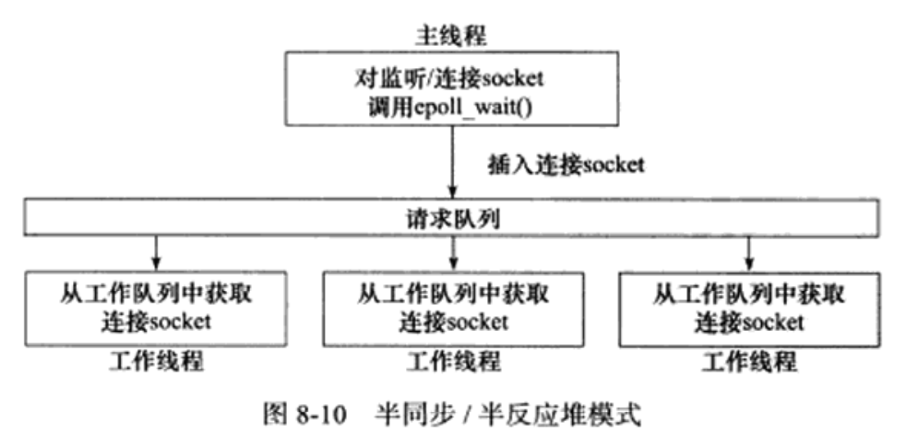
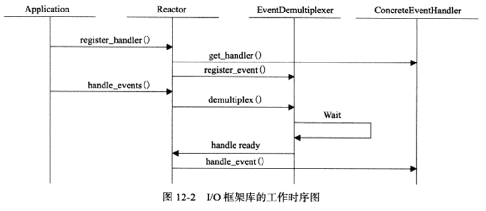

# Linux高性能服务器编程

这个是根据游双老师的书《Linux高性能服务器编程》做的笔记

## 第一篇:TCP/IP协议详解

介绍TCP/IP协议簇及各种重要的网络协议。夯实基础(1~4章)。

### 第一章：TCP/IP协议簇

- 数据链路层协议：实现网卡接口的网络驱动程序，处理数据在物理媒介上的传输
  - ARP(地址解析协议):实现IP地址与物理地址(MAC)之间的转换，将IP地址转换为MAC地址数据链路层才能提供服务。
  - RARP(逆地址解析协议):也是地址间转换。它是运行在网络管理者，网络管理者保存着该网络上机器的物理地址到IP地址的映射(因为有些机器是无盘的，无法记住自己的IP地址，只能利用网卡上的物理地址向网络管理者查询自己的IP地址)
- 网络层协议：实现数据包的选路和转发
  - IP:根据IP地址选择下一跳的目标，每一跳都会判断是否到达，是否到生命尽头
  - ICMP:因特网控制报文协议，用于检测网络连接
    - 差错报文:回应网络错误
    - 查询报文:查询网络信息
- 传输层：为两台主机上的应用程序提供端到端的通信
  - TCP:可靠的、面向连接的和基于流的服务(它需要在内核中维持一些数据结构，在关闭连接时释放这些内核数据)
  - UDP:不可靠、无连接和基于数据报的服务(基于数据报的服务，接收端必须以该长度为最小单位将其所有内容一次性取出，而基于流的服务可以一个字节一个字节的取出)
  - SCTP(流控制传输协议):在因特网上传输电话信号设计的
- 应用层：处理应用程序的逻辑(数据链路层、网络层和传输层负责网络通信细节，应用层处理众多逻辑(文件传输、名称查询和网络管理))在用户空间实现
  - telnet(远程登录协议):在本地完成远程任务
  - OSPF(开放最短路径优先):动态路由更新协议，用于路由器间通信，告知对方各自的路由信息
  - DNS(域名服务):提供机器域名到IP地址的转换

#### ARP工作原理

主机向自己所在的网络广播一个ARP请求，包含目标机器的网络地址。此网络上所有的机器都收到了这个请求，但是只有被请求的目标机器才会回应一个ARP应答，其中包含自己的物理地址。

ARP高速缓存：里面包含了(经常访问的网关地址等、最近访问的机器的IP地址到物理地址的映射)

- 可以避免重复的ARP请求，提高发送数据包的速度
- 可以查看和修改ARP高速缓存
  - arp -a:查看ARP缓存内容
  - sudo arp -d 192.168.xx.xx:删除ARP缓存项
  - sudo arp -s 192.168.xx.xx 08:00:27:53:10:67(MAC地址):添加ARP缓存项

使用tcpdump抓包(抓取和ARP通信有关的包)

- 抓包；sudo tcpdump -i eth0 -ent '(dst 192.168.1.109 and src 192.168.1.108)or(dst 192.168.1.108 and src 192.168.1.109)'

1. 00:16:d3:5c:b9:e3 > ff:ff:ff:ff:ff:ff, ethertype ARP (0x0806), length 42: Request who-has 192.168.1.109 tell 192.168.1.108, length 28
   1. 00:16:d3:5c:b9:e3 : ARP通信的源端物理地址
   2. ff:ff:ff:ff:ff:ff : 目的端物理地址，这样表示以太网的广播地址
   3. 0x0806 : 以太网帧头部的类型字段的值，表示ARP模块
   4. length 42 : 帧长度42字节(忽略了4字节的CRC字段)
   5. Request : 表示这是ARP请求
   6. who-has 192.168.1.109 tell 192.168.1.108 : 表示是ernest-laptop要查询的IP地址
   7. length 28 : 表示数据部分长度为28
2. 08:00:27:53:10:67 > 00:16:d3:5c:b9:e3, ethertype ARP (0x0806), length 60: Reply 192.168.1.109 is-at 08:00:27:53:10:67, length 46
   1. Reply : 表示这是一个ARP应答
   2. 192.168.1.109 is-at 08:00:27:53:10:67 : 报告自己的物理地址
   3. 帧长度为60(实际64)

#### DNS工作原理

DNS服务器上存放大量的机器名和IP地址的映射，并动态更新。

DNS的查询和应答报文格式比较复杂(笔记记在书上)

***Linux下访问DNS服务器***

使用的客户端程序是host

- 向首选DNS服务器查询机器www.baidu.com的IP地址
  - host -t A www.baidu.com
  - 它会返回：告诉此机器名是不是其它机器名的别名，并返回对应的所有IP地址
  - -t：告诉DNS协议使用哪种查询类型，这里使用A类型
- 更多的详情可以通过man查看

***通过tcpdump观察DNS通信过程***

- sudo tcpdump -i eth0 -nt -s 500 port domain
- host -t A www.baidu.com

输出：

- IP 192.168.1.108.34319 > 219.239.26.42.53: 57428+ A? www.baidu.com. (31)
  - IP : 表示后面的内容是IP数据报，**tcpdump以 “IP 地址.端口号” 的形式来描述通信的某一端；以 “>” 表示数据传输的方向，前面是源端，后面是目的端**
  - 57428 : 是DNS查询报文的标识值
  - “+” : 表示启用递归查询标志
  - A : 表示使用A类型的查询方式
  - 31 : DNS查询报文的长度(字节)
- IP 219.239.26.42.53 > 192.168.1.108.34319: 57428 3/4/4/ CNAME www.s.shifen.com., A 119.75.218.77, A 119.75.217.56 (226)
  - “3/4/4” : 表示该报文中包含3个应答资源记录、4个授权资源记录和4个额外信息记录
  - CNAME www.s.shifen.com., A 119.75.218.77, A 119.75.217.56 : 表示3个应答资源记录的内容，其中CNAME表示紧随其后的记录是机器的别名，A表示紧随其后的记录是IP地址
  - 该应答报文的长度是226字节

#### socket和TCP/IP协议簇的关系

socket提供的两点功能：

- 将应用程序数据从用户缓冲区中复制到TCP/UDP内核发送缓冲区，用来发送数据
  - 从内核TCP/UDP接收缓冲区中复制数据到用户缓冲区，用来读取数据
- 应用程序可以通过他们来修改内核中各层协议的某些头部信息或其他数据结构，从而精细的控制底层通信的行为
  - 通过setsockopt函数来设置IP数据报在网络上的存活时间

### 第二章：IP协议详解

从两点探讨IP协议

- IP头部信息
- IP数据报的路由和转发

#### 使用tcpdump观察IPv4头部结构

```c
sudo tcpdump -ntx -i lo # 抓取本地回路上的数据包
// -x表示输出数据包的二进制码，共60字节，前20字节IP头，后40字节TCP头
telnet 127.0.0.1 # 开启另外一个终端执行telnet命令登录本机
```

```txt
IP 127.0.0.1.39946 > 127.0.0.1.23: Flags [S], seq 4008692433, win 65495, options [mss 65495,sackOK,TS val 2518618945 ecr 0,nop,wscale 7], length 0
  0x0000:  4510 003c 007e 4000 4006 3c2c 7f00 0001
  0x0010:  7f00 0001 9c0a 0017 eeef cad1 0000 0000
  0x0020:  a002 ffd7 fe30 0000 0204 ffd7 0402 080a
  0x0030:  961f 1341 0000 0000 0103 0307
源与目的都是127.0.0.1
telnet服务器程序使用的端口号是23
telnet客户端程序使用临时端口号39946
Flags、seq、win、options：都是描述TCP头部信息
```

#### 路由

使用route命令或者netstat命令查看路由表

IP的路由机制

1. 查找路由表中和数据报的目标IP地址完全匹配的主机IP地址。如果找到，就使用该路由项，没找到就转步骤2
2. 查找路由表中和数据报的目标IP地址具有相同网络ID的网络IP地址。如果找到，就使用该路由项，没找到就步骤3
3. 选择默认路由项，意味着数据报的下一跳路由是网关

route命令可以修改路由表

```txt
sudo route add -host 192.168.1.109 dev eth0
# 添加主机192.168.1.109对应的路由项
sudo route del -net 192.168.1.0 netmask 255.255.255.0
# 表示删除网络192.168.1.0对应的路由项
sudo route del default
# 表示删除默认路由项，会导致无法访问因特网
sudo route add default gw 192.168.1.109 dev eth0
# 表示重新设置默认路由项，不过网关是192.168.1.109
```

### 第三章：TCP协议

所有知名服务使用的端口号都定义在/etc/services文件中

#### 使用tcpdump观察TCP头部信息

```txt
# 还拿之前观察IP头部信息的包看
IP 127.0.0.1.39946 > 127.0.0.1.23: Flags [S], seq 4008692433, win 65495, options [mss 65495,sackOK,TS val 2518618945 ecr 0,nop,wscale 7], length 0
  0x0000:  4510 003c 007e 4000 4006 3c2c 7f00 0001
  0x0010:  7f00 0001 9c0a 0017 eeef cad1 0000 0000
  0x0020:  a002 ffd7 fe30 0000 0204 ffd7 0402 080a
  0x0030:  961f 1341 0000 0000 0103 0307
源与目的都是127.0.0.1
telnet服务器程序使用的端口号是23
telnet客户端程序使用临时端口号39946
# Flags、seq、win、options：都是描述TCP头部信息
Flags [S]:表示该TCP报文段包含SYN标志，因此它是一个同步报文段
sql:序号值，因为这个同步报文是该方向传输的第一个TCP报文段，所以这个序号值时此次通信过程中该方向的ISN值，因为是第一个，所以没有确认值
win:报告接收通告窗口的大小
options:TCP选项，具体内容在括号内
  mms是发送端通告的最大报文长度
  sackOK表示发送端支持并同意使用SACK选项
  TS val是发送端的时间戳
  erc是时间戳回显应答(0是未收到对方的时间戳，因为这是第一次TCP通信的第一个TCP报文段)
  nop是一个空操作选项
  wscale指发送端使用的窗口扩大因子为7
```

#### 几个小命令

iptable命令用于过滤数据包

- 来丢弃所有接收到的连接请求
- sudo iptables -F
- sudo iptables -I INPUT -p tcp --syn -i eth0 -j DROP

netstat命令查看当前连接状态

iperf是测量网络状况的工具，-s表示将其作为服务器运行(iperf默认监听5001端口，并丢弃该端口上的数据)

### 第四章：TCP/IP通信案例：访问Internet上的Web服务器

分析一个完整的TCP/IP通信的实例——访问Internet上的Web服务器

**客户端：**运行wget客户端程序

**服务器：**运行squid代理服务器程序

客户端通过代理服务器的中转获得Internet上的主机的文档。

#### 部署代理服务器

在配置文件(/etc/squid/squid.conf)中添加两行代码

acl localnet src 192.168.1.0/24 # 允许网络192.168.1.0上的所有机器通过该代理服务器来访问Web服务器
http_access allow loaclnet

sudo service squid restart # 重启squid代理服务器

#### 使用tcpdump抓取传输数据包

在代理服务器操作:

```txt
sudo arp -d 192.168.1.1 # 删除ARP高速缓存中路由器对应的项，以便观察TCP/IP通信过程中ARP协议如何起作用。
sudo tcpdump -s 2000 -i eth0 -ntX '(src 192.168.1.108) or (dst 192.168.1.108) or (arp)' # 使用tcpdump命令抓取整个通信过程中传输的数据包
# -s 2000:表示抓取的包的大小
# -i eth0:用eth0接口进行抓包(可能会出错，可以设置为any)
# -w a.cap:表示抓到的内容存取到a.cap文件中
```

在客户端的操作:

```txt
export http_proxy="fattiger:3128" # 将fattiger设置为客户端的HTTP代理服务器，在客户端设置环境变量

wget --header="Connextion: close" http://www.baidu.com/index.html
```

#### 本地名称查询

通过域名访问Internet上的主机时，需要使用DNS服务器来获得主机的IP地址。

通过主机名来访问本地局域网上的机器，可以通过本地的静态文件来获得该机器的IP地址。

- Linux将目标主机名及其对应的IP地址存储在/etc/hosts配置文件中(可以自己手动配置)
- 如果在自己的静态文件中没有找到，会去DNS服务器来解析主机名

## 第二篇:深入解析高性能服务器编程

细致剖析服务器编程的各主要方面，阐述每个重要的概念、模型以及函数等以实例代码的形式加以阐述。

分为四个部分：

- 介绍Linux系统为网络编程提供的各种API(5~7章)
- 探讨高性能服务器的一般框架(8章)
  - 将服务器程序结构为I/O单元、逻辑单元和存储单元
  - 重点介绍I/O单元、逻辑单元的几种高效实现模式
  - 探讨了提高服务器性能的其它建议
- 深入剖析服务器程序的I/O单元(9~12章)
  - 探讨I/O单元需要处理的I/O事件、信号事件和定时事件
  - 介绍了一款优秀的开源I/O框架库——Libevent
- 剖析服务器程序的逻辑单元(13~15章)
  - 讨论多线程、多进程编程
  - 高性能逻辑处理模型——进程池和线程池

### 第五章:Linux网络编程基础API

#### TCP数据读写

```cpp
#include <sys/types.h>
#include <sys/socket.h>
ssize_t recv(int sockfd, void *buf, size_t len, int flags);
ssize_t send(int sockfd, const void* buf, size_t len, int flags);

// flags：为数据收发提供额外的控制，通常为0
// 返回值：
// recv：成功返回实际读取到的数据的长度，出错返回-1 并设置errno
// send：成功返回实际写入的数据的长度，失败返回-1 并设置errno
```

flags参数(可以一个或几个的逻辑或)：

| 选项名 | 含义 | send | recv |
|--|--|--|--|
|MSG_CONFIRM|指示数据链路层协议持续监听对方的回应，知道得到答复。它仅能用于SOCK_DGRAM和SOCK_RAW类型的socket|Y|N|
|MSG_DONTROUTE|不查看路由表，直接将数据发送到本地局域网络内的主机。这表示发送者确切地知道目标主机就在本地网络|Y|N|
|MSG_DONTWAWIT|对socket的此次操作将是非阻塞的|Y|Y|
|MSG_MORE|告诉内核应用程序还有更多数据要发送，内核将超时等待新数据写入TCP发送缓冲区后一并发送。这样可以防止TCP发送过多很小的报文段，从而提高传输效率|Y|N|
|MSG_WAITALL|读操作仅在读取到指定数量的字节后才返回|N|Y|
|MSG_PEEK|窥探读缓存中的数据，此次读操作不会导致这些数据被清除|N|Y|
|MSG_OOB|发送或接收紧急数据|Y|Y|
|MSG_NOSIGNAL|往读端关闭的管道或者socket连接中写数据时不引发SIGPIPE信号|Y|N|

#### UDP数据读写

```cpp
#include <sys/types.h>
#include <sys/socket.h>
ssize_t recvfrom(int sockfd, void* buf, size_t len, int flags, struct sockaddr* src_addr, socklen_t* addrlen);
ssize_t sendto(int sockfd, const void* buf, size_t len, int flags, struct sockaddr* src_addr, socklen_t* addrlen);
```

#### 通用数据读写函数

可以用于TCP数据流和UDP数据报

```cpp
#include <sys/socket.h>
ssize_t recvmsg(int sockfd, struct msghdr* msg, int flags);
ssize_t sendmsg(int sockfd, struct msghdr* msg, int flags);

struct msghdr
{
  void* msg_name; // socket地址
  socklen_t msg_namelen; // socket地址的长度
  struct iovec* msg_iov; // 分散的内存块
  int msg_iovlen; // 分散内存块的数量
  void* msg_control; // 指向辅助数据的起始位置
  socklen_t msg_controllen; // 辅助数据的大小
  int msg_flags; // 赋值函数中的flags参数，并在调用过程中更新
};

struct iovec
{
  void *iov_base; // 内存起始地址
  size_t iov_len; // 这块内存的长度
};
```

#### 带外数据

检测套接字是否包含带外数据

```cpp
#include <sys/socket.h>
int sockatmark(int sockfd);

// 返回值：有带外数据返回1，否则返回0
```

如果有带外数据可以利用带MSG_OOB标志的recv调用来接收带外数据。

#### 获得地址信息

想知道连接socket的本端socket地址以及远端的socket地址

```cpp
#include <sys/socket.h>
// 获得本端socket地址，成功返回0，失败返回-1并设置errno
int getsockname(int sockfd, struct sockaddr* address, socklen_t* address_len);
// 获得远端socket地址
int getpeername(int sockfd, struct sockaddr* address, socklen_t* address_len);
```

#### socket选项

```cpp
// 专门用来读取和设置socket文件描述符的方法
#include <sys/socket.h>
int getsockopt(int sockfd, int level, int option_name, void* option_value, socklen_t* restrict option_len);
int setsockopt(int sockfd, int level, int option_name, const void* option_value, socklen_t* option_len);

/* 参数
sockfd：被操作的目标socket
level：要操作哪个协议的选项(如IPv4、IPv6、TCP等)
option_name：指定选项的名字
option_value：被操作选项的值
option_len：被操作选项的长度
*/
// 成功返回0，失败返回-1 并设置errno
```

socket选项可于书上查找

#### 网络信息API

主要是用于主机名代替IP地址，服务名代替端口号的一些信息查找。

***获得主机信息***

```cpp
#include <netdb.h>
// 根据主机名获得主机的完整信息(它要先通过本地的/etc/hosts配置文件查找到主机，找不到去DNS服务器)
struct hostent* gethostbyname(const char* name);

// 根据IP地址获得主机的完整信息
struct hostent* gethostbyaddr(const void* addr, size_t len, int type);

/* 参数
name：指定目标主机的主机名
addr：指定目的主机的IP地址
len：指定addr所指IP地址的长度
type：指定addr所指IP地址的类型
*/

struct hostent
{
  char* h_name; // 主机名
  char** h_aliases // 主机别名列表，可能有多个
  int h_addrtype; // 地址类型(地址族)
  int h_length; // 地址长度
  char** h_addr_list; // 按网络字节序列出的主机IP地址列表
};
```

***获得服务信息***

```cpp
#include <netdb.h>
// 它要先通过本地的/etc/services配置文件来获取服务的信息
// 根据名获得某个服务的完整信息
struct servent* getservbyname(const char* name, const char* proto);

// 根据端口号获得某个服务的完整信息
struct servent* getservbyport(int port, const char* proto);

/* 参数
name：指定目标服务的名字
port：指定目标服务对应的端口号
proto：指定服务类型
  传递tcp表示获取流服务
  传递udp表示获取数据报服务
  传递NULL表示获取所有类型的服务
*/

struct servent
{
  char* s_name; // 服务名称
  char** s_aliases // 服务名称的别名列表，可能有多个
  int s_port; // 端口号
  char* s_proto; // 服务类型，通常是tcp或udp
};
```

***通过主机名/服务名获得IP地址/端口号(它是调用之前讲过的两个函数)***

```cpp
#include <netdb.h>
int getaddrinfo(const char* hostname, const char* service, const struct addrinfo* hints, struct addrinfo** result);
/* 参数
hostname：主机名或IP地址
service：服务名或端口号
hints：应用程序给getaddrinfo的一个提示，令输出更加精确控制
result：指向一个链表，用于存储反馈的结果，反馈的结果是addrinfo结构体类型的对象
*/

struct addrinfo
{
  int ai_flags;
  int ai_family; // 地址族
  int ai_socktype; // 服务类型，SOCK_STREAM或SOCK_DGRAM
  int ai_protocol;
  socklen_t ai_addrlen; // socket地址ai_addr的长度
  char* ai_canonname; // 主机的别名
  struct sockaddr* ai_addr; // 指向socket地址
  struct addrinfo* ai_next; // 指向下一个sockinfo结构的对象
};

// 使用完getaddrinfo后，在内存上开辟了一块空间，需要使用下面的函数来释放它
void freeaddrinfo(struct addrinfo* res);
```

***通过socket地址同时获得以字符串表示的主机名和服务名(它也是调用前面的函数)***

```cpp
#include <netdb.h>
int getnameinfo(const struct sockaddr* sockaddr, socklen_t addrlen, char* host, socklen_t hostlen, char* serv, socklen_t servlen, int flags);
// 将返回的主机名存储在host参数指向的缓存中，将服务名存储在serv参数指向的缓存中
// hostlen和servlen：分别指向这两块缓存的长度
// flags：控制getnameinfo的行为
// 成功返回0，失败返回错误码
// 下面函数可以将错误码转换为字符串
const char* gai_strerror(int error);
```

### 第六章:高级I/O函数

#### 管道

```cpp
// socket的基础API中的函数，可以直接创建双向管道
#include <sys/types.h>
#include <sys/socket.h>
int socketpair(int domain, int type, int protocol, int fd[2]);
```

#### readv和writev

readv(分散读)：把数据从文件描述符读到分散的内存块中
writev(集中写)：把多块分散的内存数据一并写入文件描述符

```cpp
#include <sys/uio.h>
ssize_t readv(int fd, const struct iovec* vector, int count);
ssize_t writev(int fd, const struct iovec* vector, int count);
// vector：是iovec结构数组
// count：vector数组的长度
// 成功返回读出/写入的字节数。失败返回-1并设置errno。
```

#### sendfile

在两个文件描述符之间直接传递数据(完全在内核中操作)，这也被称为零拷贝。

```cpp
#include <sys/sendfile.h>
ssize_t sendfile(int out_fd, int in_fd, off_t* offset, size_t count);
/* 参数
in_fd：待读出内容的文件描述符
out_fd：待写入内容的文件描述符
offset：指定从读入文件流的哪个位置开始读(为空则是文件流的默认起始位置)
count：指定在文件描述符in_fd和out_fd之间传输的字节数
*/
// 成功返回传输的字节数。失败返回-1并设置errno
```

#### splice

用于在两个文件描述符之间移动数据，也是零拷贝

```cpp
#include <fcntl.h>
ssize_t splice(int fd_in, loff_t* off_in, int fd_out, loff_t* off_out, size_t len, unsigned int flags);
/* 参数 (fd_in和fd_out必须至少有一个是管道文件描述符)
如果fd_in是一个管道文件描述符，那么off_in参数必须被设置为NULL。如果不是，那么off_in表示从输入数据流的何处开始读取数据，此时off_in也可被设置为NULL，表示从当前偏移位置读入。
len：移动数据的长度
flags：控制数据如何移动
*/
// 成功返回移动的字节数量，失败返回-1并设置errno
```

#### tee

在两个管道文件描述符之间复制数据，也是零拷贝

```cpp
#inclde <fcntl.h>
ssize_t tee(int fd_in, int fd_out, size_t len, unsigned int flags);
// 参数类似splice
// 成功返回复制的字节数，失败返回-1并设置errno
```

#### fcntl函数

提供了对文件描述符的各种控制操作(ioctl可以实现更多的控制)

```cpp
#include <fcntl.h>
int fcntl(int fd, int cmd, ...);

/* 参数
fd：被操作的文件描述符
cmd：指定执行何种类型的操作
根据操作不同可能会有第三个可选参数
```

### 第七章:Linux服务器程序规范

模板式的细节规范，称为服务器程序规范。

- 后台进程(又称为守护进程)没有控制终端，也不会意外接收用户输入。它的父进程通常是init进程(PID为1的进程)
- Linux服务器有一套日志系统，可以输入日志到文件(有些还会输入日志到专门的UDP服务器)，大部分后台进程都在/var/log目录下拥有自己的日志目录
- Linux服务器程序一般以某个专门的非root身份运行
- Linux服务器程序通常是可配置的。通常能处理很多命令行选项
- Linux服务器程序通常会在启动的时候生成一个PID文件并存入/var/run目录中，以记录该后台进程的PID。
- Linux服务器程序通常要考虑系统资源和限制，以预测自身能承受多大负荷

#### 日志

Linux提供一个守护进程来处理系统日志syslogd(现在都是使用rsyslogd)

rsyslogd守护进程即能接收用户进程输出的日志，又能接收内核日志。

- 用户进程通过调用syslog函数生成系统日志(函数将日志输出到一个UNIX本地域socket类型的文件/dev/log中)。rsyslogd监听该文件以获得用户进程的输出
- 内核日志由printk等函数打印至内核的环状缓存中。环状缓存的内容直接映射到/proc/kmsg文件中。rsyslogd通过读取该文件获得内核日志

rsyslogd的主配置文件是：/etc/rsyslog.conf

主要可以配置：

- 内核日志输入路径
- 是否接收UDP日志以及其监听端口
- 是否接收TCP日志以及其监听端口
- 日志文件的权限
- 包含哪些子配置文件(比如/etc/rsyslog.d/*.conf)

##### syslog函数

```cpp
#include <syslog.h>
void syslog(int priority, const char* message, ...);
/* 参数
priority：设施值与日志级别的按位或。默认值：LOG_USER
采用可变参数来结构化输出(第二三个参数)
*/
#include <syslog.h>
#define LOG_EMERG    0 /* 系统不可用 */
#define LOG_ALERT    1 /* 报警，需要立即采取动作 */
#define LOG_CRIT     2 /* 非常严重的情况 */
#define LOG_ERR      3 /* 错误 */
#define LOG_WARNING  4 /* 警告 */
#define LOG_NOTICE   5 /* 通知 */
#define LOG_INFO     6 /* 信息 */
#define LOG_DEBUG    7 /* 调试 */

// 此函数可以改变syslog的默认输出方式，进一步结构化日志内容
#include <syslog.h>
void openlog(const char* ident, int logopt, int facility);
/* 参数
ident：指定的字符串被添加到日志消息的日期和时间之后，通常被设置为程序的名字
logopt：对后续syslog调用的行为进行配置，可取下列值的按位或
faciliy：用来修改syslog函数中的默认设施值
*/
#define LOG_PID          0x01  /* 在日志消息中包含程序PID */
#define LOG_CONS         0x02  /* 如果消息不能记录到日志文件，则打印至终端 */
#define LOG_ODELAY       0x04  /* 延迟打开日志功能直到第一次调用syslog */
#define LOG_NOELAY       0x08  /* 不延迟打开日志功能 */

// 日志过滤，设置日志掩码，使日志级别大于日志掩码的日志信息被系统忽略
#include <syslog.h>
int setlogmask(int maskpri);
// mask：指定日志掩码值

// 关闭日志功能
#include <syslog.h>
void closelog();
```

#### 用户信息

用户信息对服务器程序的安全性很重要(大部分服务器以root身份启动，但不能以root身份运行)

```cpp
#include <sys/types.h>
#include <unistd.h>
uid_t getuid();                 /* 获得真实用户ID */
uid_t geteuid();                /* 获得有效用户ID */
gid_t getgid();                 /* 获得真实组ID */
gid_t getegid();                /* 获得有效组ID */
int setuid(uid_t uid);          /* 设置真实用户ID */
int seteuid(uid_t uid);         /* 设置有效用户ID */
int setgid(gid_t gid);          /* 设置真实组ID */
int setegid(gid_t gid);         /* 设置有效组ID */
```

有效ID：它使得运行程序的用户拥有该程序的有效用户的权限。

#### 进程间关系

用ps命令可查看进程、进程组和会话之间的关系

```cpp
$ps -o pid,ppid,pgid,sid,comm | less
```

#### 系统资源限制

通过函数来读取和设置物理设备限制(CPU数量、内存数量等)、系统策略限制(CPU时间等)以及具体实现的限制(比如文件名的最大长度)

```cpp
#include <sys/resource.h>
int getrlimit(int resource, struct rlimit *rlim);
int setrlimit(int resource, const struct rlimit *rlim);
// resource参数指定资源限制类型
// rlim参数是rlimit结构体类型的指针，rlimit结构体的定义如下
struct rlimit
{
  rlim_t rlim_cur;  // 指定资源的软限制
  rlim_t rlim_max;  // 指定资源的硬限制
  // rlim_t是一个整数类型，描述资源级别
};
```

#### 改变工作目录和根目录

Web服务器的逻辑根目录是站点的根目录(对于Linux的Web服务，根目录是/var/www/)

```cpp
#include <unistd.h>
// 获取进程当前工作目录
char* getcwd(char* buf, size_t size);
/* 参数
buf：它指向的内存用于存储进程当前工作目录的绝对路径名
size：来决定buf的大小(如果绝对路径的长度超过了size，则返回NULL，并设置errno为ERANGE)
*/
// 成功返回一个指向目标存储区的指针，失败返回NULL并设置errno

// 改变进程工作目录的函数
int chdir(const char* path);
// path：指定要切换到的目标目录
// 成功返回0，失败返回-1并设置errno。

// 改变进程根目录的函数(只有特权进程才能改变根目录)
int chroot(const char* path);
// path：要切换到的目标根目录
// 成功返回0，失败返回-1并设置errno
// 它并不改变进程的当前工作目录，调用完它之后仍然需要调用chdir("/")来将工作目录切换到新的根目录。
```

#### 服务器程序后台化

如何在代码中让一个进程以守护进程的方式运行

```cpp
#include <unistd.h>
int daemon(int nochdir, int noclose);
// nochdir：指定是否改变工作目录，传递0，则工作目录被设置为 "/" ,否则继续使用当前工作目录
// noclose：为0时，标准输入、标准输出和标准错误输出都被重定向到/dev/null文件
// 成功返回0，失败返回-1并设置errno
```

### 第八章:高性能服务器程序框架

服务器主要解析为以下三个主要模块

- I/O处理单元(I/O处理单元的四种I/O模型和两种高效事件处理模式)
- 逻辑单元(逻辑单元的两种高效并发模式，以及高效的逻辑处理方式——有限状态机)
- 存储单元

#### 服务器模型

##### C/S模型

所有客户端都通过访问服务器来获取所需的资源。

它非常适合资源相对集中的场合，并且实现简单。但是缺点明显：服务器是通信的中心，当访问量过大时，可能所有客户都将得到很慢的相应。

##### P2P

点对点模型更符合网络通信的实际情况。它使得每台机器在消耗服务的同时也能给别人提供服务，使得资源能够充分、自由的共享。每台主机既是客户端，又是服务器。

缺点：用户之间传输的请求过多时，网络的负载将加重。

#### 服务器编程框架

单个程序或服务器机群框架


| 模块 | 单个服务器程序 | 服务器机群 |
|--|--|--|
| I/O处理单元 | 处理客户连接，读写网络数据 | 作为接入服务器，实现负载均衡 |
| 逻辑单元 | 业务进程或线程 | 逻辑服务器 |
| 网络存储单元 | 本地数据库、文件或缓存 | 数据库服务器 |
| 请求队列 | 各单元之间的通信方式 | 各服务器之间的永久TCP连接 |

#### I/O模型

阻塞的文件描述符为阻塞I/O，非阻塞的文件描述符为非阻塞I/O。

针对阻塞I/O执行的系统调用(因为无法立即完成而被操作系统挂起，知道等待的事件发生为止。)

针对非阻塞I/O执行的系统调用则是立即返回，不管事件是否已经发生：

- 如果事件没有立即发生，这些系统调用就返回-1，类似出错的情况，可以根据errno来区分这两种情况。
  - 对accept、send和recv而言，事件未发生时errno通常被设置为EAGAIN(再来一次)或EWOULDBLOCK(期望阻塞)
  - 对于connect而言，errno则被设置为EINPROGRESS(在处理中)

**I/O复用：**应用程序通过I/O复用函数向内核注册一组事件，内核通过I/O复用函数把其中就绪的事件通知给应用程序(常用的I/O复用函数函数是select、poll和epoll_wait)(I/O复用函数本身阻塞，但是能够同时监听多个I/O事件，所以能够提高效率)。

**SIGIO信号：**能够来报告I/O事件。

同步I/O要求用户代码自行执行I/O操作，异步I/O则由内核来执行I/O操作

| I/O模型 | 读写操作和阻塞阶段 |
|--|--|
| 阻塞I/O | 程序阻塞于读写函数 |
| I/O复用 | 程序阻塞于I/O复用系统调用，但可同时监听多个I/O事件。对I/O本身的读写操作是非阻塞的 |
| SIGIO信号 | 信号触发读写就绪事件，用户程序执行读写操作。程序没有阻塞阶段 |
| 异步I/O | 内核执行读写操作并触发读写完成事件，程序没有阻塞阶段 |

#### 两种高效的事件处理模式

服务器程序通常要处理三类事件：I/O事件、信号及定时事件。

有两种高效的事件处理模式：Reactor和Proactor

***Reactor***

要求主线程只负责监听文件描述符上是否有事件发生，如果有就立即将该事件通知工作线程(主线程不做任何实质性的工作)


***Proactor***

将所有的I/O操作都交给主线程和内核来处理，工作线程仅仅负责业务逻辑。


***模拟Proactor***

主线程执行数据读写操作，读写完成之后，主线程向工作线程通知这一“完成事件”。


#### 两种高效的并发模式

##### 半同步、半异步模式

同步：程序完全按照代码序列的顺序执行

- 效率相对较低、实时性较差。但是逻辑简单

异步：程序的执行需要由系统事件(中断、信号)来驱动

- 执行效率高、实时性强。但是逻辑复杂，难以调试和扩展，不适合大量的并发。


在半同步、半异步模式中：同步线程用于处理客户逻辑，异步线程处理I/O事件。

- 异步线程监听到客户请求后，将其封装成请求对象并插入请求队列中。
- 请求队列将通知某个工作在同步模式的工作线程来读取并处理该请求对象。
- 通过请求队列的设计来决定选择哪个工作线程来为新的客户请求服务。


- 主线程制管理监听socket，连接socket由工作线程来管理。
- 新的连接到来，主线程会接收它并把返回的连接套接字派发给某个工作线程，之后该新socket上的任何I/O操作都被由选中的工作线程来处理，直到客户关闭连接。
- 主线程向工作线程派发socket方式
  - 向它和工作线程之间的管道写数据。
  - 工作线程检测管道上的数据，分析是否是一个新的客户连接请求，是连接请求就把该新socket上的读写事件注册到自己的epoll内核事件表中。

主线程和工作线程都维持自己的事件循环，它们各自独立的监听不同的事件。每个线程都工作在异步模式。

##### 半同步半反应堆模式



一个异步线程作为主线程，用来监听所有socket上的事件。

- 如果有连接请求，就接收连接并注册到内核事件
- 如果已注册的连接socket上有读写，主线程就把它插入到请求队列。(所有工作线程睡眠在请求队列上，有任务到来它们通过竞争获得任务的接管权)

缺点：

- 主线程和工作线程共享请求队列。向请求队列中添加或者取出任务都需要对请求队列加锁，浪费CPU时间。
- 每个工作线程同一时间只能处理一个任务。如果任务多、工作线程少，会在请求队列中堆积很多任务对象，客户端的相应变慢。
- 如果增加大量工作线程来解决任务多的问题，那么工作线程的切换也会消耗大量CPU时间。

##### 领导者/追随者模式

多个工作线程轮流获得事件源集合，轮流监听、分发并处理事件的模式。

在任意时间点，程序仅有一个领导者线程，负责监听I/O事件。其他线程作为追随者线程，休眠在线程池中等待成为领导者。

- 当前领导者检测出I/O事件，先从线程池中推选出新的领导者，再去处理I/O事件。
- 新的领导者等待新的I/O事件，原来的领导者则处理I/O事件，它们形成并发。


- 句柄集(HandleSet)：用于表示I/O资源，通常是文件描述符。
  - 句柄集管理句柄，监听句柄上的I/O事件，将其中的就绪事件通知给领导者线程。
  - 领导者通过绑定到句柄上的事件处理器来处理事件
- 线程集(ThreadSet)：所有工作线程的管理者(包括领导者)，负责线程间同步，以及新领导者的推选。
  - 线程集中线程的三种状态：
  - Leader：领导者身份，等待句柄集上的I/O事件
  - Processing：正在处理事件。
  - Follower：追随者身份等待成为新的领导者或等待被领导者指定处理任务
- 事件处理器(EventHandler)
  - 它包含一个或多个回调函数handle_event，回调函数用于处理事件对应的业务逻辑
  - 事件处理器在使用前需要被绑定在某个句柄上，句柄上有事件发生，领导者就会执行事件对应的回调函数
- 具体的事件处理器(ConcreteEventHandler)：事件处理器的派生类，重新实现基类的handle_event方法，处理特定的任务


优点：不需要线程间传递任何额外的数据，也不需要在线程间同步对请求队列的访问

缺点：仅支持一个事件源集合，无法让每个工作线程独立地管理多个客户连接

#### 有限状态机

这是逻辑单元内部的一种高效编程方法

#### 提高服务器性能的其他方法

硬件资源：CPU个数、速度、内存的大小

软环境：

- 系统的软件资源(操作系统允许用户打开的最大文件描述符数量)
- 服务器程序本身如何从编程的角度来确保服务器的性能

***池***

在硬件资源充足的情况下，可以适当的浪费硬件资源来提高运行效率。

池就是一组资源的集合，它在服务器启动之初就被完全创建并初始化，这种叫静态资源分配。

池相当于服务器管理系统资源的应用层设施，它避免了服务器对内核的频繁访问。

问题：池需要“足够多”的资源，这样可能会浪费太多的资源，可以预先分配一定的资源，伺候如果发现资源不够用，就再动态分配一些并加入池中。

常见的池：

- 内存池：用于socket的接收缓存和发送缓存
- 进程池：并发编程
- 线程池：并发编程
- 连接池：服务器或服务器机群的内部永久连接

***数据复制***

涉及到用户代码和内核之间的数据复制时，如果内核可以“直接处理”从socket或者文件读入的数据，则应用程序就没必要将这些数据从内核缓冲区复制到应用程序缓冲区中。

“直接处理”：应用程序不关心这些数据的内容，不需要对它进行任何分析。

用户代码内部的数据复制也应该避免，两个进程间传递大量数据时，可以使用共享内存来直接共享数据，而不是使用管道或者消息队列来传递

***上下文切换和锁***

并发程序要考虑进程切换或线程切换导致的系统开销。不应该使用过多的工作线程(工作进程)，让线程间的切换占据大量的CPU时间。

半同步/半异步模式是一种比较合理的工作模式。

当线程的数量不大于CPU的数目时，上下文的切换就不是问题了(不同的线程可以同时运行在不同的CPU上)

锁会导致服务器效率低下，因为它引入的代码不仅不处理任何业务逻辑，而且还需要访问内核资源。应该避免使用锁。

在必须使用锁的时候，应该考虑减小锁的粒度(比如使用读写锁)

### 第九章:I/O复用

功能：使得程序能同时监听多个文件描述符，提高程序的性能。

使用I/O服用的情况：

- 客户端程序同时处理多个socket(非阻塞connect技术)
- 客户端程序要同时处理用户输入和网络连接(聊天室程序)
- TCP服务器要同时处理监听socket和连接socket(这是I/O复用最多的场合)
- 服务器要同时处理TCP请求和UDP请求(回射服务器)
- 服务器要同时监听多个端口或者处理多种服务(xinetd服务器)

I/O复用能够同时监听多个文件描述符，但是它本身是阻塞的。当文件描述符同时就绪时，它会依次处理每个文件描述符，这就需要使用多进程或多线程了。

#### select系统调用

在一段指定事件内，监听用户感兴趣的文件描述符上的可读、可写和异常等事件

```cpp
#include <sys/select.h>
int select(int nfds, fd_set* readfds, fd_set* writefds, fd_set* exceptfds, struct timeval* timeout);
/* 参数
nfds：指定被监听的文件描述符的总数。被设置为select监听的所有文件描述符中的最大值加1(文件描述符从0计数)
readfds、writefds和exceptfds：分别指向可读、可写和异常等事件对应的文件描述符集合。select调用返回时，内核将修改它们来通知应用程序哪些文件描述符已经就绪。
timeout：设置select函数的超时时间，是一个指针参数(内核将修改它以告诉应用程序select等待了多久)
*/

成功返回就绪(可读、可写和异常)文件描述符的总数。如果在超时时间内没有任何文件描述符就绪，select将返回0。失败返回-1并设置errno

// fd_set结构体，仅包含一个整型数组，该数组的每个元素的每一位标记一个文件描述符。fd_set能容纳的文件描述符数量由FD_SETSIZE指定，限制select能同时处理的文件描述符的总数
#include <typesizes.h>
#define __FD_SETSIZE 1024

#include <sys/select.h>
#define FD_SETSIZE __FD_SETSIZE
typedef long int __fd_mask;
#undef __NFDBITS
#define __NFDBITS (8 * (int) sizeof (__fd_mask))
typedef struct
{
#ifdef __USE_XOPEN
  __fd_mask fds_bits[__FD_SETSIZE / __NFDBITS];
#define __FDS_BITS(set) ((set)->fds_bits)
#else
  __fd_mask __fds_bits[__FD_SETSIZE / __NFDBITS];
#define __FDS_BITS(set) ((set)->__fds_bits)
#endif
} fd_set;

// 使用宏来访问fd_set结构体的位
#include <sys/select.h>
FD_ZERO(fd_set *fdset);                /* 清除fdset的所有位 */
FD_SET(int fd, fd_set *fdset);         /* 设置fdset的位fd */
FD_CLR(int fd, fd_set *fdset);         /* 清除fdset的位fd */
int FD_ISSET(int fd, fd_set *fdset);   /* 测试fdset的位fd是否被设置 */


// timeval结构体
struct timeval
{
  long tv_sec;    /* 秒数 */
  long tv_usec;   /* 微秒数 */
};
```

***文件描述符就绪条件***

可读：

- socket内核接收缓存区中的字节数大于或等于其低水位标记SO_RCVLOWAT。此时可以无阻塞的读取该select，并且读操作返回的字节数大于0。
- socket通信的对方关闭连接。此时对该socket的读操作将返回0。
- 监听socket上有新的连接请求。
- socket上有未处理的错误。此时可以使用getsockopt来读取和清除该错误。

可写：

- socket内核发送缓冲区中的可用字节数大于或等于其低水位标记SO_SNDLOWAT。此时可以无阻塞的写该socket，并且写操作返回的字节数大于0。
- socket的写操作被关闭。对写操作被关闭的socket执行写操作后触发一个SIGPIPE信号。
- socket使用非阻塞connect连接成功或者失败后。
- socket上有未处理的错误。此时我们可以使用getsockopt来读取和清除该错误。

***处理带外数据***

网络程序中，select能处理的异常情况：socket上接收到带外数据。

socket上接收到普通数据和带外数据都将使select返回，但是前者socket处于可读状态，后者处于异常状态。

#### poll系统调用

```cpp
#include <poll.h>
int poll(struct pollfd* fds, nfds_t nfds, int timeout);

/* 参数
fds：指定所有感兴趣的文件描述符上发生的可读、可写和异常等事件
nfds：指定被监听事件集合fds的大小
timeout：指定poll的超时值，单位毫秒。为-1时，poll调用将永远阻塞，直到某个事件发生。为0时，poll调用将立即返回。
*/

// pollfd结构体
struct pollfd
{
  int fd;             /* 文件描述符 */
  short events;       /* 注册的事件 */
  short revents;      /* 实际发生的事件，由内核填充 */
};

typedef unsigned long int nfds_t;
```

#### epoll系统调用

epoll使用一组函数来完成任务。并且把用户关心的文件描述符上的事件放在内核里的一个事件表中。

```cpp
// 它需要使用一个额外的文件描述符来唯一标识内核中的这个事件表。
// 创建这个文件描述符
#include <sys/epoll.h>
int epoll_create(int size)
// size：告诉内核事件表的大小
// 返回的文件描述符用于其他所有epoll系统调用的第一个参数，指定要访问的内核事件表

// 操作epoll的内核事件表
#include <sys/epoll.h>
int epoll_ctl(int epfd, int op, int fd, struct epoll_event *event)
/* 参数
fd：要操作的文件描述符
op：操作类型
event：指定事件
*/
// 成功返回0，失败返回-1并设置errno

struct epoll_event
{
  __uint32_t events;   /* epoll事件 */
  epoll_data_t data;   /* 用户数据 */
};

typedef union epoll_data
{
  void* ptr;      /* 用来指定与fd相关的用户数据 */
  int fd;         /* 使用最多，指定事件所从属的目标文件描述符 */
  uint32_t u32;
  uint64_t u64;
} epoll_data_t;
```

***epoll_wait函数***

如果检测到事件，就将所有就绪的事件从内核事件表中复制到它的第二个参数events指向的数组中。

```cpp
// 它在一段超时时间内等待一组文件描述符上的事件
#include <sys/epoll.h>
int epoll_wait(int epfd, struct epoll_event* events, int maxevents, int timeout);
// 成功返回就绪的文件描述符的个数，失败返回-1并设置errno
// events：只用于输出epoll_wait检测到的就绪事件
// maxevents：指定最多监听多少个事件
```

***LT和ET模式***

epoll对文件描述符操作的两种模式

- LT(Level Trigger, 电平触发)
  - 默认的工作模式，这种模式下epoll详单与一个效率较高的poll
  - 采用此模式的文件描述符，epoll_wait检测到其上有事件发生并将此事件通知应用程序后，应用程序可以不立即处理该事件
    - epoll_wait会重复向应用程序通知此事件，效率变低
- ET(Edge Trigger, 边沿触发)
  - 是epoll的高效工作模式
  - 当往epoll内核事件表中注册一个文件描述符上的EPOLLET事件时，epoll将以此模式来操作该文件描述符
  - 采用此模式的文件描述符，epoll_wait检测到其上有事件发生并将此事件通知应用程序后，引用程序必须立即处理该事件

***EPOLLONESHOT事件***

作用：使得一个socket连接在任一时刻都只被一个线程处理。

注册了EPOLLONESHOT事件的文件描述符，操作系统最多触发其上注册的一个可读、可写或者异常事件，且只触发一次(除非使用epoll_ctl函数重置该文件描述符上注册的EPOLLONESHOT事件。)

注册了EPOLLONSHOT事件的socket一旦被某个线程处理完毕，该线程就应该立即重置这个socket上的EPOLLONESHOT事件，以确保这个socket下一次可读时，其EPOLLIN事件能被触发。

#### 三组I/O复用函数的比较

区别：

| 系统调用 | select | poll | epoll |
|--|--|--|--|
| 事件集合 | 用户通过3个参数分别传入感兴趣的可读、可写及异常等事件，内核通过对这些参数的在线修改来反馈其中的就绪事件。使得用户每次调用select都要重置这三个参数 | 统一处理所有事件类型，因此只需要一个事件集参数。用户通过pollfd.events传入感兴趣的事件，内核通过修改pollfd.revents反馈其中就绪的事件 | 内核通过一个事件表直接管理用户感兴趣的所有事件。因此每次调用epoll_wait时，无须反复传入用户感兴趣的事件。epoll_wait系统调用的参数events仅用来反馈就绪的事件 |
| 应用程序索引就绪文件描述符的时间复杂度 | O(n) | O(n) | O(1) |
| 最大支持文件描述符个数 | 一般有最大值限制 | 65535(现在的机器应该比这个数字大) | 65535 |
| 工作模式 | LT | LT | 支持ET高效模式 |
| 内核实现和工作效率 | 采用轮询方式来检测就绪事件 | 轮询 | 采用回调方式来检测就绪事件 |

#### I/O复用的高级应用一：非阻塞connect

connect出错时的一种errno值：EINPROGRESS

这种错误发生在对非阻塞的socket调用connect，而连接又没有立即建立时。
在这种情况下，可以调用select、poll等函数来监听这个连接失败的socket上的可写事件。当select、poll等函数返回后，再利用getsockopt来读取错误码并清除该socket上的错误。错误码是0表示连接成功建立，否则失败。

问题：

- 非阻塞socket可能会导致connect始终失败
- select对处于EINPROGRESS状态下的socket可能不起作用
- 对于出错的socket，getsockopt在有些系统上返回-1，有些系统返回0

#### I/O复用的高级应用二：聊天室程序

通过poll来实现聊天室程序，阐述如何使用I/O复用来同时处理网络连接和用户输入。

客户端：

- 从标准输入终端读入用户数据，并将用户数据发送到服务器
- 往标准输出终端打印服务器发送给它的数据

服务器：

- 接收客户数据，并把客户数据发送给每一个登录到该服务器上的客户端

#### I/O复用的高级应用三：同时处理TCP和UDP服务

同时监听多个端口(比如超级入伍inetd和android的调试服务adbd)

因为一个socket只能与一个socket地址绑定，就是只能用来监听一个端口。所以就需要同时管理多个监听socket。

即使是同一个端口，如果服务器要同时处理该端口上的TCP和UDP，则需要创建两个不同的socket

- 流socket
- 数据报socket

#### 超级服务xinetd

它在inetd的功能：同时管理着多个子服务(监听多个端口)，并且增加了一些控制选项，并提高了安全性

***配置文件***

主配置文件：/etc/xinetd.conf
子配置文件：/etc/xinetd.d目录下的文件

```txt
# /etc/xinetd.d/telnet配置文件
# default: on
# description: The telnet server serves telnet sessions; it uses \
# unencrypted username/password pairs for authentication.
service telnet
{
  flags             - REUSE
  socket_type       = stream
  wait              - no
  user              = root
  server            = /usr/sbin/in.telnetd
  log_on_failure    += USERID
  disable           = no
}
```

/etc/xinetd.d/telnet配置文件的每一项的含义

| 项目 | 含义 |
|--|--|
| service | 服务名 |
| flags | 设置连接的标志。REUSE表示复用telnet连接的socket。该标志已经过时，每个连接都默认启用REUSE标志 |
| socket_type | 服务类型 |
| wait | 服务采用单线程方式(wait=yes)还是多线程方式(wait=no)。单线程方式表示xinetd只accept第一次连接，此后将由子服务进程来accept新连接。多线程方式表示xinetd一直负责accept连接，而子服务进程仅处理连接socket上的数据读写 |
| user | 子服务进程将以user指定的用户身份运行 |
| server | 子服务程序的完整路径 |
| log_on_failure | 定义当服务不能启动时输出日志的参数 |
| disable | 是否启动该子服务 |

```cpp
service ssh                       # 代表被托管服务的名称
{
    disable = no                  # 是否禁用托管服务，no表示开启托管服务
    log_on_failure += USERID      # 设置失败时，UID添加到系统登记表
    socket_type = stream          # socket连接方式，这个是属于本地方式，对ssh无效
    server_args = --daemon        # 设置服务启动时需要的参数
    cps = 25 30                   # 每秒25个入站连接，如果超过限制，则等待30秒，主要用于对拒绝服务
的程序
    protocol = tcp                # 代表ssh走的时tcp协议连接
    wait = no                     # 是否并发，这个参数对ssh无效
    user = root                   # 以什么用户进行启动
    server = /usr/sbin/sshd       # 被托管服务的启动脚本
    server_args = -i              # 启动脚本的参数
}  
```

***工作流程***

##### xinetd

新一代网络守护进程服务程序

***特色***

- 强大的存取控制功能
  - 内置对恶意用户和善意用户的差别待遇设定
  - 使用libwrap支持，效能更甚于tcpd
  - 可以限制连接的等级，基于主机的连接数和基于服务的连接数
  - 设置特定的连接时间
  - 将某个服务设置到特定的主机以提供服务
- 有效防止Dos攻击
  - 可以限制连接的等级
  - 可以限制一个主机的最大连接数，从而防止某个主机独占某个服务
  - 可以限制日志文件的大小，防止磁盘空间被填满
- 强大的日志功能
  - 可以为每一个服务就syslog设定日志等级
  - 如果不使用syslog，也可以为每个服务建立日志文件
  - 可以记录请求的起止时间以决定对方的访问时间
  - 可以记录试图非法访问的请求
- 转向功能
  - 可以将客户端的请求转发到另一台主机去处理
- 支持IPv6
- 与客户端的交互功能
  - xinetd会有提示告知连接状态，无论客户端请求是否成功

***缺点***

对RPC支持的不稳定性，但是可以启动protmap，使它与xinetd共存来解决这个问题

***使用xinetd启动守护进程***

原则上任何系统服务都可以使用xinetd，最适合的是常用的网络服务，并且服务的请求数目和频繁程度不会太高(FTP、Telnet、SSH适合使用xinetd模式)

默认使用xinetd的服务

- 标准Internet服务：telnet、ftp
- 信息服务：finger、netstat、systat
- 邮件服务：imap、imaps、pop2、pop3、pops
- RPC服务：rquotad、rstatd、rusersd、sprayd、walld
- BSD服务：comsat、exec、login、ntalk、shell、talk
- 内部服务：chargen、daytime、echo、servers、services、time
- 安全服务：irc
- 其他服务：name、tftp、uucp

Linux系统的端口号

- 0：不可使用
- 1~1023：系统保留，只能由root用户使用
- 1024~4999：由客户端程序自由分配
- 5000~65535：由服务器程序自由分配

### 第十章:信号

#### 概述

***发送信号***

```cpp
#include <sys/types.h>
#include <signal.h>
int kill(pid_t pid, int sig);
// 把信号sig发送给进程号为pid的进程
```

***信号处理方式***

```cpp
#include <signal.h>
typedef void (*__sighandler_t) (int);
// 接收函数来处理接收到的信号
// 只有一个整形参数，该参数用来指示信号类型。

#include <bits/signum.h>
#define SIG_DFL ((__sighandler_t) 0)
#define SIG_IGN ((__sgihandler_t) 1)
// 信号的两种处理方式
// SIG_IGN ：忽略目标信号
// SIG_DFL : 使用信号的默认处理方式
// 信号的默认处理方式：结束进程(Term)、忽略信号(Ign)、结束进程并生成核心存储文件(Core)、暂停进程(Stop)、继续进程(Cont)
```

***Linux信号***

定义在bits/signum.h头文件中

***中断系统调用***

程序在执行处于阻塞状态的系统调用时接收到信号，并且为该信号设置了信号处理函数。

- 默认情况下系统调用将被中断，并且errno被设置为EINTR。

可以使用sigaction函数为信号设置SA_RESTART标志以自动重启被该信号中断的系统调用。

默认行为是暂停进程的信号(SIGSTOP、SIGTTIN)，如果没有为它们设置信号处理函数，则它们也可以终端某些系统调用。

#### 信号函数

***signal系统调用***

```cpp
#include <signal.h>
_sighandler_t signal(int sig, _sighandler_t _handler)
// 为一个信号设置处理函数
/* 参数
sig:要捕获的信号类型
_handler:函数指针，用于指定信号sig的处理函数
*/
// 成功返回一个函数指针，返回值就是调用signal函数时传入的函数指针或者是信号sig对应的默认处理函数指针SIG_DEF
// 错误返回SIG_ERR，并设置errno
```

***sigaction系统调用***

```cpp
//设置信号处理函数
#include <signal.h>
int sigaction(int sig, const struct sigaction* act, struct sigaction* oact);
/* 参数
sig:要捕获的信号类型
act:指定新的信号处理方式
oact:输出信号先前的处理方式
*/
// 成功返回0，失败返回-1并设置errno
struct sigaction
{
#ifdef __USE_POSIX199309
  union
  {
    _sighandler_t sa_handler; // 指定信号处理函数
    void (*sa_sigaction) (int, isginfo_t*, void*);
  }
  _sigaction_handler;
#define sa_handler __sigaction_handler.sa_handler
#define sa_sigaction __sigaction_handler.sa_sigaction
#else
  _sighandler_t sa_handler;
#endif
  _sigset_t sa_mask; // 设置进程的信号掩码
  int sa_flags; // 设置程序收到信号时的行为
  void (*sa_restorer) (void); // 已过时
};
```

#### 信号集

***信号集函数***

```cpp
#include <bits/sigset.h>
#define _SIGSET_NWORDS (1024 / (8 * sizeof (unsigned long int)))
// 使用数据结构sigset_t表示一组信号(实际就是一个长整数，每个元素的每个位表示一个信号)
typedef struct
{
  unsigned long int __val[_SIGSET_NWORDS];
}__sigset_t;

#incldue <signal.h>
int sigemptyset(sigset_t* _set)                   /* 清空信号集 */
int sigfillset(sigset_t* _set)                    /* 在信号集中设置所有信号 */
int sigaddset(sigset_t* _set, int _signo)         /* 将信号_signo添加到信号集中 */
int sigdelset(sigset_t* _set, int _signo)         /* 将信号_signo从信号集中删除 */
int sigismember(_const sigset_t* _set, int signo) /* 测试_signo是否在信号集中 */
```

***进程信号掩码***

```cpp
// 利用sigaction结构体的sa_mask成员来设置进程的信号掩码
// 该函数可以用于设置或查看进程的信号掩码
#include <signal.h>
int sigprocmask(int _how, _const sigset_t* _set, sigset_t* _oset);
/* 参数
_set:指定新的信号掩码
_oset:输出原来的信号掩码
_how:在_set不为NULL的情况下，它指定设置进程信号掩码的方式(就是取并集、取交集或者直接设置)
*/
// 如果_set为NULL，则进程信号掩码不变
// 成功返回0，失败返回-1并设置errno
```

***被挂起的信号***

设置进程信号掩码后，被屏蔽的信号将不能被进程接收。
如果给进程发送一个被屏蔽的信号。则操作系统将该信号设置为进程的一个被挂起的信号。
如果我们取消对被挂起信号的屏蔽，则它立即能被进程接收到。

```cpp
// 获得进程当前被挂起的信号集
#include <signal.h>
int sigpending(sigset_t* set);
// sig:用于保存被挂起的信号集，每个信号只能处理一次
// 成功返回0，失败返回-1并设置errno
```

要始终清楚地知道进程在每个运行时刻的信号掩码，以及如何适当地处理捕获到的信号。

#### 统一事件源

信号是一种异步事件：信号处理函数和程序的主循环是两条不同的执行线路。

- 信号处理函数需要尽可能快的执行完毕，以确保该信号不能被屏蔽太久。

处理方案：把信号的主要处理逻辑放到程序的主循环中，当信号处理函数被触发时，它只是简单地通过主循环程序接收到信号，并把信号值传递给主循环中，主循环再根据接收到的信号值执行目标信号对应的逻辑代码。

- 信号处理函数使用管道将信号"传递"给主循环
- 使用I/O复用系统调用来监听管道的读端文件描述符上的可读时间(主循环读管道上的数据)

#### 网络编程相关信号

三个极为重要的信号

***SIGHUP***

当挂起进程的控制终端时，SIGHUP信号将被触发。

对于没有控制终端的网络后台程序，它们能利用SIGHUP信号来强制服务器重读配置文件。

***SIGPIPE***

默认情况：往一个读端关闭的管道或socket连接中写数据将引发SIGPIPE信号。需要在代码中捕获并处理该信号，或者忽略它

- 程序接收到SIGPIPE信号的默认行为是结束进程，要避免错误的写操作导致程序退出。
- 引起SIGPIPE信号的写操作将设置errno为PIPE

解决方法

- 可以使用send函数的MSG_NOSIGNAL标志来进制写操作触发SIGPIPE信号
  - 使用send函数反馈的errno值来判断管道或者socket连接的读端是否已经关闭
- 利用I/O复用系统调用来检测管道和socket连接的读端是否已经关闭
  - 以poll为例，管道的读端关闭时，写端文件描述符上的POLLHUP事件将被触发
  - 当socket连接被对方关闭时，socket上的POLLRDHUP事件将被触发

***SIGURG***

内核通知应用程序带外数据到达的方法

- I/O复用技术，select等系统调用在接收到带外数据时返回，并向应用程序报告socket上的异常事件
- 使用SIGURG信号

***带外数据的学习***

知识点：

- 3.8节：介绍TCP带外数据的基本知识，探讨了TCP模式是如何发送和接收带外数据的
- 5.8.1：描述了如何在应用程序中使用带MSG_OOB标志的send/recv系统调用来发送/接收带外数据
- 9.1.3和10.5.3：检测带外数据是否到达的两种方法
- 5.9：socketmark系统调用解决带外数据的具体位置，它是判断一个socket是否处于带外标记

### 第十一章:定时器

一些定时事件（定期检测一个客户连接的活动状态...）。

服务器程序会管理着许多的定时事件，有效地组织它们，使得在预期的时间点触发并且不影响服务器的主要逻辑，对于服务器的性能有着至关重要的影响。

我们需要把每个定时事件封装成定时器，并使用容器类数据结构把所有定时器串联起来，实现定时事件的统一管理。

两种高效的管理定时器的容器：时间轮、时间堆。

定时的方法：在一段时间之后触发某段代码的机制，可以在这段代码中依次处理所有到期的定时器。

Linux提供的三种定时方法

- socket选项SO_RCVTIMEO和SO_SNOTIMEO
- SIGALRM信号
- I/O复用系统调用的超时参数

#### 1. socket选项SO_RCVTIMEO和SO_SNOTIMEO

socket选项SO_RCVTIMEO和SO_SNOTIMEO用来设置socket接收数据超时时间和发送数据超时时间。

| 系统调用 | 有效选项 | 系统调用超时后的行为 |
|--|--|--|
| send | SO_SNDTIMEO | 返回-1，设置errno为EAGAIN或EWOULDBLOCK |
| sendmsg | SO_SNDTIMEO | 返回-1，设置errno为EAGAIN或EWOULDBLOCK |
| recv | SO_RCVTIMEO | 返回-1，设置errno为EAGAIN或EWOULDBLOCK |
| recvmsg | SO_RCVTIMEO | 返回-1，设置errno为EAGAIN或EWOULDBLOCK |
| accept | SO_RCVTIMEO | 返回-1，设置errno为EAGAIN或EWOULDBLOCK |
| connect | SO_SNOTIMEO | 返回-1，设置errno为EINPROGRESS |

#### 2. SIGALRM信号

前提条件：由alarm和setitimer函数设置的实时闹钟一旦超时，将触发SIGALRM信号。可以利用该信号的信号处理函数来处理定时任务。

如果要处理多个定时任务，就需要不断地触发SIGALRM信号，并在信号处理函数中执行到期的任务。

一般而言，SIGALRM信号按照固定的频率生成，即由alarm或setitimer函数设置的定时周期T保持不变。如果某个定时任务的超时时间不是T的整数倍，那么它实际被执行的时间和预期的时间将略有偏差。因此定时周期T反映了定时的精度。

本节重点————处理非活动连接，用来介绍SIGALRM信号定时的使用

##### 2.1. 基于升序链表的定时器

这是一个简单的定时器实现，把它应用到处理非活动连接的实例中，可以观察SIGALRM信号处理函数是如何处理定时器并执行定时任务的。

sort_timer_lst是一个升序链表。其核心函数tick相当于一个心博函数，它每隔一段固定的时间就执行一次，以检测并处理到期的任务。判断定时任务到期的依据是定时器的expire值小于当前的系统时间。

从执行效率来看，添加定时器的时间复杂度是O(n)，删除定时器的时间复杂度是O(1)，执行定时任务的时间复杂度是O(1)

##### 2.2. 处理非活动连接

这是升序定时器链表的实际应用。

服务器程序通常要定期处理非活动连接

- 给客户端发一个重连请求，或者关闭该连接，或者其他。

处理：

- Linux在内核中提供了对连接是否处于活动状态的定期检查机制，可以通过socket选项KEEPALIVE来激活它
  - 这样会使得应用程序对连接的管理变得复杂
- 在应用层实现类似KEEPALIVE机制，以管理多有长时间处于非活动状态的连接。

#### 3. I/O复用系统调用的超时参数

3组I/O复用系统调用都带有超时参数，因此它们不仅能统一处理信号和I/O事件，也能统一处理定时事件。

但是由于I/O复用系统调用可能在超时时间到期之前就返回(有I/O事件发生)，所以如果我们要利用它们来定时，就需要不断更新定时参数以反映剩余的时间。

#### 4. 高性能定时器

##### 4.1. 时间轮

前面的基于排序链表的定时器存在着添加定时器效率低的问题，时间轮能够很好的解决这个问题


按照对它的描述来看：

- 时间轮一圈一圈的转
- 一个槽就是一个滴答，它来决定时间轮的精度问题，每个滴答的时间为si
- 每个槽位上是一个定时器链表，链表上定时器间隔为N*si的整数倍
- 提升执行效率就需要提高N值

特性

- 添加一个定时器的时间复杂度是O(1)
- 删除一个定时器的时间复杂度是O(1)
- 执行一个定时器的时间复杂度是O(n)(实际上的执行效率要高于此)
- 时间轮将所有的定时器散列到不同的链表上，时间轮的槽越多，等价于散列表上的入口越多，从而每条链表上的定时器数量越少
- 当使用多个轮子来实现时间轮时，执行一个定时器任务的时间复杂度就越接近O(1)

##### 4.2. 时间堆

前面的定时器是：以固定的频率调用心博函数tick，并在其中依次检测到期的定时器，然后执行到期定时器上的回调函数。

设计定时器的另外一种思路：将所有定时器中超时时间最小的一个定时器的超时值作为心博间隔(这样就是心博一次最少有一个定时器到期)

- 使用最小堆来处理这种定时方案
- 添加和删除定时器就是对树添加和删除操作
- 对于时间堆来说
  - 添加一个定时器的时间复杂度是O(lgn)
  - 删除一个定时器的时间复杂度是O(1)
  - 执行一个定时器的时间复杂度是O(1)

### 第十二章:高性能I/O框架库Libevent

I/O框架库是为了解决三类事件：I/O事件、信号和定时事件

解决三类事件时要考虑的三个问题

- 统一事件源：统一处理这三类事件既能使代码简单，又能避免一些潜在的逻辑错误
  - 前面实现统一事件源的方法：利用I/O复用系统调用来管理所有事件
- 可移植性：不同的操作系统具有不同的I/O复用方式
  - Solaris的dev/poll文件
  - FreeBSD的kqueue机制
  - Linux的epoll系列系统调用
- 对并发编程的支持：在多进程和多线程环境下，需要考虑各执行实体如何系统处理客户连接、信号和定时器，以避免竟态条件

稳定性、性能出色的I/O框架库：ACE、ASIO、Libevent

#### 1. io框架库概述

各种I/O框架库的实现原理基本相似(要么以Reactor模式实现，要么以Proactor模式实现，要么同时以这两种模式实现)


Reactor模式的I/O框架库包含

- 句柄(Handle)
  - I/O框架库要处理的对象(I/O事件、信号和定时事件，统一称为信号源)
  - 一个事件源和句柄绑定在一起
  - 句柄的作用是：当内核检测到就绪事件时，它将通过句柄来通知应用程序这一事件
  - 在Linux环境中，I/O事件对应的句柄是文件描述符，信号事件对应的句柄就是信号值
- 事件多路分发器(EventDemultiplexer)
  - 事件循环：事件的到来是随机、异步的，需要循环的等待并处理事件
  - 事件循环中，等待事件使用I/O复用技术实现
  - 事件多路分发器：I/O框架库将系统支持的各种I/O复用系统调用封装成统一的接口
  - demultiplex方法：等待事件的核心函数，内部调用select、poll、epoll_wait等函数
  - register_veent、remove_event：供调用者往事件多路分发器中添加、删除事件
- 事件处理器(EventHandler)
  - 执行事件对应的业务逻辑
  - handle_event：回调函数，在事件循环中被执行(虚函数，以至此用户的扩展)
  - I/O框架库中提供的事件处理器是一个接口，用户需要继承它来实现具体事件处理器
  - 具体的事件处理器(ConcreateEventHandler)
  - get_handle：返回与该事件处理器关联的句柄
  - (!!!当事件多路分发器检测到有事件发生时，它通过句柄来通知应用程序。因此，必须将事件处理器和句柄绑定，才能在事件发生时获取到争取的事件处理器)
- Reactor
  - I/O框架库的核心
  - handle_events：执行事件循环
    - 重复过程：等待事件，然后依次处理所有的就绪事件对应的事件处理器
  - register_handler：调用事件多路分发器的register_event方法来往事件多路分发器中注册一个事件
  - remove_handler：同上，删除一个事件

I/O框架库工作时序



#### 2. libevent源码分析

使用Libevent的案例

- 高性能的分布式内存对象缓存软件memcached
- Google浏览器Chromium的Linux版本

特点：

- 跨平台支持：Libevent支持Linux、UNIX和Windows
- 统一事件源：Libevent对I/O事件、信号和定时事件提供统一的处理
- 线程安全：Libevent使用libevent_pthreads库来提供线程安全支持
- 基于Reactor模式的实现

### 第十三章:多进程编程

### 第十四章:多线程编程

### 第十五章:进程池和线程池

## 第三篇:高性能服务器优化与监测

探讨如何从系统的角度优化和检测服务器性能。设计服务器程序的调制、调试和测试，以及诸多常用系统监测工具的使用(16~17章)。

### 第十六章:服务器调制、调试和测试

### 第十七章:系统检测工具

方便开发人员调试和测评服务器程序

#### 1. tcpdump

经典网络抓包工具。

它提供了大量的选项，用来过滤数据包或者定制输出格式

| 选项 | 功能 |
|--|--|
| -n | 使用IP地址表示主机；使用数字表示端口号 |
| -i | 指定要监听的网卡接口(-i any：表示抓取所有网卡接口上的数据包) |
| -v | 输出一个比较详细的信息(显示IP数据包中的TTL和TOS信息) |
| -t | 不打印时间戳 |
| -e | 显示以太网帧头部信息 |
| -c | 仅抓取指定数量的数据包 |
| -x | 以十六进制数显示数据包的内容，但不显示包中以太网帧的头部信息 |
| -X | 与-x类似，不过还打印每个十六进制字节对应的ASCII字节 |
| -XX | 与-X类似，附加打印以太网帧的头部信息 |
| -s | 设置抓包时的抓取长度(现在不用考虑这个问题了)(4.0版本之前默认抓包长度是68字节，但是对于一些协议长度不够。4.0版本之后，默认抓包长度为65535) |
| -S | 以绝对值来显示TCP报文段的序号(默认是相对值) |
| -w | 将tcpdump的输出以特殊与的格式定向到某文件(这是不是可以弄到日志系统中？) |
| -r | 从文件读取数据包信息并显示 |

还可以用表达式进一步过滤数据包

- 类型(type)：解释后面紧跟着的参数的含义
  - host：主机名(或IP地址)
  - net：用CIDR方法表示的网络地址
  - port：端口号
  - portrange：端口范围
- 方向：
  - src：指定数据包的发送端
  - dst：指定数据包的目的端
- 协议：指定目标协议
- 还可以使用逻辑操作符来建立更加复杂的表达式

#### 2. lsof

|||
|||
|||
|||
|||
|||
